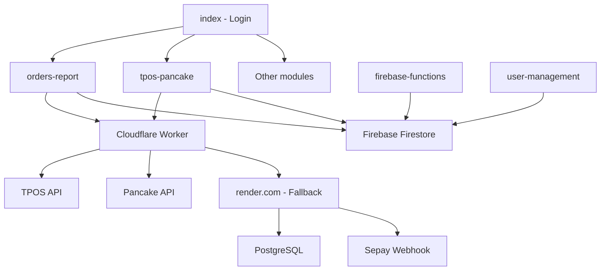

# 📁 N2Store - Tài Liệu Chức Năng Các Thư Mục

> **Dự án:** N2Store - Hệ thống quản lý bán hàng online tích hợp TPOS & Pancake
> **Cập nhật:** 2025-01-13

---

## 📋 Mục Lục

1. [AI](#1-ai)
2. [api](#2-api)
3. [balance-history](#3-balance-history)
4. [bangkiemhang](#4-bangkiemhang)
5. [build-scripts](#5-build-scripts)
6. [ck](#6-ck)
7. [cloudflare-worker](#7-cloudflare-worker)
8. [customer-hub](#8-customer-hub)
9. [firebase-functions](#9-firebase-functions)
10. [hangdat](#10-hangdat)
11. [hanghoan](#11-hanghoan)
12. [hangrotxa](#12-hangrotxa)
13. [ib](#13-ib)
14. [index](#14-index)
15. [inventory-tracking](#15-inventory-tracking)
16. [invoice-compare](#16-invoice-compare)
17. [shared (formerly js)](#17-shared-formerly-js)
18. [lichsuchinhsua](#18-lichsuchinhsua)
19. [live](#19-live)
20. [livestream](#20-livestream)
21. [nhanhang](#21-nhanhang)
22. [order-live-tracking](#22-order-live-tracking)
23. [order-management](#23-order-management)
24. [orders-report](#24-orders-report)
25. [purchase-orders](#25-purchase-orders)
26. [render.com](#26-rendercom)
27. [sanphamlive](#27-sanphamlive)
28. [scripts](#28-scripts)
29. [soluong-live](#29-soluong-live)
30. [soorder](#30-soorder)
31. [tpos-pancake](#31-tpos-pancake)
32. [user-management](#32-user-management)

---

## 1. AI

**Mục đích:** Tích hợp Google Gemini AI vào hệ thống

### Các File Chính
| File | Mô tả |
|------|-------|
| `gemini.html` | Giao diện chat AI với Gemini |
| `GEMINI-AI-GUIDE.md` | Hướng dẫn sử dụng Gemini API với 10 API keys |
| `ANIMATION-REFERENCE.md` | Tham khảo animation |

### Chức Năng
- **Text Generation** - Tạo văn bản
- **Vision** - Phân tích hình ảnh (JPG, PNG, WEBP, GIF, PDF)
- **Audio** - Xử lý âm thanh, transcription
- **Video Analysis** - Phân tích YouTube video
- **Code Execution** - Chạy code Python (NumPy, Pandas, Matplotlib)
- **Function Calling** - Gọi hàm tùy chỉnh
- **Grounding** - Tìm kiếm Google realtime
- **Key Rotation** - Tự động xoay vòng 10 API keys

---

## 2. api

**Mục đích:** Backend API server cho TPOS Upload và Facebook Live Video

### Cấu Trúc
```
api/
├── server.js           # Main Express server
├── config/             # Cấu hình TPOS
├── routes/             # API routes (upload, products, facebook)
├── helpers/            # Utils, autoDetect, attributeBuilder
├── services/           # Excel, image, TPOS services
└── public/             # HTML interfaces (test, huongdan, facebook)
```

### API Endpoints
| Endpoint | Mô tả |
|----------|-------|
| `/upload` | Upload single product lên TPOS |
| `/upload-batch` | Upload batch products |
| `/detect-attributes` | Auto-detect attributes |
| `/products` | List products |
| `/facebook/livevideo` | Lấy danh sách Facebook Live Video |

---

## 3. balance-history

**Mục đích:** Theo dõi lịch sử biến động số dư tài khoản ngân hàng qua Sepay Webhook

### Chức Năng
- Nhận webhook realtime từ Sepay
- Lưu lịch sử giao dịch vào PostgreSQL
- Tự động trích xuất số điện thoại từ nội dung
- Liên kết khách hàng từ TPOS Partner API
- Quản lý công nợ (QR debt flow)
- Thống kê tiền vào/ra, số dư

### API Endpoints
| Endpoint | Mô tả |
|----------|-------|
| `POST /api/sepay/webhook` | Nhận webhook từ Sepay |
| `GET /api/sepay/history` | Lấy lịch sử giao dịch |
| `GET /api/sepay/statistics` | Thống kê giao dịch |
| `GET /api/sepay/debt-summary` | Tổng hợp công nợ |

---

## 4. bangkiemhang

**Mục đích:** Kiểm hàng nhập kho với hệ thống CRUD đầy đủ

### Các File Chính
| File | Mô tả |
|------|-------|
| `index.html` | Giao diện chính |
| `main.js` | Entry point |
| `crud-operations.js` | CRUD operations |
| `data-loader.js` | Tải dữ liệu |
| `filters.js` | Bộ lọc dữ liệu |
| `table-renderer.js` | Render bảng |
| `export.js` | Xuất Excel |

### Chức Năng
- CRUD kiểm hàng
- Lọc theo ngày, NCC, sản phẩm
- Cache với localStorage
- Export Excel
- Notification system

---

## 5. build-scripts

**Mục đích:** Scripts build và minify code

### Scripts
| File | Mô tả |
|------|-------|
| `minify-all.js` | Minify tất cả JS files |
| `clean.js` | Dọn dẹp build artifacts |
| `add-core-loader.sh` | Thêm core loader vào HTML |

---

## 6. ck

**Mục đích:** Quản lý thông tin chuyển khoản với date slider

### Chức Năng
- Hiển thị danh sách chuyển khoản
- Date slider filter (chọn ngày nhanh)
- Filter system phức tạp
- Virtual scrolling cho performance
- Search system
- Modern UI với transitions

---

## 7. cloudflare-worker

**Mục đích:** Cloudflare Worker proxy để bypass CORS cho TPOS API

### Cấu Trúc
```
cloudflare-worker/
├── worker.js           # Main worker script (56KB)
├── wrangler.jsonc      # Wrangler config
├── DEPLOY_GUIDE.md     # Hướng dẫn deploy
└── nginx-backup.conf   # Nginx backup config
```

### Route Mapping
| Route | Target |
|-------|--------|
| `/api/odata/*` | `tomato.tpos.vn/odata/*` |
| `/api/token` | TPOS token endpoint (cached) |
| `/api/pancake/*` | `pancake.vn/api/v1/*` |
| `/api/sepay/*` | `n2store-fallback.onrender.com` |

---

## 8. customer-hub

**Mục đích:** Customer 360 - Hệ thống quản lý khách hàng tích hợp (thay thế customer-management cũ)

### Chức Năng
- Quản lý hồ sơ khách hàng (Customer Profile)
- Ví tiền ảo (Wallet) với nạp/rút/lịch sử giao dịch
- Theo dõi công nợ (Debt Tracking)
- Phân loại khách hàng (RFM Segmentation)
- Tích hợp với TPOS Partner API
- Realtime updates qua SSE

---

## 9. firebase-functions

**Mục đích:** Firebase Cloud Functions cho automatic TAG cleanup

### Functions
| Function | Type | Mô tả |
|----------|------|-------|
| `cleanupOldTagUpdates` | Scheduled | Xóa TAG updates > 7 ngày (2:00 AM daily) |
| `manualCleanupTagUpdates` | HTTP POST | Manual trigger cleanup |
| `getCleanupStats` | HTTP GET | Thống kê TAG updates |

### Cấu Hình
- **Region:** `asia-southeast1` (Singapore)
- **Timezone:** `Asia/Ho_Chi_Minh`
- **Node:** v20
- **Cost:** < $1/month

---

## 10. hangdat

**Mục đích:** Quản lý hàng đặt (order booking) với form xử lý phức tạp

### Chức Năng
- CRUD hàng đặt
- Xóa hàng loạt (bulk delete)
- Upload button icons
- Filter toggle
- Form handler với validation
- Export Excel chi tiết
- Table renderer với sorting

---

## 11. hanghoan

**Mục đích:** Quản lý hàng hoàn trả

### Các File Chính
| File | Mô tả |
|------|-------|
| `hanghoan.js` | Logic xử lý hàng hoàn |
| `trahang.js` | Logic trả hàng |
| `index.html` | Giao diện chính |

### Chức Năng
- Tra cứu đơn hàng hoàn
- Xử lý trả hàng
- Response handling từ TPOS FastSaleOrder

---

## 12. hangrotxa

**Mục đích:** Quản lý hàng rớt và hàng xả

### Module Structure
| File | Mô tả |
|------|-------|
| `hangrotxa-main.js` | Entry point |
| `hangrotxa-config.js` | Cấu hình |
| `hangrotxa-crud.js` | CRUD operations |
| `hangrotxa-ui.js` | UI components |
| `hangrotxa-utils.js` | Utilities |
| `hangrotxa-cache.js` | Cache layer |

---

## 13. ib

**Mục đích:** Kiểm tra inbox khách hàng với image handling

### Chức Năng
- Form handler cho inbox check
- Image upload/handler
- Table manager cho danh sách inbox
- Cache system
- UI components

---

## 14. index

**Mục đích:** Trang login hệ thống

### Files
| File | Mô tả |
|------|-------|
| `login.js` | Logic đăng nhập |
| `login-modern.css` | Styling modern |
| `logo.jpg` | Logo công ty |

---

## 15. inventory-tracking

**Mục đích:** Theo dõi nhập hàng SL với RBAC permissions

### Architecture
- **6 Phases:** Kiến trúc, Flow khởi tạo, CRUD, UI, Finance, Permissions
- **Collections:** `inventory_tracking`, `inventory_prepayments`, `inventory_other_expenses`, `edit_history`

### Tab Chính
1. **Tab Tracking** - Quản lý đợt hàng
2. **Tab Finance** - Công nợ/tài chính

### Permissions (RBAC)
- `tab_tracking`, `tab_congNo` - Access tabs
- `create/edit/delete_shipment` - CRUD operations
- `view_chiPhiHangVe`, `view_ghiChuAdmin` - Admin only fields

---

## 16. invoice-compare

**Mục đích:** So sánh đơn hàng tự động bằng Gemini AI

### Chức Năng
- Upload hình ảnh hóa đơn
- Gemini AI phân tích và trích xuất thông tin
- Fetch dữ liệu từ TPOS
- So sánh tự động AI vs JSON
- Phát hiện lỗi: giá, số lượng, thiếu/thừa SP
- DeepSeek AI helper

---

## 17. shared (formerly js)

**Mục đích:** Shared library cho toàn hệ thống

> **UPDATED**: Folder `/js/` đã được di chuyển vào `/shared/js/`
> Đường dẫn mới: `../shared/js/...` thay vì `../js/...`

### Cấu Trúc
```
/shared/
├── universal/      # ES Modules - Works in Browser + Node.js
├── browser/        # ES Modules - Browser only (SOURCE OF TRUTH)
├── js/             # Legacy Script-Tag Compatible (window.*)
├── node/           # ES Modules - Node.js only
└── README.md       # Full documentation
```

### Core Modules (`/shared/js/`)
| File | Mô tả |
|------|-------|
| `core-loader.js` | Dynamic script loader |
| `common-utils.js` | Shared utilities (33KB) |
| `firebase-config.js` | Firebase configuration |
| `navigation-modern.js` | Navigation system (120KB) |
| `permissions-helper.js` | Permission checking |
| `shared-auth-manager.js` | Authentication manager |
| `shared-cache-manager.js` | Cache manager |
| `ai-chat-widget.js` | AI chat widget (Gemini) |

### ES Modules (`/shared/browser/`)
| File | Mô tả |
|------|-------|
| `auth-manager.js` | Authentication (SOURCE OF TRUTH) |
| `persistent-cache.js` | Cache manager (SOURCE OF TRUTH) |
| `logger.js` | Logger (SOURCE OF TRUTH) |
| `dom-utils.js` | DOM utilities (SOURCE OF TRUTH) |
| `common-utils.js` | UI utilities (SOURCE OF TRUTH) |

### Troubleshooting
Nếu gặp lỗi `404 Not Found`:
```bash
# Kiểm tra path cũ
grep -r '../js/' . --include="*.html"

# Path đúng
<script src="../shared/js/core-loader.js"></script>
```

### Features
- AI chat widget với page context
- Lucide icons helper
- Logger system
- Optimization helper
- Service worker registration

---

## 18. lichsuchinhsua

**Mục đích:** Xem lịch sử chỉnh sửa (edit history)

### Chức Năng
- Hiển thị lịch sử thay đổi
- Filter theo user, ngày, loại
- Modern UI styling

---

## 19. live

**Mục đích:** Hiển thị Facebook Live video và quản lý realtime

### Files
| File | Mô tả |
|------|-------|
| `app.js` | Main application logic |
| `index.html` | Giao diện Live |

---

## 20. livestream

**Mục đích:** Báo cáo livestream với filters và modals

### Chức Năng
- Báo cáo doanh số livestream
- Filter theo ngày, SP, trạng thái
- Forms cho nhập liệu
- Modals chi tiết
- Table với sorting
- Totals calculation
- Export Excel

---

## 21. nhanhang

**Mục đích:** Quản lý cân nặng hàng nhận với camera

### Features
| File | Mô tả |
|------|-------|
| `camera.js` | Camera capture weights |
| `crud.js` | CRUD operations |
| `ui.js` | UI components |
| `utility.js` | Utilities |
| `config.js` | Configuration |

---

## 22. order-live-tracking

**Mục đích:** Sổ order live tracking realtime

### Files
| File | Mô tả |
|------|-------|
| `app.js` | Main application |
| `index.html` | UI interface |
| `style.css` | Styling |

---

## 23. order-management

**Mục đích:** Quản lý đơn hàng với Firebase helpers

### Files
| File | Mô tả |
|------|-------|
| `index.html` | Main orders view |
| `order-list.html` | Order list |
| `hidden-products.html` | Hidden products |
| `firebase-helpers.js` | Firebase utilities |

---

## 24. orders-report

**Mục đích:** **Module lớn nhất** - Quản lý đơn hàng đa tab với Firebase realtime

### Architecture (77 files)
```
orders-report/
├── main.html .............. Tab router
├── tab1-orders.html ....... Quản lý đơn hàng (309KB HTML)
├── tab1-orders.js ......... Logic chính (1MB+ JS, 14,000+ dòng)
├── tab2-statistics.html ... Thống kê
├── tab3-product-assignment  Gán sản phẩm
└── tab-overview.html ...... Dashboard KPI
```

### Sections trong tab1-orders.js
| Section | Chức năng |
|---------|-----------|
| GLOBAL VARIABLES | State management |
| FIREBASE & REALTIME | Tag sync, listeners |
| TAG MANAGEMENT | CRUD tags |
| BULK TAG | Gán tag hàng loạt |
| SEARCH & FILTER | Tim kiếm, lọc |
| TABLE RENDERING | Render bảng |
| MERGED ORDER | Gộp đơn cùng SĐT |
| CHAT MODAL | Chat, message, comment |
| ORDER MERGE | Merge products |
| QR & DEBT | QR code, công nợ |

### Key Managers
- `pancake-data-manager.js` - Pancake API integration
- `pancake-token-manager.js` - JWT management
- `message-template-manager.js` - Bulk messaging
- `kpi-manager.js` - KPI calculation
- `discount-stats-calculator.js` - Discount analytics

---

## 25. purchase-orders

**Mục đích:** Quản lý đơn đặt hàng nhà cung cấp

### Module Structure
| File | Mô tả |
|------|-------|
| `main.js` | Entry point |
| `config.js` | Cấu hình API |
| `service.js` | API services |
| `data-manager.js` | Data handling |
| `form-modal.js` | Form modals |
| `table-renderer.js` | Table rendering |
| `validation.js` | Form validation |
| `ui-components.js` | UI components |

---

## 26. render.com

**Mục đích:** Express.js fallback server trên Render.com

### Cấu Trúc
```
render.com/
├── server.js           # Main Express server (28KB)
├── routes/             # API routes (12 files)
├── migrations/         # PostgreSQL migrations (20 files)
├── services/           # Business logic
└── db/                 # Database config
```

### Purpose
- Fallback khi Cloudflare Worker fails
- PostgreSQL database hosting
- WebSocket realtime server

### Routes
| Route | Mô tả |
|-------|-------|
| `/api/token` | TPOS token proxy |
| `/api/odata/*` | TPOS OData proxy |
| `/api/sepay/*` | Sepay webhook & history |
| `/api/customers/*` | Customer management |

---

## 27. sanphamlive

**Mục đích:** Quản lý sản phẩm livestream với Firebase

### Files
| File | Mô tả |
|------|-------|
| `index.html` | Main products view (184KB) |
| `hidden-soluong.html` | Hidden quantity |
| `soluong-list.html` | Quantity list |
| `firebase-helpers.js` | Firebase utilities |

---

## 28. scripts

**Mục đích:** Utility scripts cho versioning

### Scripts
| File | Mô tả |
|------|-------|
| `bump-version.sh` | Shell script bump version |
| `increment-version.js` | Node.js version increment |

---

## 29. soluong-live

**Mục đích:** Quản lý số lượng sản phẩm live

### Files
| File | Mô tả |
|------|-------|
| `index.html` | Main quantity view (180KB) |
| `hidden-soluong.html` | Hidden quantity |
| `soluong-list.html` | Quantity list |
| `firebase-helpers.js` | Firebase utilities |

---

## 30. soorder

**Mục đích:** Sổ order với supplier loader

### Module Structure
| File | Mô tả |
|------|-------|
| `soorder-main.js` | Entry point |
| `soorder-config.js` | Configuration |
| `soorder-crud.js` | CRUD operations |
| `soorder-ui.js` | UI components (58KB) |
| `soorder-utils.js` | Utilities |
| `soorder-supplier-loader.js` | Load suppliers |

---

## 31. tpos-pancake

**Mục đích:** Chat tích hợp TPOS + Pancake (2 cột)

### Architecture
```
tpos-pancake/
├── index.html ............. Layout 2 cột (850 lines)
├── script.js .............. UI Manager (477 lines)
│
├── PANCAKE SIDE (Right)
│   ├── pancake-chat.js ........ Chat UI (3,456 lines)
│   ├── pancake-data-manager.js  Data layer (3,169 lines)
│   └── pancake-token-manager.js JWT manager (1,055 lines)
│
├── TPOS SIDE (Left)
│   ├── tpos-chat.js ........... Live comments (1,453 lines)
│   └── tpos-token-manager.js .. Bearer token (514 lines)
│
└── SHARED
    └── realtime-manager.js .... WebSocket (496 lines)
```

### Features
- **Pancake:** Inbox, comments, send messages, tags, customer stats
- **TPOS:** Live comments, session index, realtime orders
- **Shared:** Column swap, resize, fullscreen, WebSocket Phoenix

---

## 32. user-management

**Mục đích:** Quản lý users và phân quyền RBAC

### Hệ Thống Phân Quyền 3 Tầng

**Tầng 1: Role Level**
| Value | Role | Mô tả |
|-------|------|-------|
| `0` | Admin | Toàn quyền |
| `1` | Manager | Quản lý |
| `2` | Staff | Nhân viên |
| `3` | Viewer | Chỉ xem |

**Tầng 2: Page Permissions** - 20 pages

**Tầng 3: Detailed Permissions** - 101 quyền chi tiết

### Key Files
| File | Mô tả |
|------|-------|
| `permissions-registry.js` | Single Source of Truth |
| `page-permissions-ui.js` | Page permissions UI |
| `detailed-permissions-ui.js` | Detailed permissions UI |
| `permissions-overview.js` | Ma trận quyền |
| `user-management-enhanced.js` | User CRUD |

---

## 📊 Thống Kê Tổng Quan

| Folder | Files | Mô tả chính |
|--------|-------|-------------|
| orders-report | 77 | Quản lý đơn hàng (lớn nhất) |
| render.com | 41 | Backend API server |
| tpos-pancake | 28 | Chat tích hợp |
| inventory-tracking | 31 | Theo dõi nhập hàng |
| user-management | 22 | Phân quyền |
| js | 14 | Shared modules |
| balance-history | 22 | Lịch sử số dư |
| hangdat | 20 | Hàng đặt |
| **Tổng** | **400+** | - |

---

## 🔗 Liên Kết Giữa Các Module



---

*Tài liệu được tạo tự động - N2Store Documentation*
