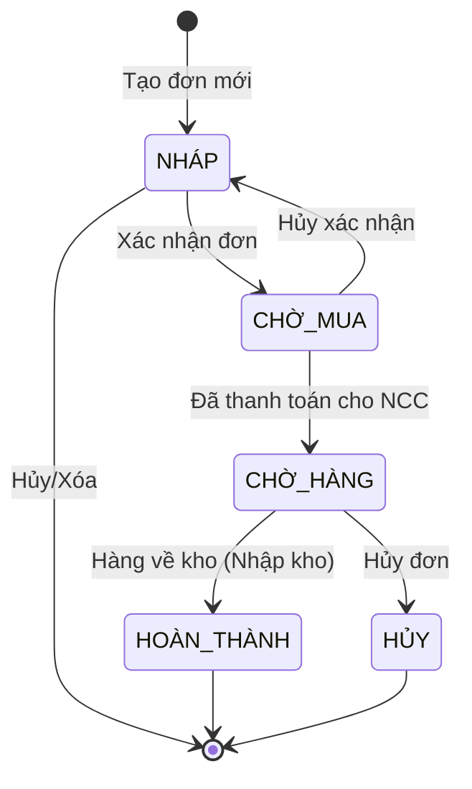

# TÀI LIỆU YÊU CẦU KỸ THUẬT (PRD) & THIẾT KẾ UI/UX
## Trang Quản Lý Đặt Hàng Nhà Cung Cấp (Purchase Orders)

**URL gốc:** https://n2store.vercel.app/purchase-orders  
**Ngày phân tích:** 30/12/2024  
**Phiên bản:** 1.0

---

## Demo Recording


---

## 1. TỔNG QUAN (Overview)

### 1.1. Mục đích chính
Trang này được thiết kế để **quản lý toàn bộ vòng đời của đơn đặt hàng từ nhà cung cấp (NCC)**. Từ lúc tạo bản nháp, xác nhận mua hàng, đến khi hàng về kho. Người dùng có thể:
- Xem danh sách tất cả đơn đặt hàng
- Lọc/tìm kiếm đơn hàng theo nhiều tiêu chí
- Theo dõi tiến độ xử lý qua các trạng thái
- Thao tác CRUD (Tạo, Xem, Sửa, Xóa) trên từng đơn

### 1.2. Bố cục chung (Layout)

```
┌─────────────────────────────────────────────────────────────────────────┐
│   SIDEBAR (Cố định bên trái, ~260px)                                    │
│   ┌───────────────────────────────────────────────────────────────────┐ │
│   │ Logo + Tên thương hiệu                                            │ │
│   ├───────────────────────────────────────────────────────────────────┤ │
│   │ Menu chính:                                                       │ │
│   │   • Dashboard                                                     │ │
│   │   • Đơn hàng                                                      │ │
│   │   • Quản lý đặt hàng (Active)                                     │ │
│   │   • Báo cáo đơn hàng                                              │ │
│   │   • Theo dõi mua hàng                                             │ │
│   │   • So khớp hóa đơn                                               │ │
│   │   • Lịch sử số dư                                                 │ │
│   │   • Quản lý khách hàng                                            │ │
│   │   • Quản lý người dùng                                            │ │
│   ├───────────────────────────────────────────────────────────────────┤ │
│   │ Footer: Avatar + Tên người dùng + Logout                          │ │
│   └───────────────────────────────────────────────────────────────────┘ │
├─────────────────────────────────────────────────────────────────────────┤
│                    MAIN CONTENT AREA                                    │
│   ┌───────────────────────────────────────────────────────────────────┐ │
│   │ HEADER: Tiêu đề trang + Mô tả + Nút "Tạo đơn đặt hàng"           │ │
│   ├───────────────────────────────────────────────────────────────────┤ │
│   │ SUMMARY CARDS: 5 thẻ thống kê nhanh (horizontal layout)          │ │
│   ├───────────────────────────────────────────────────────────────────┤ │
│   │ TABS: Nháp | Chờ mua | Chờ hàng                                   │ │
│   ├───────────────────────────────────────────────────────────────────┤ │
│   │ FILTER BAR: Date Range + Quick Filter + Search + Status Filter    │ │
│   ├───────────────────────────────────────────────────────────────────┤ │
│   │ MAIN TABLE: Bảng danh sách đơn hàng với nhiều cột                 │ │
│   │   (Có gộp dòng theo đơn hàng - Row Spanning)                      │ │
│   ├───────────────────────────────────────────────────────────────────┤ │
│   │ PAGINATION: "Showing X to Y of Z entries" + Page numbers          │ │
│   └───────────────────────────────────────────────────────────────────┘ │
└─────────────────────────────────────────────────────────────────────────┘
```

---

## 2. PHÂN TÍCH UI & VISUAL (Chi tiết giao diện)

### 2.1. Màu sắc chủ đạo

| Tên     | Mã màu HEX | Sử dụng cho                                      |
|---------|------------|--------------------------------------------------|
| Primary | `#2563eb`  | Nút bấm chính, tab active, liên kết, badge       |
| Primary Hover | `#1d4ed8` | Hover state của nút bấm chính            |
| Background | `#f8fafc` | Nền chính của toàn bộ trang                   |
| Card BG | `#ffffff`  | Nền của card, bảng, input                        |
| Border  | `#e2e8f0`  | Viền table, input, card                          |
| Text Primary | `#0f172a` | Tiêu đề, text quan trọng                    |
| Text Secondary | `#64748b` | Mô tả, placeholder, text phụ              |
| Text Muted | `#94a3b8` | Text rất nhạt, thời gian                       |
| Success | `#10b981`  | Badge "Hoàn thành", thông báo thành công         |
| Warning | `#f59e0b`  | Badge "Chờ xử lý"                                |
| Danger  | `#ef4444`  | Badge "Hủy", nút xóa, thông báo lỗi              |
| Info    | `#3b82f6`  | Badge "Chờ mua", "Chờ hàng"                      |

### 2.2. Typography

| Thành phần          | Font Family           | Font Weight | Font Size | Line Height |
|---------------------|-----------------------|-------------|-----------|-------------|
| Page Title (H1)     | Inter / System Sans   | 700 (Bold)  | 24px      | 32px        |
| Section Title       | Inter / System Sans   | 600 (Semi)  | 18px      | 28px        |
| Table Header        | Inter / System Sans   | 600 (Semi)  | 13px      | 20px        |
| Body Text           | Inter / System Sans   | 400 (Regular)| 14px     | 20px        |
| Small/Caption       | Inter / System Sans   | 400 (Regular)| 12px     | 16px        |
| Badge Text          | Inter / System Sans   | 500 (Medium)| 11px      | 16px        |

### 2.3. Spacing & Grid System

```
┌─ Sidebar ─┐┌───────────────── Main Content ─────────────────┐
│   260px   ││                                                 │
│           ││  Padding: 24px (p-6)                            │
│           ││                                                 │
│           ││  ┌─────┐ ┌─────┐ ┌─────┐ ┌─────┐ ┌─────┐       │
│           ││  │Card │ │Card │ │Card │ │Card │ │Card │       │
│           ││  └─────┘ └─────┘ └─────┘ └─────┘ └─────┘       │
│           ││     Gap: 16px (gap-4) giữa các cards           │
│           ││                                                 │
│           ││  Card padding: 16px-20px                        │
│           ││  Card border-radius: 8px (rounded-lg)           │
│           ││                                                 │
│           ││  Table cell padding: 12px 16px                  │
│           ││  Input height: 36-40px                          │
│           ││  Button padding: 8px 16px                       │
└───────────┘└─────────────────────────────────────────────────┘
```

### 2.4. Shadow & Effects

| Thành phần | Box Shadow                                        |
|------------|---------------------------------------------------|
| Card       | `0 1px 3px rgba(0,0,0,0.1), 0 1px 2px rgba(0,0,0,0.06)` |
| Dropdown   | `0 4px 6px -1px rgba(0,0,0,0.1), 0 2px 4px -1px rgba(0,0,0,0.06)` |
| Modal      | `0 25px 50px -12px rgba(0,0,0,0.25)`              |

---

## 3. CÁC THÀNH PHẦN CHỨC NĂNG (Functional Components)

### A. Header & Nút hành động chính


```
┌─────────────────────────────────────────────────────────────────────────┐
│ Quản lý đặt hàng                          [+ Tạo đơn đặt hàng]         │
│ Theo dõi và quản lý đơn đặt hàng từ nhà cung cấp                       │
└─────────────────────────────────────────────────────────────────────────┘
```

| Thành phần | Chi tiết |
|------------|----------|
| **Tiêu đề trang** | "Quản lý đặt hàng" - Font 24px bold, màu `#0f172a` |
| **Mô tả phụ** | "Theo dõi và quản lý đơn đặt hàng từ nhà cung cấp" - Font 14px, màu `#64748b` |
| **Nút "Tạo đơn đặt hàng"** | Nút Primary, có icon `+` bên trái, background `#2563eb`, text trắng, border-radius 6px |

**Hành vi:**
- Click nút "Tạo đơn đặt hàng" → Mở trang/modal tạo đơn mới

---

### B. Summary Cards (Thẻ thống kê)

```
┌──────────────┐ ┌──────────────┐ ┌──────────────┐ ┌──────────────┐ ┌──────────────┐
│ 📋 Tổng      │ │ 💰 Tổng      │ │ 📅 Đơn       │ │ 💵 Giá trị   │ │ 🔄 Đồng bộ   │
│    đơn hàng  │ │    giá trị   │ │    hôm nay   │ │    hôm nay   │ │    TPOS      │
│              │ │              │ │              │ │              │ │              │
│    125       │ │ 45.500.000đ  │ │    12        │ │ 5.200.000đ   │ │   85%        │
└──────────────┘ └──────────────┘ └──────────────┘ └──────────────┘ └──────────────┘
```

| Card | Icon | Label | Data Type | Định dạng |
|------|------|-------|-----------|-----------|
| 1 | 📋 (FileText) | Tổng đơn hàng | Number | Integer, không phân cách |
| 2 | 💰 (DollarSign) | Tổng giá trị | Currency | X.XXX.XXX đ |
| 3 | 📅 (Calendar) | Đơn hôm nay | Number | Integer |
| 4 | 💵 (Wallet) | Giá trị hôm nay | Currency | X.XXX.XXX đ |
| 5 | 🔄 (RefreshCw) | Đồng bộ TPOS | Percentage | XX% hoặc X/Y |

**Thiết kế Card:**
- Background: `#ffffff`
- Border: 1px solid `#e2e8f0`
- Border-radius: 8px
- Padding: 16px
- Icon: 20x20px, màu `#64748b`
- Label: 12px, màu `#64748b`
- Value: 24px bold, màu `#0f172a`

---

### C. Tabs (Thanh chuyển đổi trạng thái)

```
┌──────────────────────────────────────────────────────────────────┐
│  [ Nháp (3) ]    [ Chờ mua (15) ]    [ Chờ hàng (8) ]           │
│     ─────                                                        │
│    (active)                                                      │
└──────────────────────────────────────────────────────────────────┘
```

| Tab | Trạng thái tương ứng | Mô tả |
|-----|----------------------|-------|
| **Nháp** | `DRAFT` | Đơn mới tạo, chưa xác nhận, có thể chỉnh sửa thoải mái |
| **Chờ mua** | `WAITING_FOR_PURCHASE` | Đơn đã xác nhận, đang chờ xuất tiền mua hàng |
| **Chờ hàng** | `WAITING_FOR_DELIVERY` | Đã thanh toán cho NCC, đang chờ giao hàng về kho |

**Visual:**
- Tab active: Text màu `#2563eb`, có underline 2px màu `#2563eb`
- Tab inactive: Text màu `#64748b`, không underline
- Badge số lượng: Background nhạt tương ứng, border-radius 9999px (pill)

---

### D. Filter Bar (Bộ lọc)


```
┌────────────────┐ ┌────────────────┐ ┌────────────────┐ ┌────────────────────────────┐ ┌────────────────┐
│ 📅 Từ ngày     │ │ 📅 Đến ngày    │ │ 🕐 Lọc nhanh   │ │ 🔍 Tìm theo NCC, mã SP...  │ │ Trạng thái ▼   │
│   dd/mm/yyyy   │ │   dd/mm/yyyy   │ │   [Tất cả ▼]   │ │                            │ │ [CHỜ MUA ▼]    │
└────────────────┘ └────────────────┘ └────────────────┘ └────────────────────────────┘ └────────────────┘
```

#### D.1. Date Picker (Từ ngày / Đến ngày)

| Thuộc tính | Giá trị |
|------------|---------|
| Type | Date Picker |
| Format | `dd/mm/yyyy` |
| Icon | Calendar (bên trái) |
| Placeholder | `DD/MM/YYYY` |
| Width | ~150px |

**Hành vi:** 
- Click → Mở lịch chọn ngày (Calendar popup)
- Chọn ngày → Tự động filter lại danh sách

#### D.2. Lọc nhanh (Quick Filter Dropdown)

| Option | Giá trị |
|--------|---------|
| Tất cả | Không giới hạn thời gian |
| Hôm nay | Ngày hiện tại |
| Hôm qua | Ngày hôm qua |
| 7 ngày qua | 7 ngày gần nhất |
| 30 ngày qua | 30 ngày gần nhất |
| Tháng này | Từ ngày 1 đến hiện tại của tháng |
| Tháng trước | Toàn bộ tháng trước |

**Hành vi:**
- Click → Mở dropdown danh sách options
- Chọn option → Tự động cập nhật "Từ ngày" và "Đến ngày" tương ứng

#### D.3. Search Bar (Ô tìm kiếm)

| Thuộc tính | Giá trị |
|------------|---------|
| Placeholder | "Tìm theo NCC, mã sản phẩm..." |
| Icon | 🔍 Search (bên trái) |
| Width | Flex-grow (chiếm hết không gian còn lại) |
| Debounce | 300ms (gõ xong 300ms mới search) |

#### D.4. Status Filter (Lọc theo trạng thái)

Hiển thị các trạng thái chi tiết trong tab hiện tại.

---

### E. BẢNG DỮ LIỆU CHÍNH (Main Table) - ⚠️ QUAN TRỌNG

Đây là phần **phức tạp nhất** của trang, sử dụng kỹ thuật **Row Spanning** (gộp dòng).

#### E.1. Cấu trúc cột đầy đủ

| STT | Tên cột | Data Type | Width | Align | Gộp dòng? | Mô tả |
|-----|---------|-----------|-------|-------|-----------|-------|
| 1 | **Ngày đặt** | DateTime | 120px | Left | ✅ Có | Ngày tạo đơn + giờ phút (dòng nhỏ bên dưới) |
| 2 | **Nhà cung cấp** | Text | 150px | Left | ✅ Có | Tên NCC + badge số lượng SP |
| 3 | **Hóa đơn (VND)** | Currency + Image | 140px | Left | ✅ Có | Thumbnail ảnh hóa đơn + tổng tiền đơn |
| 4 | **Tên sản phẩm** | Text | Flex | Left | ❌ Không | Tên đầy đủ của sản phẩm |
| 5 | **Mã sản phẩm** | Text | 100px | Left | ❌ Không | SKU / Mã định danh |
| 6 | **Biến thể** | Text | 80px | Center | ❌ Không | Size / Màu sắc |
| 7 | **Số lượng** | Number | 80px | Center | ❌ Không | Số lượng đặt (Bold) |
| 8 | **Giá mua (VND)** | Currency | 120px | Right | ❌ Không | Giá nhập 1 đơn vị |
| 9 | **Giá bán (VND)** | Currency | 120px | Right | ❌ Không | Giá niêm yết + icon ảnh SP |
| 10 | **Ghi chú** | Text | 150px | Left | ❌ Không | Ghi chú tự do |
| 11 | **Trạng thái** | Badge | 100px | Center | ❌ Không | Badge màu theo status |
| 12 | **Thao tác** | Actions | 120px | Center | ✅ Có | Nhóm icon + checkbox |

#### E.2. Visual Design của Table

```
┌──────────┬──────────────┬──────────────┬─────────────────────────┬────────┬────────┬──────┬──────────┬──────────┬─────────┬──────────┬─────────┐
│ Ngày đặt │ Nhà cung cấp │ Hóa đơn      │ Tên sản phẩm            │ Mã SP  │ Biến   │ SL   │ Giá mua  │ Giá bán  │ Ghi chú │ Trạng    │ Thao    │
│          │              │ (VND)        │                         │        │ thể    │      │ (VND)    │ (VND)    │         │ thái     │ tác     │
├──────────┼──────────────┼──────────────┼─────────────────────────┼────────┼────────┼──────┼──────────┼──────────┼─────────┼──────────┼─────────┤
│ 28/12    │ A62          │ [🖼️]         │ 2512 A6 DÉP KẸP HOA...  │ P111   │ 37     │ 1    │ 85.000   │ 175.000  │         │ CHỜ MUA  │ ✏️📥📋🗑️ │
│ 11:54    │ 23 sản phẩm  │ 2.355.000đ   ├─────────────────────────┼────────┼────────┼──────┼──────────┼──────────┼─────────┼──────────┤   ☑️    │
│          │              │              │ 2512 A6 DÉP KẸP HOA...  │ P111   │ 38     │ 2    │ 85.000   │ 175.000  │         │ CHỜ MUA  │         │
│          │              │              ├─────────────────────────┼────────┼────────┼──────┼──────────┼──────────┼─────────┼──────────┤         │
│          │              │              │ 2512 A6 DÉP KẸP HOA...  │ P111   │ 39     │ 1    │ 85.000   │ 175.000  │         │ CHỜ MUA  │         │
├──────────┼──────────────┼──────────────┼─────────────────────────┼────────┼────────┼──────┼──────────┼──────────┼─────────┼──────────┼─────────┤
│ 27/12    │ B45          │ [🖼️]         │ 2711 GIÀY CAO GÓT...    │ P098   │ 36     │ 2    │ 120.000  │ 280.000  │ Gấp     │ CHỜ HÀNG │ ✏️📥📋🗑️ │
│ 09:30    │ 5 sản phẩm   │ 890.000đ     │                         │        │        │      │          │          │         │          │   ☑️    │
└──────────┴──────────────┴──────────────┴─────────────────────────┴────────┴────────┴──────┴──────────┴──────────┴─────────┴──────────┴─────────┘
```

#### E.3. Chi tiết từng cột

**1. Ngày đặt:**
```html
<td rowspan="3">
  <div class="flex items-center gap-2">
    <CalendarIcon class="w-4 h-4 text-gray-400" />
    <div>
      <div class="font-semibold">28/12</div>
      <div class="text-xs text-gray-400">11:54</div>
    </div>
  </div>
</td>
```

**2. Nhà cung cấp:**
```html
<td rowspan="3">
  <div class="font-semibold">A62</div>
  <span class="text-xs bg-blue-50 text-blue-600 px-2 py-0.5 rounded">
    23 sản phẩm
  </span>
</td>
```

**3. Hóa đơn (VND):**
```html
<td rowspan="3">
  
  <div class="font-semibold text-green-600">2.355.000đ</div>
</td>
```

**4-10. Các cột sản phẩm:** Mỗi sản phẩm 1 dòng riêng

**11. Trạng thái (Badge):**

| Trạng thái | Background | Text Color | Border |
|------------|------------|------------|--------|
| NHÁP | `#f3f4f6` | `#6b7280` | none |
| CHỜ MUA | `#dbeafe` | `#2563eb` | none |
| CHỜ HÀNG | `#fef3c7` | `#d97706` | none |
| HOÀN THÀNH | `#d1fae5` | `#059669` | none |
| HỦY | `#fee2e2` | `#dc2626` | none |

**12. Thao tác:**

| Icon | Tooltip | Hành động |
|------|---------|-----------|
| ✏️ (Edit) | Sửa đơn | Mở form edit |
| 📥 (Download) | Xuất Excel | Tải file Excel đơn này |
| 📋 (Copy) | Sao chép | Clone đơn hàng |
| 🗑️ (Trash) | Xóa | Confirm xóa đơn |
| ☑️ (Checkbox) | Chọn | Chọn để thao tác hàng loạt |

---

### F. Pagination (Phân trang)

```
┌─────────────────────────────────────────────────────────────────────────┐
│ Showing 1 to 10 of 125 entries          [ < ] [ 1 ] [ 2 ] [ 3 ] [ > ]  │
└─────────────────────────────────────────────────────────────────────────┘
```

| Thành phần | Mô tả |
|------------|-------|
| Info text | "Showing X to Y of Z entries" - Bên trái |
| Page buttons | Số trang + Previous/Next - Bên phải |
| Active page | Background `#2563eb`, text trắng |
| Inactive page | Background `#f3f4f6`, text `#374151` |

---

## 4. LOGIC NGHIỆP VỤ (Business Logic)

### 4.1. Quy trình trạng thái (Status Flow)



### 4.2. Quy tắc nghiệp vụ (Business Rules)

| Rule ID | Mô tả | Validation |
|---------|-------|------------|
| BR-001 | Không được xóa đơn đã HOÀN THÀNH | Disable nút xóa, hiển thị tooltip "Không thể xóa đơn đã hoàn thành" |
| BR-002 | Không được sửa đơn đã HOÀN THÀNH hoặc HỦY | Disable nút edit |
| BR-003 | Bắt buộc có ít nhất 1 sản phẩm | Validate khi lưu đơn |
| BR-004 | Số lượng phải > 0 | Input chỉ nhận số nguyên dương |
| BR-005 | Giá mua phải >= 0 | Input chỉ nhận số >= 0 |
| BR-006 | NCC là trường bắt buộc | Required field |
| BR-007 | Đồng bộ TPOS chỉ khi đơn HOÀN THÀNH | Auto sync sau khi nhập kho |

### 4.3. Tính toán Summary Cards

```javascript
// Tổng đơn hàng
totalOrders = COUNT(orders)

// Tổng giá trị
totalValue = SUM(orders.total_amount)

// Đơn hôm nay
todayOrders = COUNT(orders WHERE created_at = TODAY)

// Giá trị hôm nay  
todayValue = SUM(orders.total_amount WHERE created_at = TODAY)

// Đồng bộ TPOS
tposSyncRate = COUNT(orders WHERE tpos_synced = true) / totalOrders * 100
```

---

## 5. MÔ TẢ DỮ LIỆU (JSON Schema mẫu)

### 5.1. Purchase Order Object

```json
{
  "id": "PO-20241228-001",
  "order_number": "DH-001",
  "created_at": "2025-12-28T11:54:00+07:00",
  "updated_at": "2025-12-28T15:30:00+07:00",
  "created_by": {
    "id": "user-123",
    "name": "Nguyễn Văn A",
    "email": "a.nguyen@example.com"
  },
  "supplier": {
    "id": "sup-a62",
    "code": "A62",
    "name": "Nhà cung cấp A62",
    "phone": "0901234567",
    "address": "123 Đường ABC, Quận 1, TP.HCM"
  },
  "status": "WAITING_FOR_PURCHASE",
  "invoice_image_url": "https://storage.example.com/invoices/inv-001.jpg",
  "total_amount": 2355000,
  "total_items": 23,
  "total_quantity": 45,
  "tpos_synced": false,
  "tpos_sync_at": null,
  "note": "Giao gấp trong tuần",
  "items": [
    {
      "id": "item-001",
      "product": {
        "id": "prod-p111",
        "sku": "P111",
        "name": "2512 A6 DÉP KẸP HOA ĐÁ VÀNG",
        "image_url": "https://storage.example.com/products/p111.jpg"
      },
      "variant": {
        "id": "var-001",
        "name": "37",
        "type": "size"
      },
      "quantity": 1,
      "purchase_price": 85000,
      "retail_price": 175000,
      "subtotal": 85000,
      "note": "",
      "status": "WAITING_FOR_PURCHASE"
    },
    {
      "id": "item-002",
      "product": {
        "id": "prod-p111",
        "sku": "P111",
        "name": "2512 A6 DÉP KẸP HOA ĐÁ VÀNG",
        "image_url": "https://storage.example.com/products/p111.jpg"
      },
      "variant": {
        "id": "var-002",
        "name": "38",
        "type": "size"
      },
      "quantity": 2,
      "purchase_price": 85000,
      "retail_price": 175000,
      "subtotal": 170000,
      "note": "",
      "status": "WAITING_FOR_PURCHASE"
    }
  ]
}
```

### 5.2. TypeScript Interfaces

```typescript
// Enums
enum OrderStatus {
  DRAFT = 'DRAFT',
  WAITING_FOR_PURCHASE = 'WAITING_FOR_PURCHASE',
  WAITING_FOR_DELIVERY = 'WAITING_FOR_DELIVERY',
  COMPLETED = 'COMPLETED',
  CANCELLED = 'CANCELLED'
}

enum VariantType {
  SIZE = 'size',
  COLOR = 'color'
}

// Interfaces
interface User {
  id: string;
  name: string;
  email: string;
}

interface Supplier {
  id: string;
  code: string;
  name: string;
  phone?: string;
  address?: string;
}

interface Product {
  id: string;
  sku: string;
  name: string;
  image_url?: string;
}

interface Variant {
  id: string;
  name: string;
  type: VariantType;
}

interface OrderItem {
  id: string;
  product: Product;
  variant: Variant;
  quantity: number;
  purchase_price: number;
  retail_price: number;
  subtotal: number;
  note?: string;
  status: OrderStatus;
}

interface PurchaseOrder {
  id: string;
  order_number: string;
  created_at: string; // ISO 8601
  updated_at: string;
  created_by: User;
  supplier: Supplier;
  status: OrderStatus;
  invoice_image_url?: string;
  total_amount: number;
  total_items: number;
  total_quantity: number;
  tpos_synced: boolean;
  tpos_sync_at?: string;
  note?: string;
  items: OrderItem[];
}

// API Response
interface PurchaseOrderListResponse {
  data: PurchaseOrder[];
  pagination: {
    page: number;
    per_page: number;
    total: number;
    total_pages: number;
  };
  summary: {
    total_orders: number;
    total_value: number;
    today_orders: number;
    today_value: number;
    tpos_sync_rate: number;
  };
}
```

### 5.3. Database Schema (SQL Reference)

```sql
-- Bảng Nhà cung cấp
CREATE TABLE suppliers (
  id VARCHAR(50) PRIMARY KEY,
  code VARCHAR(20) UNIQUE NOT NULL,
  name VARCHAR(200) NOT NULL,
  phone VARCHAR(20),
  address TEXT,
  created_at TIMESTAMP DEFAULT NOW(),
  updated_at TIMESTAMP DEFAULT NOW()
);

-- Bảng Đơn đặt hàng
CREATE TABLE purchase_orders (
  id VARCHAR(50) PRIMARY KEY,
  order_number VARCHAR(50) UNIQUE NOT NULL,
  supplier_id VARCHAR(50) REFERENCES suppliers(id),
  created_by VARCHAR(50) REFERENCES users(id),
  status ENUM('DRAFT', 'WAITING_FOR_PURCHASE', 'WAITING_FOR_DELIVERY', 'COMPLETED', 'CANCELLED'),
  invoice_image_url TEXT,
  total_amount DECIMAL(15,2) DEFAULT 0,
  total_items INT DEFAULT 0,
  total_quantity INT DEFAULT 0,
  tpos_synced BOOLEAN DEFAULT FALSE,
  tpos_sync_at TIMESTAMP NULL,
  note TEXT,
  created_at TIMESTAMP DEFAULT NOW(),
  updated_at TIMESTAMP DEFAULT NOW()
);

-- Bảng Chi tiết đơn hàng
CREATE TABLE purchase_order_items (
  id VARCHAR(50) PRIMARY KEY,
  order_id VARCHAR(50) REFERENCES purchase_orders(id) ON DELETE CASCADE,
  product_id VARCHAR(50) REFERENCES products(id),
  variant_id VARCHAR(50) REFERENCES product_variants(id),
  quantity INT NOT NULL CHECK (quantity > 0),
  purchase_price DECIMAL(15,2) NOT NULL CHECK (purchase_price >= 0),
  retail_price DECIMAL(15,2) NOT NULL CHECK (retail_price >= 0),
  subtotal DECIMAL(15,2) GENERATED ALWAYS AS (quantity * purchase_price) STORED,
  note TEXT,
  status ENUM('DRAFT', 'WAITING_FOR_PURCHASE', 'WAITING_FOR_DELIVERY', 'COMPLETED', 'CANCELLED'),
  created_at TIMESTAMP DEFAULT NOW(),
  updated_at TIMESTAMP DEFAULT NOW()
);

-- Index để filter nhanh
CREATE INDEX idx_po_status ON purchase_orders(status);
CREATE INDEX idx_po_created_at ON purchase_orders(created_at);
CREATE INDEX idx_po_supplier ON purchase_orders(supplier_id);
```

---

## 6. GHI CHÚ CHO DEVELOPER

### 6.1. Thư viện đề xuất

| Loại | Thư viện | Lý do |
|------|----------|-------|
| Icons | Lucide React | Đơn giản, nhẹ, có đầy đủ icon cần thiết |
| UI Components | Shadcn/UI hoặc Headless UI | Flexibility cao, dễ customize |
| Date Picker | react-day-picker | Nhẹ, dễ tích hợp |
| Table | TanStack Table (React Table v8) | Hỗ trợ row spanning, sorting, filtering |
| State Management | Zustand hoặc React Query | Nhẹ, đủ dùng |

### 6.2. Điểm kỹ thuật khó

1. **Row Spanning trong Table:** Xử lý logic gộp dòng cho các cột "Ngày đặt", "NCC", "Hóa đơn". Cần tính toán `rowSpan` dựa trên số lượng items trong mỗi đơn.

2. **Responsive Design:** Bảng có nhiều cột, cần xử lý:
   - Horizontal scroll trên mobile
   - Hoặc ẩn bớt cột ít quan trọng
   - Hoặc chuyển sang Card layout trên mobile

3. **Real-time Updates:** Nếu cần cập nhật real-time khi có đơn mới, dùng WebSocket hoặc polling.

### 6.3. Accessibility (A11y)

- Tất cả nút bấm phải có `aria-label`
- Table cần có `<thead>` với `scope="col"`
- Form inputs cần có `<label>` tương ứng
- Focus states rõ ràng cho keyboard navigation
- Color contrast ratio tối thiểu 4.5:1

---

**Tài liệu này đảm bảo AI Developer có thể triển khai clone trang Purchase Orders một cách chính xác mà không cần hỏi lại.**
