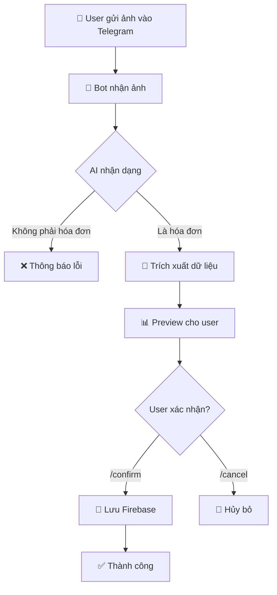

# Hướng Dẫn: Telegram Bot Nhận Ảnh Hóa Đơn → Import Inventory Tracking

> **Mục tiêu**: Bot Telegram nhận ảnh hóa đơn viết tay → AI phân tích → Import vào Firebase `inventory_tracking`

---

## Tổng Quan Luồng Xử Lý



---

## Firebase Đã Có Sẵn ✅

| Thành phần | Giá trị |
|------------|---------|
| Project | `n2shop-69e37` |
| Collection | `inventory_tracking` |
| Storage | `n2shop-69e37.appspot.com` |

> [!NOTE]
> Inventory-tracking và Telegram bot **cùng Firebase project**, chỉ cần dùng Firebase Admin SDK trên server.

---

## Cấu Trúc Dữ Liệu

### Từ ảnh hóa đơn → Firebase:

```javascript
// Trích xuất từ ảnh
{
    sttNCC: 15,              // Số khoanh đỏ
    sanPham: [
        { maSP: "721", tenSP: "MÃ 721 3 MÀU 50X23", soLuong: 4, donGia: 4600 }
    ],
    tongTien: 18400
}

// Lưu vào collection: inventory_tracking
{
    id: "ship_xxx_yyy",
    ngayDiHang: "2025-12-27",
    hoaDon: [{
        sttNCC: 15,
        anhHoaDon: "firebase_storage_url",
        sanPham: [...],
        tongTien: 18400
    }],
    tongTienHoaDon: 18400,
    tongMon: 4,
    createdBy: "telegram_bot"
}
```

---

## Logic Xử Lý NCC Trùng

```
Nhận hóa đơn NCC=15 cùng ngày
  → Nếu chưa có shipment ngày đó: Tạo mới
  → Nếu đã có shipment:
      → NCC 15 chưa có: Thêm hóa đơn mới vào mảng hoaDon[]
      → NCC 15 đã có: Gộp sản phẩm vào hóa đơn NCC 15 đó
```

**UI**: Bấm vào hàng NCC → Popup hiện tất cả hóa đơn của NCC đó

---

## Các File Cần Sửa/Tạo

### 1. Sửa [telegram-bot.js](file:///Users/mac/Downloads/n2store/render.com/routes/telegram-bot.js)
- Thêm xử lý `message.photo`
- Thêm hàm `analyzeInvoiceImage()` gọi Gemini Vision
- Thêm commands `/confirm`, `/cancel`

### 2. Tạo mới `firebase-inventory.js`
- Hàm `createShipmentFromTelegram()`
- Hàm `uploadToFirebaseStorage()`

> [!TIP]
> Firebase credentials đã có sẵn trên Render.com ✅

---

## Ảnh Mẫu Test

| File | NCC |
|------|-----|
| [IMG_5514.JPG](file:///Users/mac/Downloads/n2store/AI/IMG_5514.JPG) | 15 |
| [IMG_5515.JPG](file:///Users/mac/Downloads/n2store/AI/IMG_5515.JPG) | 11 |

---

## Checklist Thực Hiện

- [ ] Sửa `telegram-bot.js` - xử lý ảnh
- [ ] Tạo `firebase-inventory.js` - lưu Firestore  
- [ ] Cấu hình Firebase Admin SDK credentials
- [ ] Test với ảnh mẫu
- [ ] Deploy Render.com
