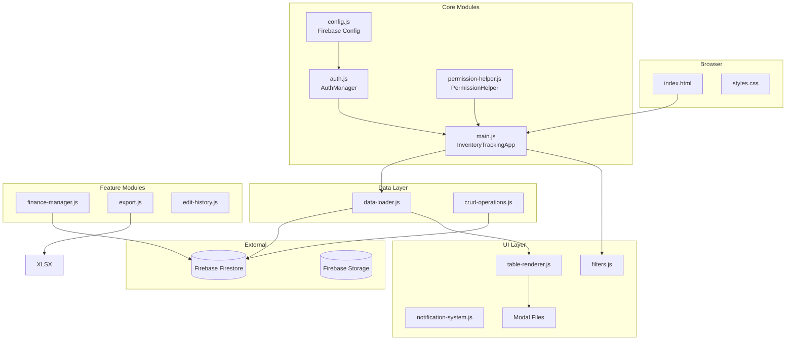
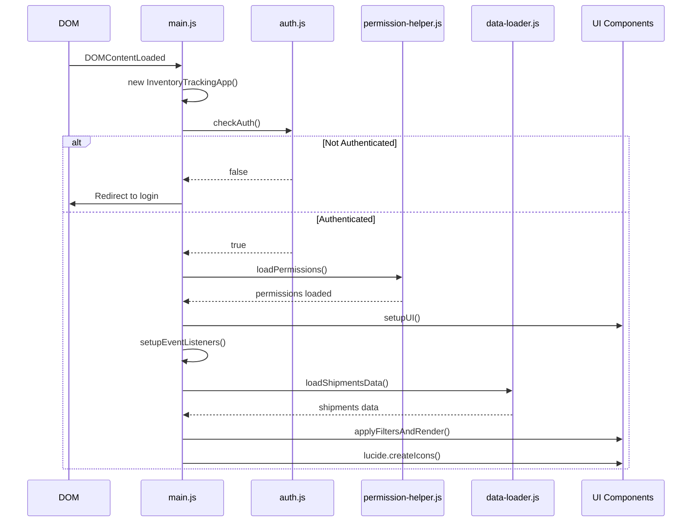
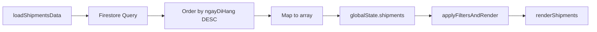
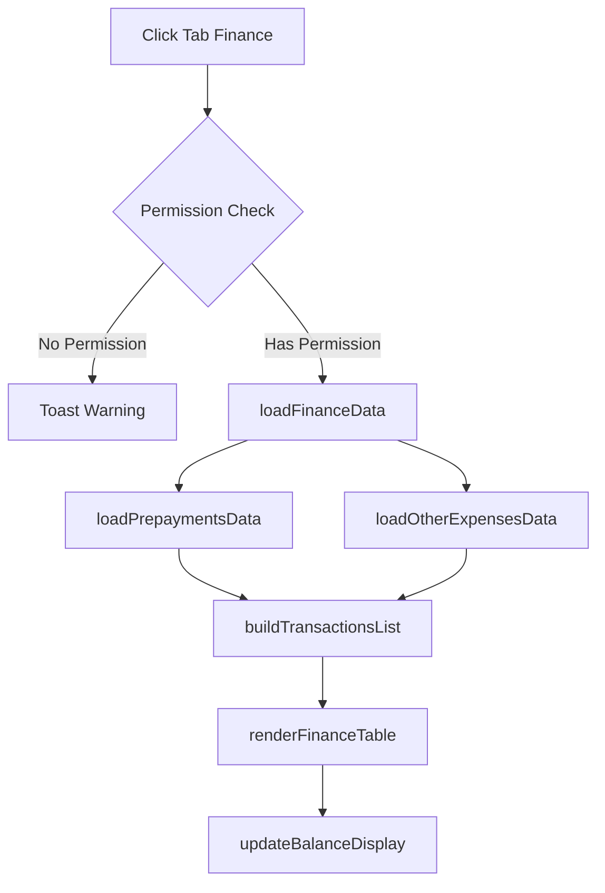

# Tài Liệu Chi Tiết: Inventory Tracking Page

> **URL**: https://nhijudyshop.github.io/n2store/inventory-tracking/index.html  
> **Tiêu đề**: Theo Dõi Nhập Hàng SL  
> **Ngày tạo**: 2025-12-26

---

## Mục Lục

- [Phase 1: Kiến Trúc Tổng Quan](#phase-1-kiến-trúc-tổng-quan)
- [Phase 2: Flow Khởi Tạo](#phase-2-flow-khởi-tạo)
- [Phase 3: CRUD Operations](#phase-3-crud-operations)
- [Phase 4: UI Components & Rendering](#phase-4-ui-components--rendering)
- [Phase 5: Finance Management](#phase-5-finance-management)
- [Phase 6: Permissions & Security](#phase-6-permissions--security)

---

## Phase 1: Kiến Trúc Tổng Quan

### 1.1 Cấu Trúc File JavaScript

```
inventory-tracking/
├── config.js              # Cấu hình Firebase & constants
├── auth.js                # Xác thực người dùng
├── permission-helper.js   # Quản lý quyền RBAC
├── main.js                # Entry point & orchestration
├── data-loader.js         # Tải dữ liệu từ Firestore
├── crud-operations.js     # Create, Update, Delete operations
├── table-renderer.js      # Render bảng shipments
├── filters.js             # Lọc dữ liệu
├── finance-manager.js     # Tab công nợ/tài chính
├── notification-system.js # Toast notifications
├── export.js              # Xuất Excel
├── modal-shipment.js      # Modal thêm/sửa đợt hàng
├── modal-prepayment.js    # Modal thanh toán trước
├── modal-other-expense.js # Modal chi phí khác
├── modal-shortage.js      # Modal cập nhật số món thiếu
├── modal-detail-invoice.js    # Modal chi tiết hóa đơn
├── modal-detail-shipping.js   # Modal chi tiết chi phí ship
└── edit-history.js        # Lịch sử chỉnh sửa
```

### 1.2 Firebase Collections

```javascript
const COLLECTIONS = {
    SHIPMENTS: 'inventory_tracking',      // Đợt hàng
    PREPAYMENTS: 'inventory_prepayments', // Thanh toán trước
    OTHER_EXPENSES: 'inventory_other_expenses', // Chi phí khác
    EDIT_HISTORY: 'edit_history',         // Lịch sử chỉnh sửa
    USERS: 'users',                       // Người dùng & quyền
};
```

### 1.3 Global State Object

```javascript
let globalState = {
    // Data từ Firestore
    shipments: [],          // Danh sách đợt hàng
    prepayments: [],        // Danh sách thanh toán trước
    otherExpenses: [],      // Danh sách chi phí khác
    
    // Filtered & computed data
    filteredShipments: [],  // Đợt hàng sau khi lọc
    transactions: [],       // Giao dịch cho tab công nợ
    
    // UI state
    isLoading: false,
    currentTab: 'tracking', // 'tracking' | 'finance'
    currentEditingId: null,
    
    // Filter state
    filters: {
        dateFrom: '',
        dateTo: '',
        ncc: 'all',
        product: '',
    },
    
    // User
    userPermissions: null,
};
```

### 1.4 Transaction Types

```javascript
const TRANSACTION_TYPES = {
    PREPAYMENT: 'prepayment',       // Thanh toán trước (+)
    INVOICE: 'invoice',             // Tiền hóa đơn (-)
    SHIPPING_COST: 'shipping_cost', // Chi phí hàng về (-)
    OTHER_EXPENSE: 'other_expense', // Chi phí khác (-)
};
```

### 1.5 Sơ Đồ Kiến Trúc



---

## Phase 2: Flow Khởi Tạo

### 2.1 Initialization Sequence



### 2.2 InventoryTrackingApp Class

```javascript
class InventoryTrackingApp {
    constructor() {
        this.isInitialized = false;
    }

    async init() {
        // 1. Check authentication
        if (!this.checkAuth()) return;
        
        // 2. Load user permissions
        await this.loadPermissions();
        
        // 3. Setup UI components
        this.setupUI();
        
        // 4. Setup event listeners
        this.setupEventListeners();
        
        // 5. Load initial data
        await this.loadData();
        
        // 6. Initialize Lucide icons
        lucide.createIcons();
        
        this.isInitialized = true;
    }
}
```

### 2.3 Authentication Check (auth.js)

```javascript
class AuthManager {
    init() {
        // Check sessionStorage first (session-only login)
        let authData = sessionStorage.getItem('loginindex_auth');
        
        // If not found, check localStorage (remembered login)
        if (!authData) {
            authData = localStorage.getItem('loginindex_auth');
        }
        
        if (authData && this.isValidSession(auth)) {
            this.currentUser = auth;
            return true;
        }
        
        this.clearAuth();
        return false;
    }
    
    isValidSession(auth, isFromSession = false) {
        // Session timeout:
        // - 8 hours for sessionStorage
        // - 30 days for localStorage (remembered)
        const SESSION_TIMEOUT = isFromSession
            ? 8 * 60 * 60 * 1000
            : 30 * 24 * 60 * 60 * 1000;
        
        return Date.now() - auth.timestamp <= SESSION_TIMEOUT;
    }
}
```

### 2.4 UI Setup Methods

| Method | Mô tả |
|--------|-------|
| `setupFilterToggle()` | Toggle collapse/expand filter section |
| `setupTabs()` | Tab navigation (Tracking/Finance) |
| `setDefaultDateFilters()` | Set default date range (30 ngày gần nhất) |
| `setupEventListeners()` | Bind events cho các buttons |
| `setupFilterListeners()` | Debounced filter input handlers |
| `setupModalCloseListeners()` | Modal close on overlay/ESC/cancel |

---

## Phase 3: CRUD Operations

### 3.1 Data Structure - Shipment

```javascript
{
    id: "ship_lxyz123_abc456",      // Auto-generated ID
    ngayDiHang: "2025-12-20",       // Ngày đi hàng (YYYY-MM-DD)
    kienHang: "K1, K2, K3",         // Kiện hàng
    
    hoaDon: [                        // Mảng hóa đơn
        {
            sttNCC: 1,               // Số thứ tự NCC
            anhHoaDon: "url...",     // URL ảnh hóa đơn
            sanPham: [
                {
                    maSP: "SP001",
                    tenSP: "Tên sản phẩm",
                    soLuong: 10,
                    donGia: 100000,
                    rawText: "SP001 x 10"
                }
            ],
            tongTien: 1000000
        }
    ],
    
    tongTienHoaDon: 1000000,         // Tổng tiền hóa đơn
    tongMon: 15,                     // Tổng số món
    soMonThieu: 2,                   // Số món thiếu
    
    chiPhiHangVe: [                  // Chi phí hàng về (Admin only)
        {
            loai: "Ship nội địa",
            soTien: 50000
        }
    ],
    tongChiPhi: 50000,
    
    ghiChuAdmin: "Ghi chú...",       // Ghi chú admin (Admin only)
    
    // Metadata
    createdAt: Timestamp,
    updatedAt: Timestamp,
    createdBy: "username",
    updatedBy: "username"
}
```

### 3.2 CRUD Functions

#### Create Shipment
```javascript
async function createShipment(data) {
    const shipmentData = {
        ...data,
        id: generateId('ship'),
        createdAt: firebase.firestore.Timestamp.now(),
        updatedAt: firebase.firestore.Timestamp.now(),
        createdBy: authManager.getUserName(),
        updatedBy: authManager.getUserName()
    };
    
    await shipmentsRef.doc(shipmentData.id).set(shipmentData);
    await logEditHistory('create', 'shipment', shipmentData.id, null, shipmentData);
    
    toast.success('Đã tạo đợt hàng mới');
}
```

#### Update Shipment
```javascript
async function updateShipment(id, data) {
    const oldDoc = await shipmentsRef.doc(id).get();
    const oldData = oldDoc.data();
    
    const updateData = {
        ...data,
        updatedAt: firebase.firestore.Timestamp.now(),
        updatedBy: authManager.getUserName()
    };
    
    await shipmentsRef.doc(id).update(updateData);
    await logEditHistory('update', 'shipment', id, oldData, updateData);
    
    toast.success('Đã cập nhật đợt hàng');
}
```

#### Delete Shipment
```javascript
async function deleteShipment(id) {
    if (!confirm('Bạn có chắc muốn xóa đợt hàng này?')) return;
    
    const oldDoc = await shipmentsRef.doc(id).get();
    await shipmentsRef.doc(id).delete();
    await logEditHistory('delete', 'shipment', id, oldData, null);
    await loadShipmentsData(); // Refresh
    
    toast.success('Đã xóa đợt hàng');
}
```

### 3.3 Data Loading Flow



---

## Phase 4: UI Components & Rendering

### 4.1 Filter System

```javascript
function applyFiltersAndRender() {
    let filtered = [...globalState.shipments];
    
    // 1. Filter by date range
    if (dateFrom) filtered = filtered.filter(s => s.ngayDiHang >= dateFrom);
    if (dateTo) filtered = filtered.filter(s => s.ngayDiHang <= dateTo);
    
    // 2. Filter by NCC
    if (ncc !== 'all') {
        filtered = filtered.filter(s =>
            s.hoaDon?.some(hd => String(hd.sttNCC) === String(ncc))
        );
    }
    
    // 3. Filter by product code
    if (product) {
        filtered = filtered.filter(s =>
            s.hoaDon?.some(hd =>
                hd.sanPham?.some(sp =>
                    sp.maSP?.toLowerCase().includes(product) ||
                    sp.rawText?.toLowerCase().includes(product)
                )
            )
        );
    }
    
    globalState.filteredShipments = filtered;
    renderShipments(filtered);
    updateNCCFilterOptions();
}
```

### 4.2 Notification System

```javascript
class NotificationManager {
    show(message, type = 'info', duration = 3000) {
        // Create toast element
        const toast = document.createElement('div');
        toast.className = `toast toast-${type}`;
        
        // Add to container & animate
        this.container.appendChild(toast);
        toast.classList.add('show');
        
        // Auto-remove after duration
        setTimeout(() => this.remove(toast), duration);
    }
    
    // Convenience methods
    success(msg) { return this.show(msg, 'success', 3000); }
    error(msg)   { return this.show(msg, 'error', 5000); }
    warning(msg) { return this.show(msg, 'warning', 4000); }
    info(msg)    { return this.show(msg, 'info', 3000); }
    loading(msg) { /* Returns persistent toast */ }
}

// Global alias
window.toast = {
    success: (msg) => notificationManager.success(msg),
    error: (msg) => notificationManager.error(msg),
    // ...
};
```

### 4.3 Modal Management

```javascript
// Open modal
openModal(modalId) {
    const modal = document.getElementById(modalId);
    modal.classList.add('active');
    document.body.style.overflow = 'hidden';
}

// Close modal
closeModal(modalId) {
    const modal = document.getElementById(modalId);
    modal.classList.remove('active');
    document.body.style.overflow = '';
}

// Close on ESC
document.addEventListener('keydown', (e) => {
    if (e.key === 'Escape') {
        const activeModal = document.querySelector('.modal.active');
        if (activeModal) closeModal(activeModal.id);
    }
});
```

---

## Phase 5: Finance Management

### 5.1 Tab Finance Flow



### 5.2 Transaction Building Logic

```javascript
function buildTransactionsList() {
    const transactions = [];
    
    // 1. Prepayments (+)
    globalState.prepayments.forEach(p => {
        transactions.push({
            type: TRANSACTION_TYPES.PREPAYMENT,
            ngay: p.ngay,
            soTien: p.soTien,
            isPositive: true
        });
    });
    
    // 2. Invoices (-) - Grouped by date
    const invoicesByDate = {};
    globalState.shipments.forEach(s => {
        // Group by ngayDiHang
        // Calculate totals
    });
    
    // 3. Shipping costs (-) - Grouped by date
    // Similar logic
    
    // 4. Other expenses (-)
    globalState.otherExpenses.forEach(e => {
        transactions.push({
            type: TRANSACTION_TYPES.OTHER_EXPENSE,
            ngay: e.ngay,
            soTien: e.soTien,
            isPositive: false
        });
    });
    
    // Sort by date
    transactions.sort((a, b) => a.ngay.localeCompare(b.ngay));
    
    globalState.transactions = transactions;
}
```

### 5.3 Transaction Actions

| Action | Function | Description |
|--------|----------|-------------|
| Edit | `editTransaction(type, id)` | Open appropriate modal based on type |
| Delete | `deleteTransaction(type, id)` | Delete with confirmation |
| View Detail | `viewTransactionDetail(type, date)` | Open detail modal for invoices/shipping |

---

## Phase 6: Permissions & Security

### 6.1 Permission Keys

```javascript
const DEFAULT_PERMISSIONS = {
    // Tab access
    tab_tracking: true,
    tab_congNo: false,
    
    // CRUD permissions - Tab 1
    create_shipment: false,
    edit_shipment: false,
    delete_shipment: false,
    
    // Field visibility - Tab 1
    view_ngayDiHang: true,
    view_kienHang: true,
    view_hoaDon: true,
    view_anhHoaDon: true,
    view_tongTien: true,
    view_tongMon: true,
    view_soMonThieu: true,
    edit_soMonThieu: false,
    view_chiPhiHangVe: false,    // Admin only
    edit_chiPhiHangVe: false,
    view_ghiChuAdmin: false,     // Admin only
    edit_ghiChuAdmin: false,
    
    // Tab 2 - Finance
    view_congNo: false,
    create_prepayment: false,
    edit_prepayment: false,
    delete_prepayment: false,
    create_otherExpense: false,
    edit_otherExpense: false,
    delete_otherExpense: false,
    edit_invoiceTotal: false,
    edit_shippingCost: false,
    
    // Export
    export_excel: true,
};
```

### 6.2 PermissionHelper Class

```javascript
class PermissionHelper {
    async loadPermissions() {
        const username = authManager.getUserName();
        const userDoc = await usersRef.doc(username).get();
        
        if (userDoc.exists) {
            const userData = userDoc.data();
            if (userData.inventoryTrackingPermissions) {
                this.permissions = {
                    ...DEFAULT_PERMISSIONS,
                    ...userData.inventoryTrackingPermissions,
                };
            }
        }
    }
    
    can(permissionKey) {
        return this.permissions[permissionKey] === true;
    }
    
    canAll(...keys) {
        return keys.every(key => this.can(key));
    }
    
    canAny(...keys) {
        return keys.some(key => this.can(key));
    }
    
    applyToUI() {
        // Tab Finance lock
        if (!this.can('tab_congNo')) {
            tabFinance.classList.add('disabled');
            financeLock.classList.remove('hidden');
        }
        
        // Hide buttons based on permissions
        btnAddShipment.style.display = this.can('create_shipment') ? '' : 'none';
        // ...
    }
}
```

### 6.3 Permission Usage Examples

```javascript
// In tab navigation
if (tabId === 'finance' && !permissionHelper.can('tab_congNo')) {
    toast.warning('Bạn không có quyền truy cập tab này');
    return;
}

// In table renderer
${this.can('edit_shipment') ? `<button onclick="editShipment('${id}')">Sửa</button>` : ''}

// In finance table
canEdit: permissionHelper.can('edit_prepayment'),
canDelete: permissionHelper.can('delete_prepayment'),
```

---

## Tổng Kết

### Key Functions Reference

| File | Function | Description |
|------|----------|-------------|
| `main.js` | `InventoryTrackingApp.init()` | Entry point |
| `auth.js` | `AuthManager.isAuthenticated()` | Check login status |
| `data-loader.js` | `loadShipmentsData()` | Fetch shipments |
| `data-loader.js` | `applyFiltersAndRender()` | Apply filters & render |
| `crud-operations.js` | `createShipment()` | Create new shipment |
| `crud-operations.js` | `updateShipment()` | Update shipment |
| `crud-operations.js` | `deleteShipment()` | Delete shipment |
| `filters.js` | `applyFilters()` | Apply filter values |
| `finance-manager.js` | `loadFinanceData()` | Load finance tab data |
| `finance-manager.js` | `buildTransactionsList()` | Build transaction list |
| `permission-helper.js` | `PermissionHelper.can()` | Check permission |
| `notification-system.js` | `toast.success/error/warning/info()` | Show notifications |

### Data Flow Summary

```
User Action → Event Handler → CRUD Function → Firestore → Reload Data → Re-render
```


