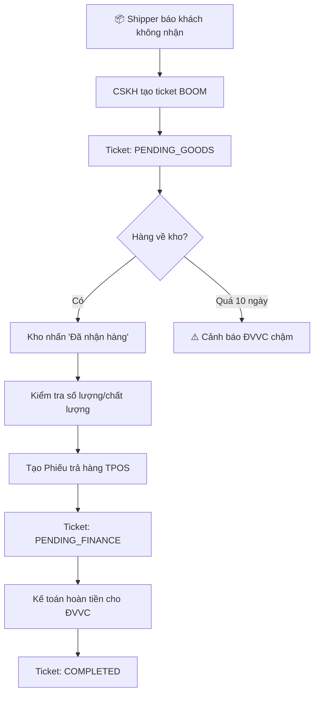
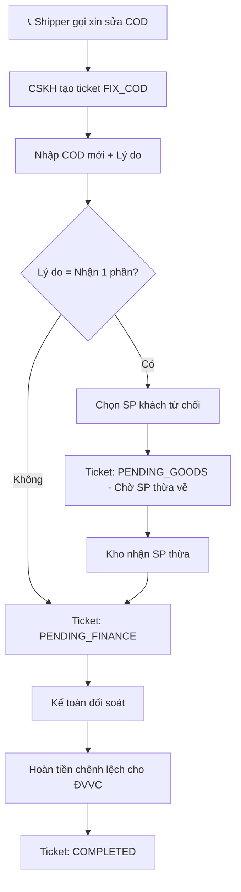
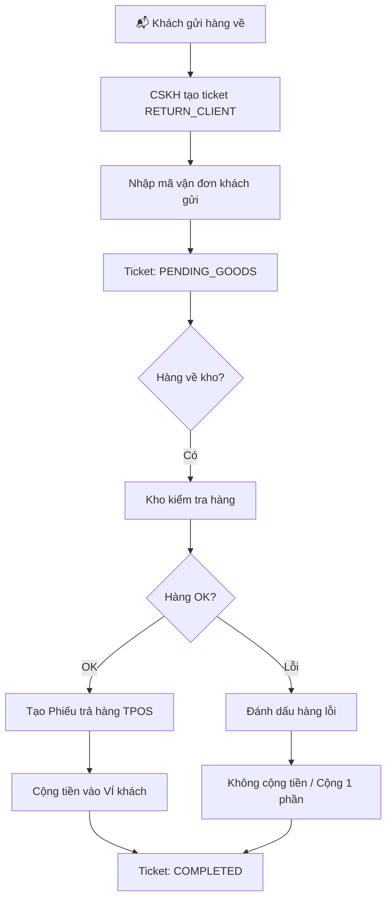
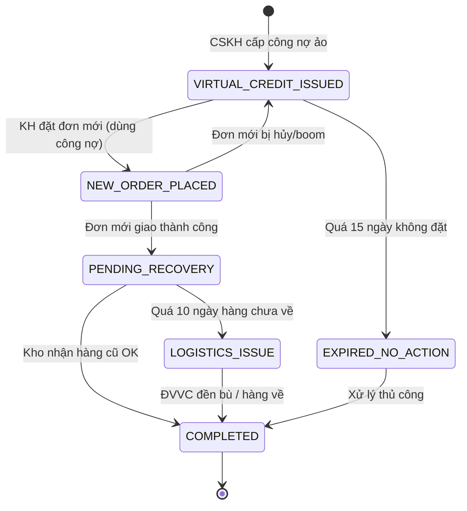

# TÀI LIỆU TỔNG HỢP: HỆ THỐNG QUẢN LÝ SỰ VỤ SAU BÁN HÀNG

> **Phiên bản:** 5.2 - Bản Thiết Kế Thực Thi Tuyệt Đối
> **Ngày cập nhật:** 2026-01-06
> **Mục đích:** Tài liệu duy nhất - AI Agent có thể code chính xác 100% không cần hỏi lại

---

# 🤖 HƯỚNG DẪN CHO AI AGENT

## ⚠️ LƯU Ý QUAN TRỌNG - ĐỌC TRƯỚC KHI LÀM BẤT CỨ ĐIỀU GÌ

```
┌─────────────────────────────────────────────────────────────────────────────┐
│  📋 QUY TẮC BẮT BUỘC CHO AI AGENT                                          │
├─────────────────────────────────────────────────────────────────────────────┤
│                                                                             │
│  1. TRƯỚC KHI BẮT ĐẦU CÔNG VIỆC:                                           │
│     → Đọc toàn bộ file này để hiểu context                                 │
│     → Xem phần "TIẾN ĐỘ THỰC HIỆN" để biết đã làm gì                       │
│     → Xem phần "TASK TIẾP THEO" để biết cần làm gì                         │
│     → Kiểm tra "PROJECT CONTEXT" để biết vị trí file, biến môi trường      │
│                                                                             │
│  2. TRONG KHI LÀM VIỆC:                                                    │
│     → Tuân thủ các quy tắc trong "CODING STANDARDS"                        │
│     → Tham chiếu "DATA MODEL" khi làm việc với database                    │
│     → Kiểm tra "API REFERENCE" khi gọi external services                   │
│     → Sử dụng "UI/UX STANDARDS" cho mọi thay đổi giao diện                 │
│     → Đọc "GLOBAL STATE" để biết cách truy xuất dữ liệu dùng chung         │
│     → Tuân thủ "SECURITY RULES" khi xử lý dữ liệu nhạy cảm                 │
│     → Dùng "ERROR MATRIX" để hiển thị thông báo lỗi chuẩn                  │
│                                                                             │
│  3. SAU KHI HOÀN THÀNH:                                                    │
│     → CHẠY TEST theo "DEFINITION OF DONE" của task                         │
│     → CẬP NHẬT file này với những gì đã làm                                │
│     → Đánh dấu checkbox ở phần TIẾN ĐỘ                                     │
│     → Ghi rõ ngày và mô tả thay đổi ở CHANGELOG                            │
│                                                                             │
│  4. ⚡ QUY TẮC CẬP NHẬT NGƯỢC (CRITICAL):                                  │
│     → Nếu phát hiện LOGIC MỚI chưa có trong tài liệu → CẬP NHẬT NGAY      │
│     → Nếu phát hiện BIẾN/FIELD MỚI chưa có trong Data Model → THÊM VÀO    │
│     → Nếu phát hiện EDGE CASE mới → Ghi vào phần Error Matrix              │
│     → Nếu thay đổi FLOW nghiệp vụ → Cập nhật Mermaid diagram               │
│     → KHÔNG ĐƯỢC kết thúc session mà không cập nhật tài liệu!              │
│                                                                             │
└─────────────────────────────────────────────────────────────────────────────┘
```

---

<a id="error-matrix"></a>
## 🚨 ERROR MATRIX (Ma trận Xử lý Lỗi)

> **Mục đích:** AI Agent PHẢI sử dụng bảng này để hiển thị thông báo lỗi chuẩn cho user.
> **Quy tắc:** KHÔNG tự nghĩ thông báo lỗi. Tra cứu bảng này trước.

### Lỗi API & Network

| Error Code | Nguyên nhân | Thông báo cho User (Tiếng Việt) | Action |
|------------|-------------|--------------------------------|--------|
| `TPOS_TIMEOUT` | Worker hoặc TPOS API chậm/quá tải | "Hệ thống TPOS đang bận, vui lòng thử lại sau 30 giây." | Retry button |
| `TPOS_NOT_FOUND` | Không tìm thấy đơn hàng | "Không tìm thấy đơn hàng với thông tin này. Vui lòng kiểm tra lại SĐT hoặc mã vận đơn." | None |
| `TPOS_ERROR` | TPOS trả về lỗi | "Lỗi từ hệ thống TPOS: {error_message}" | Contact admin |
| `NETWORK_ERROR` | Mất kết nối internet | "Không có kết nối mạng. Vui lòng kiểm tra internet và thử lại." | Retry button |
| `WORKER_ERROR` | Cloudflare Worker lỗi | "Máy chủ proxy đang gặp sự cố. Vui lòng thử lại sau." | Retry button |

### Lỗi Firebase & Authentication

| Error Code | Nguyên nhân | Thông báo cho User | Action |
|------------|-------------|-------------------|--------|
| `PERMISSION_DENIED` | User không có quyền | "Bạn không có quyền thực hiện thao tác này. Liên hệ Admin nếu cần." | None |
| `PERMISSION_ACCOUNTANT` | CSKH cố hoàn tất đơn | "Chỉ Kế toán mới được phép đánh dấu 'Đã thanh toán'." | None |
| `PERMISSION_WAREHOUSE` | Không phải Kho | "Chỉ nhân viên Kho mới được xác nhận 'Đã nhận hàng'." | None |
| `AUTH_EXPIRED` | Session hết hạn | "Phiên đăng nhập đã hết hạn. Vui lòng đăng nhập lại." | Redirect login |
| `AUTH_REQUIRED` | Chưa đăng nhập | "Vui lòng đăng nhập để tiếp tục." | Redirect login |
| `FIREBASE_OFFLINE` | Firebase mất kết nối | "Đang mất kết nối với server. Dữ liệu sẽ tự đồng bộ khi có mạng." | Auto-retry |

### Lỗi Wallet (Ví khách hàng)

| Error Code | Nguyên nhân | Thông báo cho User | Action |
|------------|-------------|-------------------|--------|
| `INSUFFICIENT_BALANCE` | Số dư không đủ | "Số dư ví khách hàng ({current_balance}) không đủ để thanh toán đơn này ({required_amount})." | Show wallet |
| `WALLET_NOT_FOUND` | Khách chưa có ví | "Khách hàng chưa có ví. Hệ thống sẽ tự động tạo ví mới." | Auto-create |
| `INVALID_AMOUNT` | Số tiền không hợp lệ | "Số tiền không hợp lệ. Vui lòng nhập số dương." | Focus input |
| `AMOUNT_EXCEED_LIMIT` | Vượt giới hạn | "Số tiền vượt quá giới hạn cho phép (100 triệu đồng)." | None |
| `VIRTUAL_CREDIT_EXPIRED` | Công nợ ảo hết hạn | "Công nợ ảo của khách đã hết hạn vào ngày {expiry_date}." | None |

### Lỗi Validation (Nhập liệu)

| Error Code | Nguyên nhân | Thông báo cho User | Action |
|------------|-------------|-------------------|--------|
| `INVALID_PHONE` | SĐT sai định dạng | "Số điện thoại không hợp lệ. Phải bắt đầu bằng 0 và có 10-11 số." | Focus input |
| `INVALID_ORDER_ID` | Thiếu mã đơn | "Vui lòng chọn đơn hàng trước khi tạo sự vụ." | Highlight field |
| `INVALID_TICKET_TYPE` | Chưa chọn loại | "Vui lòng chọn loại sự vụ." | Focus select |
| `INVALID_COD` | COD không hợp lệ | "COD mới phải là số không âm và nhỏ hơn COD gốc." | Focus input |
| `NO_PRODUCTS_SELECTED` | Chưa chọn SP | "Vui lòng chọn ít nhất 1 sản phẩm." | Highlight checklist |

### Lỗi Business Logic

| Error Code | Nguyên nhân | Thông báo cho User | Action |
|------------|-------------|-------------------|--------|
| `TICKET_ALREADY_COMPLETED` | Đơn đã hoàn tất | "Sự vụ này đã được hoàn tất trước đó." | None |
| `DUPLICATE_TICKET` | Trùng ticket | "Đã có sự vụ cho đơn hàng này. Bạn có muốn xem sự vụ hiện có?" | Link to ticket |
| `ORDER_ALREADY_CANCELLED` | Đơn đã hủy | "Đơn hàng này đã bị hủy trên TPOS, không thể tạo sự vụ." | None |
| `CARRIER_DEADLINE_EXCEEDED` | ĐVVC quá hạn | "⚠️ ĐVVC đã quá hạn 10 ngày! Cần liên hệ claim bồi thường." | Flag ticket |

### Hàm xử lý lỗi chuẩn

```javascript
// error-handler.js - AI Agent PHẢI sử dụng pattern này

const ErrorMessages = {
  // API & Network
  'TPOS_TIMEOUT': 'Hệ thống TPOS đang bận, vui lòng thử lại sau 30 giây.',
  'TPOS_NOT_FOUND': 'Không tìm thấy đơn hàng với thông tin này.',
  'NETWORK_ERROR': 'Không có kết nối mạng. Vui lòng kiểm tra internet.',

  // Firebase
  'PERMISSION_DENIED': 'Bạn không có quyền thực hiện thao tác này.',
  'PERMISSION_ACCOUNTANT': 'Chỉ Kế toán mới được phép đánh dấu "Đã thanh toán".',
  'AUTH_EXPIRED': 'Phiên đăng nhập đã hết hạn. Vui lòng đăng nhập lại.',

  // Wallet
  'INSUFFICIENT_BALANCE': 'Số dư ví khách hàng không đủ để thanh toán.',
  'WALLET_NOT_FOUND': 'Khách hàng chưa có ví.',

  // Validation
  'INVALID_PHONE': 'Số điện thoại không hợp lệ (phải 10-11 số, bắt đầu bằng 0).',
  'INVALID_ORDER_ID': 'Vui lòng chọn đơn hàng trước.',
  'INVALID_TICKET_TYPE': 'Vui lòng chọn loại sự vụ.',

  // Default
  'UNKNOWN': 'Đã xảy ra lỗi. Vui lòng thử lại hoặc liên hệ Admin.'
};

/**
 * Hiển thị thông báo lỗi chuẩn
 * @param {string} errorCode - Mã lỗi từ ErrorMessages
 * @param {object} params - Tham số động (optional)
 */
function showError(errorCode, params = {}) {
  let message = ErrorMessages[errorCode] || ErrorMessages['UNKNOWN'];

  // Replace dynamic params
  Object.keys(params).forEach(key => {
    message = message.replace(`{${key}}`, params[key]);
  });

  // Determine toast type
  const isWarning = errorCode.includes('DEADLINE') || errorCode.includes('EXPIRED');
  const toastType = isWarning ? 'warning' : 'error';

  showToast(toastType, message);
  console.error(`[Error] ${errorCode}:`, message, params);
}

// Sử dụng:
// showError('INSUFFICIENT_BALANCE', { current_balance: '200,000đ', required_amount: '350,000đ' });
// showError('TPOS_TIMEOUT');
// showError('PERMISSION_ACCOUNTANT');
```

---

<a id="project-context"></a>
## 📁 PROJECT CONTEXT (Môi trường và Ngữ cảnh)

### Vị trí Files trong Project

```
n2store/                              # ROOT PROJECT
│
├── orders-report/                    # Module Báo cáo đơn hàng
│   ├── api-config.js                 # ⚠️ SHARED: Server URLs, API endpoints
│   ├── api-handler.js                # ⚠️ SHARED: Address search, utilities
│   └── ...
│
├── issue-tracking/                   # 📍 MODULE HIỆN TẠI
│   ├── index.html                    # Entry point - UI chính
│   ├── script.js                     # Core logic (import api-service.js)
│   ├── api-service.js                # Firebase CRUD + TPOS API calls
│   ├── wallet-service.js             # [TẠO MỚI] Module ví khách hàng
│   ├── cron-jobs.js                  # [TẠO MỚI] Auto-expire jobs
│   ├── firebase-init.js              # Firebase configuration
│   ├── style.css                     # All styles
│   ├── images/                       # Guide images
│   └── MASTER_DOCUMENTATION.md       # 📄 FILE NÀY
│
└── shared/                           # Shared resources
    └── firebase-config.js            # Firebase keys (nếu có)
```

### Import Dependencies (Thứ tự quan trọng trong index.html)

```html
<!-- 1. Firebase SDK - PHẢI load trước -->
<script src="https://www.gstatic.com/firebasejs/8.10.0/firebase-app.js"></script>
<script src="https://www.gstatic.com/firebasejs/8.10.0/firebase-database.js"></script>
<script src="https://www.gstatic.com/firebasejs/8.10.0/firebase-auth.js"></script>

<!-- 2. Firebase Init - Sau SDK -->
<script src="firebase-init.js"></script>

<!-- 3. Shared Modules từ orders-report -->
<script src="../orders-report/api-config.js"></script>

<!-- 4. Local Modules - Theo thứ tự dependency -->
<script src="api-service.js"></script>
<script src="wallet-service.js"></script>      <!-- [MỚI] Sau api-service -->
<script src="cron-jobs.js"></script>            <!-- [MỚI] Sau wallet-service -->
<script src="script.js"></script>               <!-- Cuối cùng -->
```

### Biến Môi Trường (Environment Variables)

```javascript
// firebase-init.js - Firebase Configuration
// ⚠️ KHÔNG COMMIT giá trị thật lên Git public repo
const firebaseConfig = {
  apiKey: "YOUR_API_KEY",                    // Placeholder
  authDomain: "YOUR_PROJECT.firebaseapp.com",
  databaseURL: "https://YOUR_PROJECT-default-rtdb.firebaseio.com",
  projectId: "YOUR_PROJECT_ID",
  storageBucket: "YOUR_PROJECT.appspot.com",
  messagingSenderId: "YOUR_SENDER_ID",
  appId: "YOUR_APP_ID"
};

// api-config.js - API URLs
const API_CONFIG = {
  // Cloudflare Worker Proxy URL
  WORKER_URL: "https://your-worker.your-subdomain.workers.dev",

  // TPOS OData Base URL (qua proxy)
  TPOS_ODATA_BASE: "/api/odata",

  // SePay Webhook (Cloud Function)
  SEPAY_WEBHOOK_URL: "https://us-central1-YOUR_PROJECT.cloudfunctions.net/handleSepayWebhook"
};
```

### Thư viện bên thứ 3 - Phiên bản CHÍNH XÁC

| Library | Version | Import | Lưu ý |
|---------|---------|--------|-------|
| **Firebase SDK** | `8.10.0` | CDN script tags | ⚠️ Dùng v8 (compat), KHÔNG dùng v9 modular |
| **Mermaid.js** | `latest` | CDN | Cho flow diagrams |
| **Inter Font** | Google Fonts | CSS @import | Typography |

```javascript
// ⚠️ QUAN TRỌNG: Firebase v8 syntax (KHÔNG dùng v9 modular)

// ✅ ĐÚNG - Firebase v8 (chúng ta đang dùng)
const db = firebase.database();
const ref = db.ref('issue_tracking/tickets');
ref.push().set(data);
ref.on('value', snapshot => { ... });

// ❌ SAI - Firebase v9 modular (KHÔNG dùng)
import { getDatabase, ref, push } from 'firebase/database';
```

---

<a id="ui-standards"></a>
## 🎨 UI/UX STANDARDS (Tiêu chuẩn Giao diện)

### Design Tokens (Hệ màu)

```css
:root {
  /* === PRIMARY COLORS === */
  --color-primary: #2563eb;           /* Blue - Actions chính */
  --color-primary-hover: #1d4ed8;     /* Blue darker */
  --color-primary-light: #dbeafe;     /* Blue light background */

  /* === SEMANTIC COLORS === */
  --color-success: #10b981;           /* Green - Hoàn tất, thành công */
  --color-success-light: #d1fae5;
  --color-warning: #f59e0b;           /* Amber - Cảnh báo, chờ xử lý */
  --color-warning-light: #fef3c7;
  --color-danger: #ef4444;            /* Red - Lỗi, quá hạn */
  --color-danger-light: #fee2e2;
  --color-info: #3b82f6;              /* Blue - Thông tin */
  --color-info-light: #dbeafe;

  /* === NEUTRAL COLORS === */
  --color-text-primary: #1f2937;      /* Gray 800 */
  --color-text-secondary: #6b7280;    /* Gray 500 */
  --color-text-muted: #9ca3af;        /* Gray 400 */
  --color-border: #e5e7eb;            /* Gray 200 */
  --color-background: #f9fafb;        /* Gray 50 */
  --color-surface: #ffffff;           /* White */

  /* === EXTENDED STATUS COLORS === */
  --status-new: #3b82f6;              /* Blue */
  --status-pending: #f59e0b;          /* Amber */
  --status-virtual-credit: #8b5cf6;   /* Purple */
  --status-new-order: #06b6d4;        /* Cyan */
  --status-completed: #10b981;        /* Green */
  --status-expired: #ef4444;          /* Red */
  --status-logistics-issue: #ef4444;  /* Red */

  /* === SPACING === */
  --spacing-xs: 4px;
  --spacing-sm: 8px;
  --spacing-md: 16px;
  --spacing-lg: 24px;
  --spacing-xl: 32px;

  /* === BORDER RADIUS === */
  --radius-sm: 4px;
  --radius-md: 8px;
  --radius-lg: 12px;
  --radius-full: 9999px;

  /* === SHADOWS === */
  --shadow-sm: 0 1px 2px rgba(0, 0, 0, 0.05);
  --shadow-md: 0 4px 6px rgba(0, 0, 0, 0.1);
  --shadow-lg: 0 10px 15px rgba(0, 0, 0, 0.1);
}
```

### Layout Blueprint

```
┌─────────────────────────────────────────────────────────────────────────────┐
│  TOPBAR (height: 60px)                                                      │
│  ┌─────────────────────────────────────────────────────────────────────────┐│
│  │ Logo    │  Tabs (Chờ Hàng | Chờ ĐS | Hoàn Tất)  │  User │ Notifications ││
│  └─────────────────────────────────────────────────────────────────────────┘│
├─────────────────────────────────────────────────────────────────────────────┤
│  STATS BAR (height: 80px)                                                   │
│  ┌──────────┬──────────┬──────────┬──────────┐                              │
│  │ Chờ Hàng │ Chờ ĐS   │ Hoàn Tất │ Công Nợ  │                              │
│  │   12     │    5     │   234    │  3 ⚠️    │                              │
│  └──────────┴──────────┴──────────┴──────────┘                              │
├─────────────────────────────────────────────────────────────────────────────┤
│  TOOLBAR (height: 50px)                                                     │
│  ┌─────────────────────────────────────────────────────────────────────────┐│
│  │ [+ Tạo Sự Vụ]  │  🔍 Search...  │  Filter ▼  │  Sort ▼  │  [Export]    ││
│  └─────────────────────────────────────────────────────────────────────────┘│
├─────────────────────────────────────────────────────────────────────────────┤
│  MAIN CONTENT (flex: 1)                                                     │
│  ┌─────────────────────────────────────────────────────────────────────────┐│
│  │  TABLE / TICKET LIST                                                    ││
│  │  ┌─────┬──────────┬────────┬──────────┬────────┬─────────┬───────────┐ ││
│  │  │ #ID │ Đơn hàng │ Khách  │ Loại     │ Số tiền│ Trạng   │ Actions   │ ││
│  │  ├─────┼──────────┼────────┼──────────┼────────┼─────────┼───────────┤ ││
│  │  │ 001 │ NJD/...  │ Nguyễn │ BOOM     │ 350k   │ 🟡 Chờ  │ [Nhận]    │ ││
│  │  │ 002 │ NJD/...  │ Trần   │ FIX_COD  │ 100k   │ 🟢 Xong │           │ ││
│  │  └─────┴──────────┴────────┴──────────┴────────┴─────────┴───────────┘ ││
│  └─────────────────────────────────────────────────────────────────────────┘│
└─────────────────────────────────────────────────────────────────────────────┘
```

### Component Library

| Component | Class | Mô tả | Example |
|-----------|-------|-------|---------|
| **Button Primary** | `.btn-primary` | Nút hành động chính | `<button class="btn-primary">Xác Nhận</button>` |
| **Button Secondary** | `.btn-secondary` | Nút phụ | `<button class="btn-secondary">Hủy</button>` |
| **Button Danger** | `.btn-danger` | Nút xóa/hủy nguy hiểm | `<button class="btn-danger">Xóa</button>` |
| **Input Text** | `.form-input` | Input nhập liệu | `<input class="form-input" required>` |
| **Select** | `.form-select` | Dropdown chọn | `<select class="form-select">` |
| **Badge** | `.badge-{type}` | Status badge | `<span class="badge-success">Hoàn tất</span>` |
| **Card** | `.card` | Container card | `<div class="card">...</div>` |
| **Modal** | `.modal-overlay` | Modal container | Xem chi tiết bên dưới |
| **Table** | `.data-table` | Bảng dữ liệu | Xem chi tiết bên dưới |
| **Toast** | `.toast-{type}` | Notification | `showToast('success', 'Đã lưu')` |

### Button Styles

```css
/* Buttons */
.btn-primary {
  background: var(--color-primary);
  color: white;
  padding: var(--spacing-sm) var(--spacing-md);
  border-radius: var(--radius-md);
  border: none;
  cursor: pointer;
  font-weight: 500;
  transition: background 0.2s;
}
.btn-primary:hover { background: var(--color-primary-hover); }
.btn-primary:disabled { background: var(--color-text-muted); cursor: not-allowed; }

.btn-secondary {
  background: var(--color-surface);
  color: var(--color-text-primary);
  border: 1px solid var(--color-border);
  /* ...same padding, radius... */
}

.btn-danger {
  background: var(--color-danger);
  color: white;
  /* ...same padding, radius... */
}
```

### Input Styles

```css
/* Inputs */
.form-input, .form-select {
  width: 100%;
  padding: var(--spacing-sm) var(--spacing-md);
  border: 1px solid var(--color-border);
  border-radius: var(--radius-md);
  font-size: 14px;
  transition: border-color 0.2s, box-shadow 0.2s;
}
.form-input:focus, .form-select:focus {
  outline: none;
  border-color: var(--color-primary);
  box-shadow: 0 0 0 3px var(--color-primary-light);
}
.form-input::placeholder { color: var(--color-text-muted); }

/* Input với label */
.form-group {
  margin-bottom: var(--spacing-md);
}
.form-label {
  display: block;
  margin-bottom: var(--spacing-xs);
  font-weight: 500;
  color: var(--color-text-primary);
}
.form-label.required::after {
  content: " *";
  color: var(--color-danger);
}
```

### Modal Structure

```html
<!-- Modal Template -->
<div class="modal-overlay" id="modalCreate" style="display: none;">
  <div class="modal-container">
    <div class="modal-header">
      <h2 class="modal-title">Tạo Sự Vụ Mới</h2>
      <button class="modal-close" onclick="closeModal(modalCreate)">&times;</button>
    </div>
    <div class="modal-body">
      <!-- Content here -->
    </div>
    <div class="modal-footer">
      <button class="btn-secondary" onclick="closeModal(modalCreate)">Hủy</button>
      <button class="btn-primary" onclick="handleSubmit()">Xác Nhận</button>
    </div>
  </div>
</div>
```

```css
/* Modal Styles */
.modal-overlay {
  position: fixed;
  top: 0; left: 0; right: 0; bottom: 0;
  background: rgba(0, 0, 0, 0.5);
  display: flex;
  align-items: center;
  justify-content: center;
  z-index: 1000;
}
.modal-container {
  background: var(--color-surface);
  border-radius: var(--radius-lg);
  box-shadow: var(--shadow-lg);
  width: 90%;
  max-width: 600px;
  max-height: 90vh;
  overflow: hidden;
  display: flex;
  flex-direction: column;
}
.modal-header {
  padding: var(--spacing-md) var(--spacing-lg);
  border-bottom: 1px solid var(--color-border);
  display: flex;
  justify-content: space-between;
  align-items: center;
}
.modal-body {
  padding: var(--spacing-lg);
  overflow-y: auto;
  flex: 1;
}
.modal-footer {
  padding: var(--spacing-md) var(--spacing-lg);
  border-top: 1px solid var(--color-border);
  display: flex;
  justify-content: flex-end;
  gap: var(--spacing-sm);
}
```

### Table Styles

```css
/* Data Table */
.data-table {
  width: 100%;
  border-collapse: collapse;
}
.data-table th {
  text-align: left;
  padding: var(--spacing-sm) var(--spacing-md);
  background: var(--color-background);
  border-bottom: 2px solid var(--color-border);
  font-weight: 600;
  color: var(--color-text-secondary);
  font-size: 12px;
  text-transform: uppercase;
}
.data-table td {
  padding: var(--spacing-sm) var(--spacing-md);
  border-bottom: 1px solid var(--color-border);
  vertical-align: middle;
}
.data-table tr:hover {
  background: var(--color-background);
}

/* Empty State */
.table-empty {
  text-align: center;
  padding: var(--spacing-xl);
  color: var(--color-text-muted);
}
.table-empty-icon {
  font-size: 48px;
  margin-bottom: var(--spacing-md);
}
```

### Badge Styles

```css
/* Status Badges */
.badge {
  display: inline-flex;
  align-items: center;
  padding: 2px 8px;
  border-radius: var(--radius-full);
  font-size: 12px;
  font-weight: 500;
}

.badge-success { background: var(--color-success-light); color: #047857; }
.badge-warning { background: var(--color-warning-light); color: #b45309; }
.badge-danger { background: var(--color-danger-light); color: #b91c1c; }
.badge-info { background: var(--color-info-light); color: #1d4ed8; }
.badge-purple { background: #ede9fe; color: #6d28d9; }
.badge-cyan { background: #cffafe; color: #0e7490; }

/* Status-specific badges */
.badge-status-new { background: #dbeafe; color: #1d4ed8; }
.badge-status-pending { background: #fef3c7; color: #b45309; }
.badge-status-virtual-credit { background: #ede9fe; color: #6d28d9; }
.badge-status-completed { background: #d1fae5; color: #047857; }
.badge-status-expired { background: #fee2e2; color: #b91c1c; }
```

---

<a id="global-state"></a>
## 🗃️ GLOBAL STATE (Quản lý Trạng thái)

### AppState Object

```javascript
// Định nghĩa ở đầu script.js
// AI AGENT: Luôn truy xuất dữ liệu qua AppState, KHÔNG tạo biến global mới

window.AppState = {
  // === CURRENT USER ===
  currentUser: null,                    // Firebase Auth user object
  userRole: null,                       // 'ADMIN' | 'ACCOUNTANT' | 'WAREHOUSE' | 'CSKH'

  // === TICKETS DATA ===
  allTickets: [],                       // Tất cả tickets từ Firebase
  filteredTickets: [],                  // Tickets sau khi filter
  currentTicket: null,                  // Ticket đang xem/edit

  // === ORDER DATA (từ TPOS search) ===
  searchResults: [],                    // Kết quả tìm kiếm đơn hàng
  selectedOrder: null,                  // Đơn hàng được chọn để tạo ticket

  // === WALLET DATA ===
  currentWallet: null,                  // Ví của KH đang xem
  walletTransactions: [],               // Lịch sử giao dịch ví

  // === UI STATE ===
  currentTab: 'PENDING_GOODS',          // Tab đang active
  isLoading: false,                     // Loading state
  activeModal: null,                    // Modal đang mở

  // === FILTERS ===
  filters: {
    status: null,
    extendedStatus: null,
    type: null,
    dateFrom: null,
    dateTo: null,
    searchQuery: ''
  },

  // === PENDING ACTIONS ===
  pendingActionTicketId: null,          // ID ticket đang chờ confirm action
  pendingActionType: null               // 'RECEIVE' | 'SETTLE' | 'DELETE'
};
```

### Cách sử dụng AppState

```javascript
// ✅ ĐÚNG - Đọc từ AppState
function renderDashboard() {
  const tickets = AppState.filteredTickets;
  // render...
}

// ✅ ĐÚNG - Cập nhật AppState
function onTicketsLoaded(ticketsArray) {
  AppState.allTickets = ticketsArray;
  AppState.filteredTickets = applyFilters(ticketsArray);
  renderDashboard();
}

// ✅ ĐÚNG - Truy xuất user info
function checkPermission(action) {
  if (action === 'SETTLE' && AppState.userRole !== 'ACCOUNTANT') {
    alert('Chỉ Kế toán mới được thực hiện thao tác này');
    return false;
  }
  return true;
}

// ❌ SAI - Tạo biến global mới
let tickets = [];  // KHÔNG LÀM THẾ NÀY
var currentOrder; // KHÔNG LÀM THẾ NÀY
```

### State Update Pattern

```javascript
// Pattern chuẩn để update state và re-render

function updateFilters(newFilters) {
  // 1. Update state
  AppState.filters = { ...AppState.filters, ...newFilters };

  // 2. Apply filters
  AppState.filteredTickets = applyFilters(AppState.allTickets);

  // 3. Re-render
  renderDashboard();
  updateStats();
}

function applyFilters(tickets) {
  const { status, type, searchQuery, dateFrom, dateTo } = AppState.filters;

  return tickets.filter(ticket => {
    if (status && ticket.status !== status) return false;
    if (type && ticket.type !== type) return false;
    if (searchQuery) {
      const query = searchQuery.toLowerCase();
      if (!ticket.customer.toLowerCase().includes(query) &&
          !ticket.phone.includes(query) &&
          !ticket.orderId.toLowerCase().includes(query)) {
        return false;
      }
    }
    if (dateFrom && ticket.createdAt < dateFrom) return false;
    if (dateTo && ticket.createdAt > dateTo) return false;
    return true;
  });
}
```

---

<a id="security"></a>
## 🔒 SECURITY & DATA INTEGRITY (Bảo mật và Toàn vẹn Dữ liệu)

### Firebase Security Rules

```json
{
  "rules": {
    // === TICKETS ===
    "issue_tracking": {
      "tickets": {
        ".read": "auth != null",
        ".write": "auth != null",
        "$ticketId": {
          ".validate": "newData.hasChildren(['orderId', 'type', 'status', 'createdAt'])",

          // Chỉ ACCOUNTANT mới được chuyển sang COMPLETED
          "status": {
            ".validate": "newData.val() != 'COMPLETED' || root.child('users').child(auth.uid).child('role').val() == 'ACCOUNTANT' || root.child('users').child(auth.uid).child('role').val() == 'ADMIN'"
          }
        }
      }
    },

    // === WALLETS - Chỉ ACCOUNTANT/ADMIN mới được write ===
    "customer_wallets": {
      ".read": "auth != null",
      ".write": "auth != null && (root.child('users').child(auth.uid).child('role').val() == 'ACCOUNTANT' || root.child('users').child(auth.uid).child('role').val() == 'ADMIN')",

      "$phone": {
        // Balance không được âm
        "balance": {
          ".validate": "newData.val() >= 0"
        },
        "virtualBalance": {
          ".validate": "newData.val() >= 0"
        }
      }
    },

    // === TRANSACTIONS - Chỉ được tạo mới, không được sửa/xóa ===
    "wallet_transactions": {
      ".read": "auth != null",
      "$transactionId": {
        ".write": "auth != null && !data.exists()",  // Chỉ create, không update/delete
        ".validate": "newData.hasChildren(['phone', 'type', 'amount', 'balanceAfter', 'createdAt'])"
      }
    },

    // === SEPAY WEBHOOKS - Chỉ Cloud Functions ===
    "sepay_webhooks": {
      ".read": "auth != null && root.child('users').child(auth.uid).child('role').val() == 'ADMIN'",
      ".write": false  // Chỉ Cloud Functions (với admin SDK) mới write được
    }
  }
}
```

### Role-Based Access Control

| Role | Tickets | Wallet | Transactions | SePay Logs |
|------|---------|--------|--------------|------------|
| `ADMIN` | Full access | Full access | Read + Create | Read |
| `ACCOUNTANT` | Read + Update status | Full access | Read + Create | No |
| `WAREHOUSE` | Read + Update (nhận hàng) | Read only | No | No |
| `CSKH` | Read + Create | Read only | No | No |

```javascript
// Kiểm tra quyền trước mọi action
function checkPermission(action, resource) {
  const role = AppState.userRole;

  const permissions = {
    'ADMIN': ['*'],
    'ACCOUNTANT': ['ticket.read', 'ticket.update', 'ticket.complete', 'wallet.read', 'wallet.write'],
    'WAREHOUSE': ['ticket.read', 'ticket.receive', 'wallet.read'],
    'CSKH': ['ticket.read', 'ticket.create', 'wallet.read']
  };

  const userPerms = permissions[role] || [];
  if (userPerms.includes('*')) return true;
  return userPerms.includes(`${resource}.${action}`);
}
```

### Atomic Transactions (Wallet Operations)

```javascript
// ⚠️ BẮT BUỘC: Dùng Firebase Transaction cho mọi thao tác với số dư

// ✅ ĐÚNG - Sử dụng transaction
async function deposit(phone, amount, source, reference, note) {
  const walletRef = db.ref(`customer_wallets/${phone}`);

  return walletRef.transaction((currentData) => {
    if (currentData === null) {
      // Wallet chưa tồn tại
      return {
        phone,
        balance: amount,
        virtualBalance: 0,
        createdAt: firebase.database.ServerValue.TIMESTAMP,
        updatedAt: firebase.database.ServerValue.TIMESTAMP
      };
    }

    // Cộng tiền
    currentData.balance = (currentData.balance || 0) + amount;
    currentData.updatedAt = firebase.database.ServerValue.TIMESTAMP;
    return currentData;
  }).then((result) => {
    if (result.committed) {
      // Log transaction
      logWalletTransaction(phone, 'DEPOSIT', amount, result.snapshot.val().balance, source, reference, note);
      return result.snapshot.val();
    }
    throw new Error('Transaction failed');
  });
}

// ❌ SAI - Read rồi Write riêng lẻ (có thể gây sai số dư)
async function depositWrong(phone, amount) {
  const wallet = await getWallet(phone);
  wallet.balance += amount;  // Race condition!
  await walletRef.update(wallet);
}
```

### Input Validation

```javascript
// Validate tất cả input trước khi xử lý

const Validators = {
  phone: (value) => {
    const cleaned = value.replace(/[^0-9]/g, '');
    if (!/^0\d{9,10}$/.test(cleaned)) {
      throw new Error('Số điện thoại không hợp lệ (phải bắt đầu bằng 0, 10-11 số)');
    }
    return cleaned;
  },

  amount: (value) => {
    const num = parseInt(value, 10);
    if (isNaN(num) || num < 0) {
      throw new Error('Số tiền không hợp lệ');
    }
    if (num > 100000000) { // 100 triệu
      throw new Error('Số tiền vượt quá giới hạn');
    }
    return num;
  },

  orderId: (value) => {
    if (!value || value.trim().length === 0) {
      throw new Error('Mã đơn hàng không được để trống');
    }
    return value.trim();
  },

  ticketType: (value) => {
    const validTypes = ['FIX_COD', 'RETURN_CLIENT', 'RETURN_SHIPPER', 'BOOM', 'OTHER'];
    if (!validTypes.includes(value)) {
      throw new Error('Loại sự vụ không hợp lệ');
    }
    return value;
  }
};

// Sử dụng
try {
  const phone = Validators.phone(formData.phone);
  const amount = Validators.amount(formData.amount);
  // proceed...
} catch (error) {
  showToast('error', error.message);
  return;
}
```

---

<a id="formulas"></a>
## 📐 CÔNG THỨC TÀI CHÍNH

### Công thức tính tiền hoàn ĐVVC

$$
\text{RefundAmount} = \text{OriginalCOD} - \text{ActualCOD}
$$

Trong đó:
- `OriginalCOD`: COD ban đầu khi tạo đơn
- `ActualCOD`: COD thực tế thu được (có thể = 0 nếu boom)

**Ví dụ:**
```
Đơn hàng COD gốc: 500,000đ
Khách chỉ trả: 350,000đ (nhận 1 phần)
→ Số tiền shop phải hoàn ĐVVC = 500,000 - 350,000 = 150,000đ
```

### Công thức tính số dư Ví

$$
\text{TotalBalance} = \text{RealBalance} + \sum_{i=1}^{n} \text{VirtualCredit}_i \quad \text{where } status = \text{'ACTIVE'}
$$

$$
\text{AvailableBalance} = \text{RealBalance} + \sum_{i=1}^{n} \text{VirtualCredit}_i \quad \text{where } status = \text{'ACTIVE'} \land expiresAt > \text{now}
$$

### Công thức tính COD đơn mới (khi dùng Ví)

$$
\text{NewOrderCOD} = \max(0, \text{OrderTotal} - \text{WalletDeduction})
$$

$$
\text{WalletDeduction} = \min(\text{AvailableBalance}, \text{OrderTotal})
$$

**Logic trừ Ví (thứ tự ưu tiên):**
1. Trừ Công nợ ẢO trước (FIFO - sắp hết hạn trước)
2. Sau đó mới trừ Công nợ THỰC

```javascript
function calculateWalletDeduction(orderTotal, wallet) {
  let remaining = orderTotal;
  let virtualUsed = 0;
  let realUsed = 0;

  // 1. Trừ công nợ ẢO (FIFO by expiresAt)
  const activeCredits = wallet.virtualCredits
    .filter(c => c.status === 'ACTIVE' && c.expiresAt > Date.now())
    .sort((a, b) => a.expiresAt - b.expiresAt);

  for (const credit of activeCredits) {
    if (remaining <= 0) break;
    const use = Math.min(credit.amount, remaining);
    virtualUsed += use;
    remaining -= use;
  }

  // 2. Trừ công nợ THỰC
  if (remaining > 0 && wallet.balance > 0) {
    realUsed = Math.min(wallet.balance, remaining);
    remaining -= realUsed;
  }

  return {
    virtualUsed,
    realUsed,
    totalDeducted: virtualUsed + realUsed,
    newCOD: remaining  // Số tiền KH cần trả thêm
  };
}
```

---

## 📑 MỤC LỤC - THỨ TỰ ƯU TIÊN ĐỌC

> **AI Agent:** Đọc theo thứ tự từ trên xuống. Các phần đầu là QUAN TRỌNG NHẤT.

| # | Phần | Nội dung | Ưu tiên | Jump to |
|---|------|----------|---------|---------|
| **0** | 🤖 **AI RULES** | Quy tắc bắt buộc, cập nhật ngược | 🔴 CRITICAL | ⬆️ Đang ở đây |
| **1** | 🚨 **Error Matrix** | Thông báo lỗi chuẩn | 🔴 CRITICAL | [Jump](#error-matrix) |
| **2** | 📁 **Project Context** | Vị trí files, env vars, imports | 🔴 CRITICAL | [Jump](#project-context) |
| **3** | 🗃️ **Global State** | AppState object, patterns | 🔴 CRITICAL | [Jump](#global-state) |
| **4** | 🔒 **Security** | Firebase rules, RBAC, atomic | 🟠 HIGH | [Jump](#security) |
| **5** | 📐 **Formulas** | Công thức tài chính | 🟠 HIGH | [Jump](#formulas) |
| **6** | 🎨 **UI/UX Standards** | Design tokens, components | 🟡 MEDIUM | [Jump](#ui-standards) |
| | | | | |
| **A** | 📋 **Nghiệp vụ** | Flow công việc (cho BA/User) | 🟢 Reference | [Jump](#phan-a) |
| **B** | 🔧 **Kỹ thuật** | Data model, API | 🟢 Reference | [Jump](#phan-b) |
| **C** | 📅 **Kế hoạch** | Tasks, DoD, Roadmap | 🟢 Reference | [Jump](#phan-c) |
| **D** | 📊 **Tiến độ** | Changelog, Standards | 🟢 Reference | [Jump](#phan-d) |

```
┌─────────────────────────────────────────────────────────────────────────────┐
│  📖 CÁCH ĐỌC TÀI LIỆU NÀY (cho AI Agent)                                   │
├─────────────────────────────────────────────────────────────────────────────┤
│                                                                             │
│  LẦN ĐẦU VÀO SESSION:                                                      │
│  1. Đọc phần 0-3 (Rules, Error, Context, State) → ~5 phút                 │
│  2. Xem phần D (Tiến độ) → Biết task tiếp theo                             │
│  3. Đọc chi tiết task trong phần C                                         │
│                                                                             │
│  KHI CODE:                                                                  │
│  → Tra cứu phần 4-6 khi cần (Security, Formulas, UI)                       │
│  → Tra cứu phần A-B khi cần hiểu nghiệp vụ/data model                      │
│                                                                             │
│  KHI GẶP LỖI:                                                              │
│  → Tra phần 1 (Error Matrix) → Copy message chuẩn                          │
│                                                                             │
│  TRƯỚC KHI KẾT THÚC:                                                       │
│  → Cập nhật phần D (Changelog, Tiến độ)                                    │
│  → Nếu có logic mới → Cập nhật phần B (Data Model)                         │
│                                                                             │
└─────────────────────────────────────────────────────────────────────────────┘
```

---

<a id="phan-a"></a>
# PHẦN A: NGHIỆP VỤ XỬ LÝ

## A1. Tổng quan hệ thống

### A1.1 Mục đích
Hệ thống quản lý các sự vụ phát sinh **sau khi bán hàng**, giúp:
- Theo dõi hàng hoàn về (boom, trả hàng)
- Quản lý điều chỉnh COD
- Quản lý công nợ khách hàng
- Đối soát tài chính với ĐVVC

### A1.2 Các loại sự vụ

| Loại | Mã | Mô tả ngắn | Ví dụ |
|------|-----|------------|-------|
| **Boom hàng** | `BOOM` | Khách không nhận đơn | KH từ chối nhận, không liên lạc được |
| **Sửa COD** | `FIX_COD` | Shipper gọi xin điều chỉnh tiền thu | KH đòi giảm giá, chỉ nhận 1 phần |
| **Khách gửi** | `RETURN_CLIENT` | Khách tự gửi hàng về qua bưu điện | KH đổi size, trả hàng lỗi |
| **Thu về** | `RETURN_SHIPPER` | Shipper thu hàng cũ khi giao đơn mới | Đổi hàng tận nơi |
| **CSKH khác** | `OTHER` | Tư vấn, bảo hành, khiếu nại | Hỏi thông tin sản phẩm |

### A1.3 Nguyên tắc tài chính cốt lõi

```
┌─────────────────────────────────────────────────────────────────────────────┐
│  💰 ĐVVC ỨNG TRƯỚC 100% COD CHO SHOP NGAY KHI LẤY HÀNG                     │
├─────────────────────────────────────────────────────────────────────────────┤
│                                                                             │
│  Khi ĐVVC đã lấy hàng = Shop đã nhận đủ tiền COD                           │
│                                                                             │
│  → Nếu COD giảm (sửa COD, boom...) = Shop NỢ lại ĐVVC số chênh lệch        │
│  → Kế toán PHẢI chuyển khoản trả lại ĐVVC sau khi đối soát                 │
│                                                                             │
│  Công thức: Số tiền nợ ĐVVC = COD ban đầu - COD thực thu                   │
│                                                                             │
└─────────────────────────────────────────────────────────────────────────────┘
```

---

### A1.4 Ma trận Luồng Trạng thái (Status Flow Matrix)

> **⚠️ QUAN TRỌNG CHO AI AGENT:** Đây là bảng tham chiếu chính để xác định trạng thái ban đầu và luồng xử lý cho mỗi loại ticket.

#### Tổng quan 4 luồng xử lý

```
┌─────────────────────────────────────────────────────────────────────────────┐
│  📊 4 LUỒNG CHUYỂN TRẠNG THÁI                                               │
├─────────────────────────────────────────────────────────────────────────────┤
│                                                                             │
│  🔵 LUỒNG 1: Chờ Hàng → Chờ Đối Soát → Hoàn Tất                            │
│     (Có hàng hoàn VÀ có tiền chênh lệch cần trả ĐVVC)                      │
│                                                                             │
│  🟢 LUỒNG 2: Chờ Hàng → Hoàn Tất                                           │
│     (Có hàng hoàn NHƯNG không cần trả tiền ĐVVC)                           │
│                                                                             │
│  🟡 LUỒNG 3: Chờ Đối Soát → Hoàn Tất                                       │
│     (Không có hàng hoàn, chỉ cần đối soát tiền)                            │
│                                                                             │
│  ⚫ LUỒNG 4: Hoàn Tất Ngay                                                  │
│     (Xử lý ở Tab "Tất cả", bấm hoàn tất thủ công)                          │
│                                                                             │
└─────────────────────────────────────────────────────────────────────────────┘
```

#### Bảng chi tiết theo Loại Sự Vụ

| Loại sự vụ | Lý do (fixCodReason) | Status ban đầu | Luồng | Số tiền | Ghi chú |
|------------|---------------------|----------------|-------|---------|---------|
| `BOOM` | - | `PENDING_GOODS` | 🔵 1 | = Toàn bộ COD | Tất cả SP hoàn về |
| `FIX_COD` | `REJECT_PARTIAL` | `PENDING_GOODS` | 🔵 1 | = Giá SP bị từ chối | Một phần SP hoàn về |
| `FIX_COD` | `RETURN_OLD_ORDER` | `PENDING_GOODS` | 🔵 1 | = Giá SP đơn cũ trả | Trả hàng đơn cũ khi giao đơn mới |
| `FIX_COD` | `WRONG_SHIP` | `PENDING_FINANCE` | 🟡 3 | = COD gốc - COD mới | Không lấy hàng thừa về |
| `FIX_COD` | `CUSTOMER_DEBT` | `PENDING_FINANCE` | 🟡 3 | = COD gốc - COD mới | Trừ nợ cũ của khách |
| `FIX_COD` | `DISCOUNT` | `PENDING_FINANCE` | 🟡 3 | = COD gốc - COD mới | Shipper deal giảm giá |
| `RETURN_CLIENT` | - | `PENDING_GOODS` | 🟢 2 | = Giá SP hoàn | Cộng vào ví KH |
| `RETURN_SHIPPER` | - | `PENDING_GOODS` | 🟢 2 | = Giá SP hoàn | Công nợ ảo |
| `OTHER` | - | `PENDING_GOODS` | ⚫ 4 | = 0 | ⚠️ *Sẽ hoàn thiện sau* |

#### Chi tiết từng luồng

**🔵 LUỒNG 1: PENDING_GOODS → PENDING_FINANCE → COMPLETED**
```
Điều kiện: Có hàng hoàn về VÀ có tiền chênh lệch cần trả ĐVVC
Áp dụng: BOOM, FIX_COD (REJECT_PARTIAL)

Bước 1: Tạo ticket → status = PENDING_GOODS
Bước 2: Kho nhận hàng → Bấm "Đã nhận hàng" → status = PENDING_FINANCE
Bước 3: Kế toán CK cho ĐVVC → Bấm "Đã thanh toán" → status = COMPLETED
```

**🟢 LUỒNG 2: PENDING_GOODS → COMPLETED**
```
Điều kiện: Có hàng hoàn về NHƯNG không cần trả tiền ĐVVC
Áp dụng: RETURN_CLIENT, RETURN_SHIPPER

Bước 1: Tạo ticket → status = PENDING_GOODS
Bước 2: Kho nhận hàng OK → Bấm "Đã nhận hàng" → status = COMPLETED

Lý do bỏ qua đối soát: Đơn gốc đã thu COD đầy đủ, không chênh lệch
```

**🟡 LUỒNG 3: PENDING_FINANCE → COMPLETED**
```
Điều kiện: KHÔNG có hàng hoàn về, chỉ cần đối soát tiền
Áp dụng: FIX_COD (WRONG_SHIP, CUSTOMER_DEBT, DISCOUNT)

Bước 1: Tạo ticket → status = PENDING_FINANCE (bỏ qua Chờ Hàng)
Bước 2: Kế toán CK cho ĐVVC → Bấm "Đã thanh toán" → status = COMPLETED
```

**⚫ LUỒNG 4: (Xử lý thủ công) → COMPLETED**
```
Điều kiện: Không có hàng, không có tiền
Áp dụng: OTHER (tư vấn, bảo hành, khiếu nại...)

Hiện tại: Hiển thị ở Tab "Tất cả sự vụ", bấm hoàn tất thủ công
⚠️ NOTE: Sẽ hoàn thiện logic sự vụ OTHER sau
```

---

## A2. Chi tiết từng loại sự vụ


### A2.1 BOOM HÀNG (`BOOM`)

**Tình huống:** Khách không nhận đơn hàng, shipper mang hàng về.

**Các bước xử lý:**



**Thông tin cần thu thập:**
- Mã đơn hàng / Mã vận đơn
- Lý do boom (nếu biết)
- Danh sách sản phẩm trong đơn

**Tiền liên quan:** `Số tiền = Tổng COD của đơn`

---

### A2.2 SỬA COD (`FIX_COD`)

**Tình huống:** Shipper đang giao hàng, gọi về xin điều chỉnh tiền COD.

**Các lý do thường gặp:**

| Lý do | Mã | Xử lý |
|-------|-----|-------|
| Ship sai SP | `WRONG_SHIP` | Giảm COD, không lấy hàng thừa về |
| Trừ nợ cũ | `CUSTOMER_DEBT` | Giảm COD, trừ vào số KH đang nợ |
| Xin giảm giá | `DISCOUNT` | Giảm COD theo deal |
| Nhận 1 phần | `REJECT_PARTIAL` | Giảm COD, đánh dấu SP bị từ chối |

**Flow chi tiết:**



**Công thức tính tiền:**
```
Tiền chênh lệch = COD gốc - COD mới
Ví dụ: COD gốc 500k, khách trả 400k → Chênh lệch = 100k (shop nợ ĐVVC)
```

---

### A2.3 KHÁCH GỬI - TỈNH (`RETURN_CLIENT`)

**Tình huống:** Khách hàng tự gửi hàng về shop qua bưu điện/ĐVVC.

**Flow:**



**Tiền liên quan:** `Số tiền = Giá trị SP khách gửi về (được cộng vào Ví)`

---

### A2.4 THU VỀ - CÔNG NỢ ẢO (`RETURN_SHIPPER`)

**Tình huống:** Khách muốn đổi hàng, shipper thu hồi hàng cũ khi giao đơn mới.

**⚠️ ĐÂY LÀ FLOW PHỨC TẠP NHẤT - CẦN ĐỌC KỸ**

```
┌─────────────────────────────────────────────────────────────────────────────┐
│  🔄 FLOW CÔNG NỢ ẢO (Virtual Credit)                                       │
├─────────────────────────────────────────────────────────────────────────────┤
│                                                                             │
│  Bước 1: KH muốn đổi hàng → CSKH cấp "Công nợ ảo" = Giá trị hàng cũ        │
│                                                                             │
│  Bước 2: KH dùng công nợ ảo để đặt đơn mới (COD = Đơn mới - Công nợ ảo)    │
│                                                                             │
│  Bước 3: Shipper giao đơn mới → Thu hàng cũ về                             │
│                                                                             │
│  Bước 4: Kho nhận hàng cũ → Hoàn tất                                       │
│                                                                             │
│  ⏰ QUAN TRỌNG: Công nợ ảo có THỜI HẠN 15 NGÀY                              │
│     - Nếu KH không đặt đơn mới → Công nợ ảo TỰ ĐỘNG HẾT HẠN                │
│     - Cần gọi KH nhắc trước khi hết hạn                                    │
│                                                                             │
└─────────────────────────────────────────────────────────────────────────────┘
```

**State Machine:**



**Ví dụ cụ thể:**

```
Ngày 1: KH A mua áo 300k, giao thành công
Ngày 5: KH A muốn đổi size
        → CSKH tạo ticket THU VỀ, cấp công nợ ảo 300k

Ngày 7: KH A đặt đơn mới (áo size khác) 350k
        → COD thực = 350k - 300k = 50k
        → Ticket chuyển sang NEW_ORDER_PLACED

Ngày 9: Shipper giao đơn 50k + Thu áo cũ về
        → Ticket chuyển sang PENDING_RECOVERY

Ngày 10: Kho nhận áo cũ về, kiểm tra OK
         → Ticket: COMPLETED

---
Trường hợp xấu:
Ngày 20: KH A không đặt đơn mới
         → Công nợ ảo 300k TỰ ĐỘNG HẾT HẠN
         → Ticket: EXPIRED_NO_ACTION
         → CSKH cần xử lý thủ công (gọi KH, quyết định...)
```

---

### A2.5 CSKH KHÁC (`OTHER`)

**Tình huống:** Các vấn đề không thuộc 4 loại trên.

- Tư vấn sản phẩm
- Bảo hành
- Khiếu nại dịch vụ
- Hỏi thông tin đơn hàng

**Flow:** Tạo ticket → Ghi chú → Hoàn tất ngay (auto-complete)

---

## A3. Module Ví Khách Hàng (Customer Wallet)

### A3.1 Khái niệm

```
┌─────────────────────────────────────────────────────────────────────────────┐
│  💳 VÍ KHÁCH HÀNG                                                          │
├─────────────────────────────────────────────────────────────────────────────┤
│                                                                             │
│  Mỗi khách hàng có 1 VÍ gồm 2 loại số dư:                                  │
│                                                                             │
│  1. SỐ DƯ THỰC (Real Balance)                                              │
│     - Tiền thật khách đã nạp/được hoàn                                     │
│     - Không có thời hạn                                                    │
│     - Có thể rút ra (chuyển khoản lại cho KH)                              │
│                                                                             │
│  2. SỐ DƯ ẢO (Virtual Balance)                                             │
│     - Công nợ ảo từ flow THU VỀ                                            │
│     - CÓ THỜI HẠN (15 ngày)                                                │
│     - Chỉ dùng được khi đặt đơn mới                                        │
│     - Tự động mất nếu hết hạn                                              │
│                                                                             │
│  Khi đặt đơn: Ưu tiên trừ SỐ DƯ ẢO trước, sau đó mới trừ SỐ DƯ THỰC        │
│                                                                             │
└─────────────────────────────────────────────────────────────────────────────┘
```

### A3.2 Các nguồn tiền vào ví

| Nguồn | Loại số dư | Mô tả |
|-------|------------|-------|
| KH chuyển khoản | Thực | KH CK tiền trước để đặt hàng |
| Hoàn hàng (RETURN_CLIENT) | Thực | KH gửi hàng về, được hoàn tiền |
| Thu về (RETURN_SHIPPER) | **Ảo** | Cấp công nợ ảo để đổi hàng |

### A3.3 Các nguồn tiền ra khỏi ví

| Tình huống | Loại số dư | Mô tả |
|------------|------------|-------|
| Đặt đơn mới | Ảo trước, rồi Thực | Trừ để giảm COD |
| Rút tiền | Thực | KH xin rút, shop CK lại |
| Hết hạn | Ảo | Công nợ ảo quá 15 ngày |

---

## A4. Dashboard và báo cáo

### A4.1 Các tab hiển thị

| Tab | Lọc theo | Mô tả |
|-----|----------|-------|
| **Chờ Hàng Về** | `status = PENDING_GOODS` | Ticket đang chờ hàng về kho |
| **Chờ Đối Soát** | `status = PENDING_FINANCE` | Hàng đã về, chờ KT đối soát |
| **Hoàn Tất** | `status = COMPLETED` | Ticket đã xử lý xong |
| **Công Nợ Ảo** | `extendedStatus = VIRTUAL_CREDIT_*` | Các ticket Thu về |

### A4.2 Cảnh báo quan trọng

| Cảnh báo | Điều kiện | Màu |
|----------|-----------|-----|
| 🟡 Sắp hết hạn | Công nợ ảo còn < 3 ngày | Vàng |
| 🔴 Đã hết hạn | Công nợ ảo quá 15 ngày | Đỏ |
| 🔴 ĐVVC chậm | Hàng chưa về quá 10 ngày | Đỏ |

---

<a id="phan-b"></a>
# PHẦN B: ĐẶC TẢ KỸ THUẬT

## B1. Kiến trúc hệ thống

### B1.1 Stack công nghệ

```
Frontend:
├── HTML5 + Vanilla JavaScript (ES6+)
├── CSS3 (Custom variables, Flexbox, Grid)
├── Mermaid.js (Flow diagrams)
└── Firebase SDK 8.10.0

Backend/APIs:
├── Firebase Realtime Database (Primary storage)
├── Cloudflare Worker (Proxy to TPOS)
├── TPOS OData API (Orders, Products, Invoices)
└── SePay Webhook (Bank transactions)

Shared Modules:
├── orders-report/api-config.js (Server URLs)
├── orders-report/api-handler.js (Utilities)
└── Firebase Auth (Authentication)
```

### B1.2 Cấu trúc files

```
issue-tracking/
├── index.html                    # UI chính
├── script.js                     # Core logic (850+ lines)
├── api-service.js                # Firebase CRUD + TPOS API
├── wallet-service.js             # [MỚI] Module ví khách hàng
├── cron-jobs.js                  # [MỚI] Auto-expire, warnings
├── firebase-init.js              # Firebase config
├── style.css                     # Styling
├── images/                       # Guide images
└── MASTER_DOCUMENTATION.md       # File này
```

### B1.3 Sơ đồ kiến trúc

```
┌──────────────────────────────────────────────────────────────────────┐
│                        HỆ SINH THÁI                                  │
├──────────────────────────────────────────────────────────────────────┤
│                                                                      │
│   ┌─────────┐         ┌──────────────┐        ┌─────────────┐       │
│   │  TPOS   │◄───────►│  WEB NỘI BỘ  │◄──────►│  FIREBASE   │       │
│   │ (Core)  │  OData  │ (Issue Track)│  RTDB  │  Realtime   │       │
│   └─────────┘         └──────────────┘        └─────────────┘       │
│       │                      │                      │               │
│       │                      │                      │               │
│       ▼                      ▼                      ▼               │
│   ┌─────────┐         ┌──────────────┐        ┌─────────────┐       │
│   │  ĐVVC   │         │    SEPAY     │        │   USERS     │       │
│   │ GHN/SPX │         │  (Webhook)   │        │ Auth/Roles  │       │
│   └─────────┘         └──────────────┘        └─────────────┘       │
│                                                                      │
└──────────────────────────────────────────────────────────────────────┘
```

---

## B2. Data Model

### B2.1 Ticket Object (Complete)

```typescript
interface Ticket {
  // === IDENTITY ===
  firebaseId: string;           // Auto-generated by Firebase push()

  // === ORDER INFO ===
  orderId: string;              // Mã đơn TPOS (VD: "NJD/2026/42639")
  trackingCode?: string;        // Mã vận đơn ĐVVC
  customer: string;             // Tên khách hàng
  phone: string;                // SĐT khách
  channel: string;              // Kênh bán: "TPOS", "SPX", "Shopee"...

  // === TICKET INFO ===
  type: TicketType;             // Loại sự vụ
  status: TicketStatus;         // Trạng thái cơ bản
  extendedStatus?: ExtendedStatus; // Trạng thái chi tiết

  // === PRODUCTS ===
  products: Product[];          // Danh sách SP liên quan

  // === MONEY ===
  money: number;                // Số tiền liên quan
  originalCod?: number;         // COD gốc (cho FIX_COD)
  newCod?: number;              // COD mới (cho FIX_COD)
  codDifference?: number;       // Chênh lệch

  // === TYPE-SPECIFIC FIELDS ===
  fixReason?: FixCodReason;     // Lý do sửa COD
  returnTrackingCode?: string;  // Mã VĐ khách gửi về
  shipperName?: string;         // Tên shipper thu hàng

  // === VIRTUAL CREDIT (cho RETURN_SHIPPER) ===
  virtualCredit?: {
    amount: number;
    issuedAt: number;           // Timestamp cấp
    expiresAt: number;          // Timestamp hết hạn (15 ngày sau)
    status: 'ACTIVE' | 'USED' | 'EXPIRED' | 'CANCELLED';
    linkedOrderId?: string;     // Mã đơn mới khi KH sử dụng
    linkedOrderDeliveredAt?: number;
  };

  // === CARRIER TRACKING ===
  carrierRecoveryDeadline?: number; // Deadline ĐVVC phải mang hàng về
  carrierIssueFlag?: boolean;       // Cờ quá hạn

  // === DEFECTIVE ITEMS ===
  hasDefectiveItems?: boolean;
  defectiveItemsNote?: string;

  // === NOTES ===
  note: string;                 // Ghi chú nội bộ

  // === TIMESTAMPS ===
  createdAt: number;
  updatedAt: number;
  completedAt?: number;

  // === AUDIT ===
  createdBy?: string;
  updatedBy?: string;
  actionHistory?: ActionLog[];
}

// Enums
type TicketType = 'FIX_COD' | 'RETURN_CLIENT' | 'RETURN_SHIPPER' | 'BOOM' | 'OTHER';

type TicketStatus = 'PENDING_GOODS' | 'PENDING_FINANCE' | 'COMPLETED';

type ExtendedStatus =
  | 'NEW'
  | 'PENDING_RETURN'
  | 'RECEIVED_VERIFIED'
  | 'ACCOUNTING_DONE'
  | 'VIRTUAL_CREDIT_ISSUED'
  | 'NEW_ORDER_PLACED'
  | 'PENDING_RECOVERY'
  | 'COMPLETED'
  | 'EXPIRED_NO_ACTION'
  | 'LOGISTICS_ISSUE';

type FixCodReason = 'WRONG_SHIP' | 'CUSTOMER_DEBT' | 'DISCOUNT' | 'REJECT_PARTIAL';

interface Product {
  id: string | number;
  name: string;
  price: number;
  quantity: number;
}

interface ActionLog {
  action: string;
  performedBy: string;
  performedAt: number;
  note?: string;
  oldStatus?: string;
  newStatus?: string;
}
```

### B2.2 Customer Wallet

```typescript
interface CustomerWallet {
  // === IDENTITY ===
  phone: string;                // Primary key (normalized: "0977888999")
  customerName: string;

  // === BALANCES ===
  balance: number;              // Số dư thực (≥ 0)
  virtualBalance: number;       // Số dư ảo (tổng các công nợ ảo active)

  // === VIRTUAL CREDITS ===
  virtualCredits: VirtualCredit[];

  // === TIMESTAMPS ===
  createdAt: number;
  updatedAt: number;
}

interface VirtualCredit {
  ticketId: string;             // ID ticket Thu về
  amount: number;               // Số tiền còn lại
  issuedAt: number;
  expiresAt: number;
  status: 'ACTIVE' | 'USED' | 'EXPIRED' | 'CANCELLED';
}

interface WalletTransaction {
  id: string;
  phone: string;
  type: 'DEPOSIT' | 'WITHDRAW' | 'VIRTUAL_CREDIT' | 'VIRTUAL_DEBIT' | 'VIRTUAL_EXPIRE';
  amount: number;
  balanceAfter: number;
  source: 'BANK_TRANSFER' | 'RETURN_GOODS' | 'ORDER_PAYMENT' | 'VIRTUAL_CREDIT_ISSUE' | 'VIRTUAL_CREDIT_USE' | 'VIRTUAL_CREDIT_EXPIRE';
  reference?: string;           // ticketId, orderId, bankTxId
  note?: string;
  createdAt: number;
  createdBy?: string;
}
```

### B2.3 Firebase Database Structure

```
Firebase Realtime Database
│
├── issue_tracking/
│   ├── tickets/
│   │   └── {pushId}/                    # Ticket object
│   │       ├── firebaseId
│   │       ├── orderId
│   │       ├── customer
│   │       ├── phone
│   │       ├── type
│   │       ├── status
│   │       ├── extendedStatus
│   │       ├── products: []
│   │       ├── money
│   │       ├── virtualCredit: {}
│   │       ├── note
│   │       ├── createdAt
│   │       ├── updatedAt
│   │       └── completedAt
│   │
│   └── reconciliation_batches/          # Lịch sử đối soát Excel
│       └── {batchId}/
│
├── customer_wallets/
│   └── {normalizedPhone}/               # VD: "0977888999"
│       ├── phone
│       ├── customerName
│       ├── balance
│       ├── virtualBalance
│       ├── virtualCredits: []
│       ├── createdAt
│       └── updatedAt
│
├── wallet_transactions/
│   └── {transactionId}/
│       ├── phone
│       ├── type
│       ├── amount
│       ├── balanceAfter
│       ├── source
│       ├── reference
│       ├── note
│       └── createdAt
│
├── sepay_webhooks/
│   └── {webhookId}/                     # Log từ SePay
│       ├── raw_payload
│       ├── processedAt
│       ├── status: 'SUCCESS' | 'NO_MATCH' | 'ERROR'
│       └── matchedPhone
│
└── system_config/
    ├── virtual_credit_expiry_days: 15
    └── carrier_recovery_days: 10
```

---

## B3. API Reference

### B3.1 TPOS OData API

**Base URL:** Qua Cloudflare Worker proxy

**Search Orders:**
```javascript
// Endpoint
GET /api/odata/SaleOnline_Order/ODataService.GetView
    ?$filter=Phone eq '{phone}' or Code eq '{code}' or TrackingRef eq '{trackingCode}'
    &$top=20
    &$orderby=CreateDate desc

// Response Fields Mapping
{
  "Id": 42639,              → orderId (number)
  "Number": "NJD/2026/42639", → tposCode
  "Phone": "0773841886",    → phone
  "State": "paid",          → status
  "StateCode": "CrossCheckComplete", → stateCode
  "CashOnDelivery": 325000, → cod
  "AmountTotal": 325000,    → totalAmount
  "TrackingRef": "12345678", → trackingCode
  "CarrierName": "J&T",     → carrier
  "DateInvoice": "2026-01-05", → createdAt
  "CustomerName": "Nguyễn A", → customer
  "Address": "123 ABC...",  → address
  "OrderDetails": [...]     → products
}

// State Values
"draft"  → Nháp (bỏ qua)
"open"   → Đã xác nhận ✓
"paid"   → Đã thanh toán ✓
"cancel" → Hủy bỏ (bỏ qua)

// StateCode Values
"CrossCheckComplete"  → Đã ĐS sản phẩm (🟢)
"NotEnoughInventory"  → Không đủ tồn (🟠)
"None"                → Chưa ĐS sản phẩm (🟠)
```

**Create Return Invoice:**
```javascript
// Endpoint
POST /api/odata/SaleOnline_Order/ODataService.CreateReturnInvoice

// Body
{
  "OriginalOrderId": 42639,
  "Products": [
    { "ProductId": 123, "Quantity": 1, "Price": 150000 }
  ],
  "Note": "Ticket #xxx - Boom hàng"
}
```

### B3.2 SePay Webhook

**Webhook URL:** Cloud Function endpoint

**Payload từ SePay:**
```json
{
  "id": "12345",
  "gateway": "VCB",
  "transactionDate": "2026-01-04 10:30:00",
  "accountNumber": "1234567890",
  "content": "0977888999 nop tien",
  "transferType": "in",
  "transferAmount": 500000,
  "referenceCode": "FT26004xxxx"
}
```

**Xử lý:**
1. Parse `content` để tìm SĐT (regex: `/(0\d{9,10})/`)
2. Tìm wallet theo phone
3. Nếu tìm thấy → Deposit vào wallet
4. Log webhook vào `sepay_webhooks/`

---

## B4. Core Logic - Code Reference

### B4.1 Status Assignment (Tạo ticket mới)

```javascript
// File: script.js - handleSubmitTicket()

function determineInitialStatus(type) {
  switch (type) {
    case 'FIX_COD':
      return { status: 'PENDING_FINANCE', extendedStatus: 'NEW' };

    case 'OTHER':
      return { status: 'COMPLETED', extendedStatus: 'COMPLETED' };

    case 'RETURN_SHIPPER':
      // Flow công nợ ảo
      return { status: 'PENDING_GOODS', extendedStatus: 'VIRTUAL_CREDIT_ISSUED' };

    case 'BOOM':
    case 'RETURN_CLIENT':
    default:
      return { status: 'PENDING_GOODS', extendedStatus: 'PENDING_RETURN' };
  }
}
```

### B4.2 Money Calculation

```javascript
// File: script.js

function calculateMoney(type, order, formData) {
  switch (type) {
    case 'FIX_COD':
      // Chênh lệch COD
      return order.cod - formData.newCod;

    case 'BOOM':
    case 'RETURN_CLIENT':
    case 'RETURN_SHIPPER':
      // Tổng giá trị SP được chọn
      return formData.selectedProducts.reduce((sum, p) => sum + p.price, 0);

    case 'OTHER':
    default:
      return 0;
  }
}
```

### B4.3 Wallet Operations Priority

```javascript
// File: wallet-service.js - withdraw()

async function withdraw(phone, amount, reference) {
  // 1. Ưu tiên trừ công nợ ẢO trước (FIFO - sắp hết hạn trước)
  const activeCredits = wallet.virtualCredits
    .filter(c => c.status === 'ACTIVE' && c.expiresAt > Date.now())
    .sort((a, b) => a.expiresAt - b.expiresAt);

  for (const credit of activeCredits) {
    const useAmount = Math.min(credit.amount, remaining);
    credit.amount -= useAmount;
    remaining -= useAmount;
    virtualUsed += useAmount;

    if (credit.amount <= 0) credit.status = 'USED';
    if (remaining <= 0) break;
  }

  // 2. Sau đó mới trừ công nợ THỰC
  if (remaining > 0) {
    if (wallet.balance < remaining) throw new Error('Insufficient balance');
    realUsed = remaining;
  }

  // 3. Update wallet
  ...
}
```

### B4.4 Cron Jobs

```javascript
// File: cron-jobs.js

const CronJobs = {
  INTERVAL: 60 * 60 * 1000, // 1 giờ

  async runAll() {
    await this.expireVirtualCredits();    // Thu hồi công nợ ảo hết hạn
    await this.checkCarrierDeadlines();   // Cảnh báo ĐVVC chậm
  },

  async expireVirtualCredits() {
    // Tìm tất cả virtualCredits có status=ACTIVE và expiresAt <= now
    // Update status = EXPIRED
    // Update ticket extendedStatus = EXPIRED_NO_ACTION
    // Trừ virtualBalance của wallet
  },

  async checkCarrierDeadlines() {
    // Tìm tickets có extendedStatus = PENDING_RECOVERY
    // Và linkedOrderDeliveredAt + 10 ngày < now
    // Update extendedStatus = LOGISTICS_ISSUE
    // Set carrierIssueFlag = true
  }
};
```

---

## B5. Validation Rules

### B5.1 Ticket Creation

| Field | Rule | Error Message |
|-------|------|---------------|
| `orderId` | Required | "Chưa chọn đơn hàng!" |
| `type` | Required, enum | "Vui lòng chọn loại vấn đề" |
| `newCod` | Required if FIX_COD, >= 0 | "Vui lòng nhập COD mới hợp lệ" |
| `products` | At least 1 if BOOM/RETURN | "Vui lòng chọn ít nhất 1 sản phẩm" |

### B5.2 Wallet Operations

| Operation | Rule | Error |
|-----------|------|-------|
| Deposit | amount > 0 | "Số tiền phải > 0" |
| Withdraw | amount <= (balance + virtualBalance) | "Số dư không đủ" |
| Virtual Credit | amount > 0, expiryDays > 0 | Invalid params |

---

## B6. Error Handling

### B6.1 API Errors

```javascript
// Standard error handling pattern
try {
  const result = await ApiService.someOperation();
  // success
} catch (error) {
  console.error('[Module] Operation failed:', error);

  // User-friendly message
  if (error.code === 'PERMISSION_DENIED') {
    alert('Bạn không có quyền thực hiện thao tác này');
  } else if (error.code === 'NETWORK_ERROR') {
    alert('Lỗi kết nối. Vui lòng kiểm tra mạng và thử lại');
  } else {
    alert('Đã xảy ra lỗi: ' + error.message);
  }
}
```

### B6.2 Firebase Error Codes

| Code | Meaning | Recovery |
|------|---------|----------|
| `PERMISSION_DENIED` | No auth or wrong rules | Check login, Firebase rules |
| `NETWORK_ERROR` | No internet | Retry later |
| `INVALID_INPUT` | Wrong data format | Fix data and retry |

---

<a id="phan-c"></a>
# PHẦN C: KẾ HOẠCH THỰC HIỆN

## C1. Roadmap tổng quan

```
┌──────────────────────────────────────────────────────────────────────────────┐
│                           ROADMAP IMPLEMENTATION                              │
├──────────────────────────────────────────────────────────────────────────────┤
│                                                                              │
│  PHASE 0: CRITICAL FIX (Phải làm trước)                                     │
│  ├── [P0-1] ✅ DONE - Tích hợp TPOS API searchOrders()                      │
│  └── [P0-2] ✅ DONE - Firebase realtime subscription                         │
│                                                                              │
│  PHASE 1: CORE FEATURES (Tính năng cốt lõi)                                 │
│  ├── [P1-1] ⏳ TODO - Module Customer Wallet                                 │
│  ├── [P1-2] ⏳ TODO - Flow "Thu Về" với Công nợ ảo                          │
│  ├── [P1-3] ⏳ TODO - Extended Status system                                 │
│  └── [P1-4] ⏳ TODO - UI hiển thị Wallet                                    │
│                                                                              │
│  PHASE 2: AUTOMATION (Tự động hóa)                                          │
│  ├── [P2-1] ⏳ TODO - SePay Webhook Integration                             │
│  ├── [P2-2] ⏳ TODO - Cron Jobs (auto-expire, warnings)                     │
│  ├── [P2-3] ⏳ TODO - TPOS API tạo Phiếu trả hàng                           │
│  └── [P2-4] ⏳ TODO - Notification System                                   │
│                                                                              │
│  PHASE 3: POLISH (Hoàn thiện)                                               │
│  ├── [P3-1] ⏳ TODO - Audit Trail                                           │
│  ├── [P3-2] ⏳ TODO - Reports & Analytics                                   │
│  └── [P3-3] ⏳ TODO - Mobile Responsive                                     │
│                                                                              │
└──────────────────────────────────────────────────────────────────────────────┘
```

## C2. Chi tiết từng Task

### PHASE 0: CRITICAL FIX

#### [P0-1] Tích hợp TPOS API - searchOrders() ✅ DONE

```
Files đã sửa:
├── api-service.js     # Implement searchOrders() với TPOS OData
└── script.js          # Handle multiple search results

Acceptance Criteria: ✅
✓ Tìm được đơn theo SĐT
✓ Tìm được đơn theo Mã VĐ
✓ Hiện danh sách nếu có nhiều kết quả
✓ Handle lỗi API
```

#### [P0-2] Firebase Realtime Subscription ✅ DONE

```
Files đã implement:
├── api-service.js     # subscribeToTickets() với Firebase v8 syntax
└── script.js          # Gọi subscription trong DOMContentLoaded

Đã hoàn thành:
✓ Subscription code hoạt động tại script.js:41-47
✓ ApiService.subscribeToTickets() tại api-service.js:212-227
✓ Dashboard tự động cập nhật khi có ticket mới
✓ Stats (số lượng) tự động cập nhật
✓ Sử dụng Firebase v8 ref.on('value', ...) syntax đúng chuẩn
```

---

### PHASE 1: CORE FEATURES

#### [P1-1] Module Customer Wallet ⏳ TODO

```
Files cần tạo MỚI:
├── wallet-service.js    # Core wallet logic
└── wallet-ui.js         # UI components (optional)

Files cần sửa:
├── index.html           # Add wallet UI elements
├── style.css            # Wallet styles
└── firebase-init.js     # Add wallet database refs

Implementation Steps:
1. Tạo wallet-service.js với các methods:
   - getWallet(phone)
   - upsertWallet(phone, customerName)
   - deposit(phone, amount, source, reference, note)
   - withdraw(phone, amount, reference, note)
   - issueVirtualCredit(phone, amount, ticketId, expiryDays)
   - expireVirtualCredits(phone)

2. Tạo UI hiển thị wallet trong modal tạo ticket
3. Tích hợp vào flow tạo đơn hàng

Acceptance Criteria:
□ CRUD Wallet hoạt động
□ Deposit/Withdraw hoạt động
□ Có transaction history
□ UI hiển thị số dư

📋 DEFINITION OF DONE (Test Cases):
┌────────────────────────────────────────────────────────────────────────┐
│ Test 1: Gọi deposit("0977888999", -50000, ...) → PHẢI báo lỗi          │
│ Test 2: Gọi deposit("0977888999", 100000, ...) → balance tăng 100k     │
│ Test 3: Gọi withdraw() với amount > balance → PHẢI báo "Số dư không đủ"│
│ Test 4: Kiểm tra Firebase → Có node customer_wallets/0977888999        │
│ Test 5: Kiểm tra Firebase → Có transaction log trong wallet_transactions│
│ Test 6: 2 người cùng deposit → Số dư cuối = tổng 2 lần (atomic test)   │
└────────────────────────────────────────────────────────────────────────┘
```

#### [P1-2] Flow "Thu Về" với Công nợ ảo ⏳ TODO

```
Files cần sửa:
├── script.js            # handleVirtualCreditFlow()
├── api-service.js       # Support virtualCredit field
└── index.html           # UI cho flow này

Implementation Steps:
1. Thêm option "Thu về (Công nợ ảo)" vào issue type
2. Khi chọn RETURN_SHIPPER, hỏi confirm flow công nợ ảo
3. Tạo ticket với extendedStatus = VIRTUAL_CREDIT_ISSUED
4. Gọi WalletService.issueVirtualCredit()
5. Hiển thị thông tin công nợ ảo trong ticket detail

Acceptance Criteria:
□ Cấp được công nợ ảo khi tạo ticket Thu về
□ Công nợ ảo có ngày hết hạn (15 ngày)
□ Hiển thị countdown trong UI
□ State machine hoạt động đúng

📋 DEFINITION OF DONE (Test Cases):
┌────────────────────────────────────────────────────────────────────────┐
│ Test 1: Tạo ticket RETURN_SHIPPER → Wallet có virtualCredit mới       │
│ Test 2: virtualCredit.expiresAt = issuedAt + 15 ngày                  │
│ Test 3: UI hiển thị "Còn X ngày" countdown                            │
│ Test 4: Ticket có extendedStatus = 'VIRTUAL_CREDIT_ISSUED'            │
│ Test 5: Wallet.virtualBalance = tổng các công nợ ảo ACTIVE            │
└────────────────────────────────────────────────────────────────────────┘
```

#### [P1-3] Extended Status System ⏳ TODO

```
Files cần sửa:
├── script.js            # translateStatus(), filter logic
├── style.css            # Status badge colors
└── api-service.js       # Query by extendedStatus

Implementation Steps:
1. Update translateStatus() để handle extendedStatus
2. Thêm filter dropdown cho extendedStatus
3. Thêm badge colors cho từng status
4. Update renderDashboard() để hiển thị đúng

Status Badge Colors:
- NEW: #3b82f6 (blue)
- PENDING_RETURN: #f59e0b (amber)
- VIRTUAL_CREDIT_ISSUED: #8b5cf6 (purple)
- NEW_ORDER_PLACED: #06b6d4 (cyan)
- PENDING_RECOVERY: #f59e0b (amber)
- COMPLETED: #10b981 (green)
- EXPIRED_NO_ACTION: #ef4444 (red)
- LOGISTICS_ISSUE: #ef4444 (red)

Acceptance Criteria:
□ Tất cả 10+ trạng thái có badge riêng
□ Filter theo extendedStatus hoạt động
□ Thống kê theo extendedStatus
```

#### [P1-4] UI Wallet Display ⏳ TODO

```
Files cần sửa:
├── index.html           # Wallet info panel
├── script.js            # Fetch và display wallet
└── style.css            # Wallet card styles

Implementation Steps:
1. Thêm section hiển thị wallet trong customer info
2. Show balance + virtualBalance
3. Highlight warning nếu công nợ ảo sắp hết hạn
4. Quick link xem transaction history

Acceptance Criteria:
□ Hiển thị số dư thực + ảo
□ Warning cho công nợ ảo < 3 ngày
□ Link xem lịch sử giao dịch
```

---

### PHASE 2: AUTOMATION

#### [P2-1] SePay Webhook Integration ⏳ TODO

```
Files cần tạo MỚI:
├── functions/
│   └── index.js         # Firebase Cloud Functions
└── sepay-admin.html     # (Optional) Admin view

Implementation Steps:
1. Setup Firebase Cloud Functions project
2. Create webhook endpoint
3. Parse phone from content
4. Auto-deposit to wallet
5. Log all webhooks

Acceptance Criteria:
□ Webhook nhận được từ SePay
□ Parse SĐT từ nội dung chuyển khoản
□ Tự động cộng tiền vào wallet
□ Log đầy đủ để debug
```

#### [P2-2] Cron Jobs ⏳ TODO

```
Files cần tạo MỚI:
└── cron-jobs.js         # Client-side polling

Implementation Steps:
1. Tạo CronJobs module
2. Job 1: expireVirtualCredits - chạy mỗi giờ
3. Job 2: checkCarrierDeadlines - chạy mỗi giờ
4. Log kết quả mỗi lần chạy

Acceptance Criteria:
□ Công nợ ảo tự động expire sau 15 ngày
□ Ticket tự động chuyển LOGISTICS_ISSUE sau 10 ngày
□ Không chạy quá tải client

📋 DEFINITION OF DONE (Test Cases):
┌────────────────────────────────────────────────────────────────────────┐
│ Test 1: Tạo virtualCredit với expiresAt = now - 1 ngày                │
│         → Chạy expireVirtualCredits() → status = 'EXPIRED'            │
│ Test 2: Ticket PENDING_RECOVERY với linkedOrderDeliveredAt = now - 11d│
│         → Chạy checkCarrierDeadlines() → extendedStatus = 'LOGISTICS' │
│ Test 3: Console.log cho thấy "[CRON] Running..." mỗi giờ              │
│ Test 4: Không block UI khi cron đang chạy                             │
└────────────────────────────────────────────────────────────────────────┘
```

#### [P2-3] TPOS API - Create Return Invoice ⏳ TODO

```
Files cần sửa:
├── api-service.js       # createReturnInvoice()
└── script.js            # Gọi khi nhấn "Đã nhận hàng"

Implementation Steps:
1. Research TPOS API endpoint cho Phiếu trả hàng
2. Implement createReturnInvoice()
3. Gọi API sau khi kho xác nhận nhận hàng
4. Liên kết Phiếu trả với ticket

Acceptance Criteria:
□ Tạo được Phiếu trả hàng trên TPOS
□ Tồn kho TPOS được cập nhật
□ Ticket lưu reference đến Phiếu trả
```

#### [P2-4] Notification System ⏳ TODO

```
Files cần tạo MỚI:
└── notification-service.js

Implementation Steps:
1. Toast notifications cho events
2. Sound alert cho urgent items
3. (Optional) Desktop notifications

Acceptance Criteria:
□ Toast khi có ticket mới
□ Sound cho LOGISTICS_ISSUE, EXPIRED
□ Desktop notification (với permission)
```

---

### PHASE 3: POLISH

#### [P3-1] Audit Trail ⏳ TODO

```
Implementation:
- Thêm actionHistory array vào ticket
- Log mọi action với user, timestamp
- UI xem history trong ticket detail

Acceptance Criteria:
□ Mọi action đều được log
□ Có UI xem history
□ Export được audit log
```

#### [P3-2] Reports & Analytics ⏳ TODO

```
Implementation:
- Báo cáo theo ngày/tuần/tháng
- Thống kê theo loại ticket
- Tổng tiền đã đối soát

Acceptance Criteria:
□ Chart thống kê
□ Export Excel
□ Filter theo date range
```

---

## C3. Dependency Graph

```
                    ┌──────────────────┐
                    │  [P0-1] TPOS API │ ✅ DONE
                    │   searchOrders   │
                    └────────┬─────────┘
                             │
              ┌──────────────┼──────────────┐
              │              │              │
              ▼              ▼              ▼
    ┌─────────────┐  ┌─────────────┐  ┌─────────────┐
    │   [P0-2]    │  │   [P1-1]    │  │   [P1-3]    │
    │  Firebase   │  │   Wallet    │  │  Extended   │
    │ Subscription│  │   Module    │  │   Status    │
    └──────┬──────┘  └──────┬──────┘  └──────┬──────┘
           │                │                │
           │         ┌──────┴──────┐         │
           │         ▼             ▼         │
           │  ┌─────────────┐ ┌─────────┐   │
           │  │   [P1-2]    │ │ [P1-4]  │   │
           │  │ Virtual     │ │ Wallet  │   │
           │  │ Credit Flow │ │   UI    │   │
           │  └──────┬──────┘ └────┬────┘   │
           │         │             │        │
           └─────────┼─────────────┼────────┘
                     │             │
              ┌──────┴──────┬──────┴──────┐
              ▼             ▼             ▼
       ┌──────────┐  ┌──────────┐  ┌──────────┐
       │ [P2-1]   │  │ [P2-2]   │  │ [P2-3]   │
       │ SePay    │  │ Cron     │  │ TPOS     │
       │ Webhook  │  │ Jobs     │  │ Return   │
       └──────────┘  └──────────┘  └──────────┘
```

---

<a id="phan-d"></a>
# PHẦN D: TIẾN ĐỘ VÀ CHANGELOG

## D1. Tiến độ thực hiện

### Phase 0: Critical Fix
- [x] **[P0-1]** Tích hợp TPOS API searchOrders() - _Hoàn thành 2026-01-05_
- [x] **[P0-2]** Firebase realtime subscription - _Hoàn thành 2026-01-06_

### Phase 1: Core Features
- [ ] **[P1-1]** Module Customer Wallet
- [ ] **[P1-2]** Flow "Thu Về" với Công nợ ảo
- [ ] **[P1-3]** Extended Status system
- [ ] **[P1-4]** UI Wallet display

### Phase 2: Automation
- [ ] **[P2-1]** SePay Webhook Integration
- [ ] **[P2-2]** Cron Jobs
- [ ] **[P2-3]** TPOS Create Return Invoice
- [ ] **[P2-4]** Notification System

### Phase 3: Polish
- [ ] **[P3-1]** Audit Trail
- [ ] **[P3-2]** Reports & Analytics
- [ ] **[P3-3]** Mobile Responsive

---

## D2. Changelog

| Ngày | Phiên bản | Thay đổi | Người thực hiện |
|------|-----------|----------|-----------------|
| 2026-01-04 | 1.0 | Tạo file business_flow_documentation.md | AI |
| 2026-01-04 | 2.0 | Tạo file TECHNICAL_SPEC_AND_IMPLEMENTATION_PLAN.md | AI |
| 2026-01-05 | 3.0 | Hoàn thành [P0-1] - TPOS API searchOrders | AI |
| 2026-01-06 | 4.0 | Gộp 3 file thành MASTER_DOCUMENTATION.md | AI |
| 2026-01-06 | 5.0 | **Bản Thiết Kế Thực Thi Tuyệt Đối** - Bổ sung: | AI |
| | | - PROJECT CONTEXT (vị trí file, import order, env vars) | |
| | | - UI/UX STANDARDS (design tokens, layout, components) | |
| | | - GLOBAL STATE (AppState object, patterns) | |
| | | - SECURITY & DATA INTEGRITY (Firebase rules, RBAC, atomic transactions) | |
| | | - CÔNG THỨC TÀI CHÍNH (LaTeX formulas) | |
| | | - DEFINITION OF DONE cho mỗi task | |
| 2026-01-06 | 5.1 | Bổ sung thêm để tối ưu AI đọc: | AI |
| | | - 🚨 ERROR MATRIX (ma trận xử lý lỗi đầy đủ) | |
| | | - ⚡ QUY TẮC CẬP NHẬT NGƯỢC (critical rule) | |
| | | - 📑 MỤC LỤC theo thứ tự ưu tiên đọc | |
| | | - 📖 Hướng dẫn cách đọc tài liệu cho AI | |
| 2026-01-06 | 5.2 | Fix anchor links cho TOC navigation: | AI |
| | | - Thêm `<a id="...">` tags cho tất cả sections có emoji | |
| | | - Cập nhật TOC Jump links dùng clean anchor IDs | |
| | | - Anchors: error-matrix, project-context, ui-standards, | |
| | | global-state, security, formulas, phan-a/b/c/d | |
| 2026-01-06 | 5.3 | Cập nhật [P0-2] Firebase Subscription: | AI |
| | | - Đánh dấu DONE vì đã hoạt động tại script.js:41-47 | |
| | | - Subscription dùng ApiService.subscribeToTickets() | |
| | | - PHASE 0 hoàn tất, sẵn sàng cho PHASE 1 | |
| 2026-01-06 | 5.4 | Bổ sung Ma trận Luồng Trạng thái (A1.4): | AI |
| | | - Thêm bảng tổng hợp 4 luồng chuyển trạng thái | |
| | | - Quick reference table cho AI Agent xác định status | |
| | | - Ghi chú OTHER sẽ hoàn thiện sau | |

---

## D3. Ghi chú cho lần làm việc tiếp theo

```
┌─────────────────────────────────────────────────────────────────────────────┐
│  📝 NEXT SESSION TODO                                                       │
├─────────────────────────────────────────────────────────────────────────────┤
│                                                                             │
│  ✅ PHASE 0 HOÀN TẤT!                                                       │
│                                                                             │
│  Task tiếp theo cần làm: [P1-1] Module Customer Wallet                      │
│  - Tạo file wallet-service.js mới                                           │
│  - Implement theo spec ở mục B2.2                                           │
│  - Tạo các methods: getWallet, deposit, withdraw, issueVirtualCredit        │
│                                                                             │
└─────────────────────────────────────────────────────────────────────────────┘
```

---

## D4. Coding Standards (Quy tắc code)

### Naming Conventions
```javascript
// Variables: camelCase
const ticketData = {};
const virtualCreditAmount = 0;

// Functions: camelCase, verb prefix
function getWallet() {}
function handleSubmitTicket() {}
async function createReturnInvoice() {}

// Constants: UPPER_SNAKE_CASE
const VIRTUAL_CREDIT_EXPIRY_DAYS = 15;
const CARRIER_RECOVERY_DAYS = 10;

// Firebase paths: snake_case
'issue_tracking/tickets'
'customer_wallets'
'wallet_transactions'
```

### Error Handling Pattern
```javascript
async function someOperation() {
  try {
    // Main logic
    const result = await ApiService.doSomething();
    return result;
  } catch (error) {
    console.error('[ModuleName] Operation failed:', error);
    throw error; // Re-throw for caller to handle
  }
}
```

### Comment Style
```javascript
/**
 * Brief description of function
 * @param {string} phone - Customer phone number
 * @param {number} amount - Amount to deposit
 * @returns {Promise<number>} New balance
 */
async function deposit(phone, amount) {
  // Implementation
}
```

---

## D5. Glossary (Thuật ngữ)

| Thuật ngữ | Tiếng Anh | Giải thích |
|-----------|-----------|------------|
| TPOS | Third-party POS | Hệ thống POS bên thứ 3 (master về tồn kho) |
| ĐVVC | Delivery Carrier | Đơn vị vận chuyển (GHN, SPX, VTP...) |
| COD | Cash On Delivery | Tiền thu hộ |
| Công nợ ảo | Virtual Credit | Số tiền tạm cấp cho KH, có thời hạn |
| Boom hàng | Failed Delivery | Khách không nhận đơn, hàng hoàn về |
| Thu về | Return Collection | Shipper thu hồi hàng cũ khi giao đơn mới |
| SePay | - | Dịch vụ webhook theo dõi giao dịch ngân hàng |
| Ví | Wallet | Số dư công nợ của khách hàng |

---

*Tài liệu này là nguồn thông tin duy nhất (Single Source of Truth) cho hệ thống Issue Tracking. Mọi thay đổi code PHẢI được cập nhật vào đây.*
