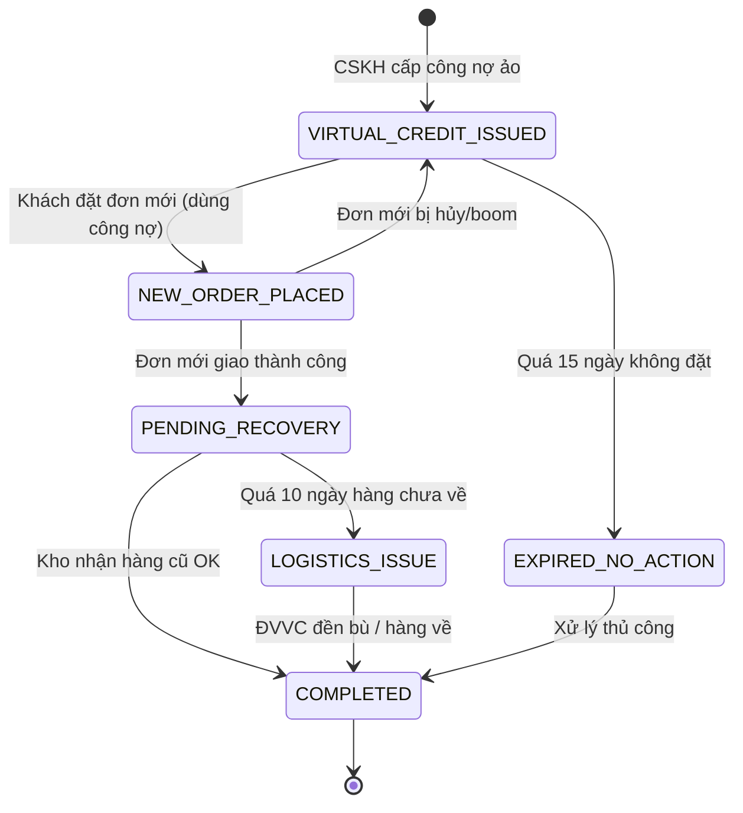

# BẢN ĐẶC TẢ KỸ THUẬT & KẾ HOẠCH THỰC HIỆN
## HỆ THỐNG QUẢN LÝ SỰ VỤ SAU BÁN HÀNG (Issue Tracking Module)

> **Phiên bản:** 3.0 - Technical Specification & Implementation Plan
> **Ngày lập:** 2026-01-04
> **Người lập:** Senior Full-Stack Solutions Architect
> **Dựa trên:** Phân tích code thực tế + Tài liệu nghiệp vụ `nghiepvucskh_xulybuucuc.md`

---

## MỤC LỤC

1. [TỔNG QUAN HỆ THỐNG](#1-tổng-quan-hệ-thống)
2. [KIẾN TRÚC KỸ THUẬT](#2-kiến-trúc-kỹ-thuật)
3. [DATA MODEL CHI TIẾT](#3-data-model-chi-tiết)
4. [GAP ANALYSIS - PHÂN TÍCH THIẾU HỤT](#4-gap-analysis---phân-tích-thiếu-hụt)
5. [ĐẶC TẢ CHỨC NĂNG CHI TIẾT](#5-đặc-tả-chức-năng-chi-tiết)
6. [KẾ HOẠCH THỰC HIỆN](#6-kế-hoạch-thực-hiện)
7. [PHỤ LỤC](#7-phụ-lục)

---

## 1. TỔNG QUAN HỆ THỐNG

### 1.1 Mục đích & Phạm vi

**Module Issue Tracking** là trung tâm xử lý các sự vụ phát sinh sau bán hàng, bao gồm:
- **Boom hàng:** Khách không nhận đơn
- **Sửa COD:** Điều chỉnh số tiền thu hộ khi shipper đang giao
- **Khách Gửi (Tỉnh):** Khách tự gửi hàng về qua bưu điện
- **Thu Về (TP - Công nợ ảo):** Shipper thu hồi hàng cũ khi giao đơn mới
- **CSKH khác:** Các vấn đề tư vấn, bảo hành

### 1.2 Nguyên tắc Tài chính Cốt lõi

```
┌─────────────────────────────────────────────────────────────────────────┐
│  ĐVVC ỨNG TRƯỚC 100% COD CHO SHOP NGAY KHI LẤY HÀNG                    │
│                                                                         │
│  → Khi ĐVVC đã lấy hàng = Shop đã nhận đủ tiền                         │
│  → Bất kỳ giảm COD nào = Shop NỢ lại ĐVVC số tiền chênh lệch           │
│  → Kế toán PHẢI chuyển khoản trả lại ĐVVC sau đối soát                  │
└─────────────────────────────────────────────────────────────────────────┘
```

### 1.3 Hệ sinh thái tích hợp

```
┌──────────────────────────────────────────────────────────────────┐
│                        HỆ SINH THÁI                              │
├──────────────────────────────────────────────────────────────────┤
│                                                                  │
│   ┌─────────┐         ┌──────────────┐        ┌─────────────┐   │
│   │  TPOS   │◄───────►│  WEB NỘI BỘ  │◄──────►│  FIREBASE   │   │
│   │ (Core)  │  API    │   (CRM)      │ RTDB   │  Realtime   │   │
│   └─────────┘         └──────────────┘        └─────────────┘   │
│       │                      │                      │           │
│       │                      │                      │           │
│       ▼                      ▼                      ▼           │
│   ┌─────────┐         ┌──────────────┐        ┌─────────────┐   │
│   │  ĐVVC   │         │    SEPAY     │        │   USERS     │   │
│   │ GHN/SPX │         │  (Webhook)   │        │ Auth/Roles  │   │
│   └─────────┘         └──────────────┘        └─────────────┘   │
│                                                                  │
└──────────────────────────────────────────────────────────────────┘
```

**Phân quyền Master Data:**

| Data Domain | Master System | Ghi chú |
|-------------|---------------|---------|
| Tồn kho, Sản phẩm | TPOS | Web chỉ đọc qua API |
| Phiếu Bán/Trả hàng | TPOS | Web gọi API để tạo |
| Đơn vận chuyển | TPOS → ĐVVC | TPOS đẩy đơn |
| Khách hàng | Web Nội bộ | Master về CRM |
| Ví công nợ (Wallet) | Web Nội bộ | Tính toán số dư |
| Tickets/Sự vụ | Web Nội bộ | Quản lý trạng thái |
| Giao dịch ngân hàng | SePay → Web | Webhook tự động |

---

## 2. KIẾN TRÚC KỸ THUẬT

### 2.1 Stack hiện tại

```
Frontend:
├── HTML5 + Vanilla JavaScript (ES6+)
├── CSS3 (Custom variables, Flexbox, Grid)
├── Mermaid.js (Flow diagrams)
└── Firebase SDK 8.10.0 (Realtime Database)

Backend/APIs:
├── Firebase Realtime Database (Data storage)
├── Cloudflare Worker (Proxy to TPOS OData)
├── TPOS OData API (Orders, Products)
└── SePay Webhook (Bank transactions)

Shared Modules (từ orders-report/):
├── api-config.js (Server URLs, auto-fallback)
├── api-handler.js (Address search utilities)
└── Firebase Auth (User authentication)
```

### 2.2 Cấu trúc Files hiện tại

```
issue-tracking/
├── index.html              # UI structure (300 lines)
├── script.js               # Core logic (858 lines)
├── api-service.js          # Firebase/API abstraction (85 lines)
├── firebase-init.js        # Firebase config (32 lines)
├── style.css               # Styling (569 lines)
├── images/
│   ├── fix_cod.png         # Guide images
│   ├── return.png
│   └── partial.png
└── business_flow_documentation.md
```

### 2.3 Firebase Data Structure

```
Firebase Realtime Database
└── issue_tracking/
    └── tickets/
        └── {pushId}/
            ├── firebaseId: string
            ├── orderId: string
            ├── customer: string
            ├── phone: string
            ├── type: enum
            ├── channel: string
            ├── status: enum
            ├── products: Array
            ├── money: number
            ├── note: string
            ├── createdAt: timestamp
            ├── updatedAt: timestamp
            └── completedAt: timestamp (nullable)
```

---

## 3. DATA MODEL CHI TIẾT

### 3.1 Ticket Object (Hiện tại vs Yêu cầu)

```typescript
// HIỆN TẠI - Basic Ticket
interface CurrentTicket {
  firebaseId: string;
  orderId: string;
  customer: string;
  phone: string;
  type: 'FIX_COD' | 'RETURN_CLIENT' | 'RETURN_SHIPPER' | 'BOOM' | 'OTHER';
  channel: string;
  status: 'PENDING_GOODS' | 'PENDING_FINANCE' | 'COMPLETED';
  products: Product[];
  money: number;
  note: string;
  createdAt: number;
  updatedAt: number;
  completedAt?: number;
}

// YÊU CẦU NGHIỆP VỤ - Extended Ticket
interface RequiredTicket extends CurrentTicket {
  // Thông tin bổ sung cho RETURN_CLIENT
  returnTrackingCode?: string;        // Mã VĐ khách gửi về

  // Thông tin bổ sung cho RETURN_SHIPPER
  shipperName?: string;               // Tên shipper thu hàng

  // Thông tin bổ sung cho FIX_COD
  originalCod: number;                // COD ban đầu
  newCod: number;                     // COD mới (thực thu)
  codDifference: number;              // Chênh lệch = originalCod - newCod
  fixReason: 'WRONG_SHIP' | 'CUSTOMER_DEBT' | 'DISCOUNT' | 'REJECT_PARTIAL';

  // === CÁC TRƯỜNG CẦN THÊM MỚI ===

  // Công nợ ảo (Virtual Credit) cho RETURN_SHIPPER
  virtualCredit?: {
    amount: number;                   // Số tiền công nợ ảo
    issuedAt: number;                 // Thời điểm cấp
    expiresAt: number;                // Hết hạn (15 ngày sau)
    status: 'ACTIVE' | 'USED' | 'EXPIRED' | 'CANCELLED';
    linkedOrderId?: string;           // Mã đơn mới khi khách sử dụng
    linkedOrderDeliveredAt?: number;  // Thời điểm giao đơn mới thành công
  };

  // Timer theo dõi ĐVVC (10 ngày)
  carrierRecoveryDeadline?: number;   // Deadline ĐVVC phải mang hàng về
  carrierIssueFlag?: boolean;         // Cờ đánh dấu quá hạn

  // Đánh dấu hàng lỗi
  hasDefectiveItems?: boolean;
  defectiveItemsNote?: string;

  // Trạng thái mở rộng (theo nghiệp vụ)
  extendedStatus?: ExtendedStatus;

  // Audit trail
  createdBy?: string;
  updatedBy?: string;
  actionHistory?: ActionLog[];
}

// Trạng thái mở rộng theo từng loại ticket
type ExtendedStatus =
  // Boom hàng / Sửa COD (chờ hàng về)
  | 'NEW'                    // Vừa ghi nhận
  | 'PENDING_RETURN'         // Đang chờ ĐVVC mang hàng về
  | 'RECEIVED_VERIFIED'      // Kho đã nhận và kiểm tra OK
  | 'ACCOUNTING_DONE'        // Kế toán đã hoàn tiền cho ĐVVC

  // Thu về (Công nợ ảo)
  | 'VIRTUAL_CREDIT_ISSUED'  // Đã cấp công nợ ảo, chờ khách đặt đơn mới
  | 'NEW_ORDER_PLACED'       // Khách đã dùng công nợ đặt đơn mới
  | 'PENDING_RECOVERY'       // Đơn mới đã giao, đang chờ hàng cũ về
  | 'COMPLETED'              // Hàng cũ đã về và nhập kho
  | 'EXPIRED_NO_ACTION'      // Quá 15 ngày khách không mua
  | 'LOGISTICS_ISSUE';       // Quá 10 ngày hàng chưa về (claim ĐVVC)

interface ActionLog {
  action: string;
  performedBy: string;
  performedAt: number;
  note?: string;
  oldStatus?: string;
  newStatus?: string;
}
```

### 3.2 Customer Wallet (Ví công nợ) - CẦN TẠO MỚI

```typescript
interface CustomerWallet {
  customerId: string;
  phone: string;                      // Primary key lookup
  customerName: string;

  // Số dư
  balance: number;                    // Công nợ thực (≥ 0)
  virtualBalance: number;             // Công nợ ảo (có thời hạn)

  // Lịch sử giao dịch
  transactions: WalletTransaction[];

  // Metadata
  createdAt: number;
  updatedAt: number;
}

interface WalletTransaction {
  id: string;
  type: 'DEPOSIT' | 'WITHDRAW' | 'VIRTUAL_CREDIT' | 'VIRTUAL_DEBIT' | 'VIRTUAL_EXPIRE';
  amount: number;
  balance_after: number;
  source: 'BANK_TRANSFER' | 'RETURN_GOODS' | 'ORDER_PAYMENT' | 'VIRTUAL_CREDIT_ISSUE' | 'VIRTUAL_CREDIT_USE';
  reference?: string;                 // orderId, ticketId, bank transaction ID
  note?: string;
  createdAt: number;
  createdBy?: string;
}
```

### 3.3 Cấu trúc Firebase Database mở rộng

```
Firebase Realtime Database
├── issue_tracking/
│   ├── tickets/{ticketId}            # Tickets (đã có)
│   └── reconciliation_batches/{id}   # Lịch sử đối soát Excel
│
├── customer_wallets/                  # [MỚI] Ví công nợ khách hàng
│   └── {phone}/
│       ├── balance: number
│       ├── virtualBalance: number
│       └── ...
│
├── wallet_transactions/              # [MỚI] Lịch sử giao dịch ví
│   └── {transactionId}/
│       └── ...
│
├── sepay_webhooks/                   # [MỚI] Log webhook từ SePay
│   └── {webhookId}/
│       └── ...
│
└── system_config/                    # [MỚI] Cấu hình hệ thống
    ├── virtual_credit_expiry_days: 15
    ├── carrier_recovery_days: 10
    └── ...
```

---

## 4. GAP ANALYSIS - PHÂN TÍCH THIẾU HỤT

### 4.1 Ma trận so sánh Yêu cầu vs Hiện thực

| # | Yêu cầu Nghiệp vụ | Hiện trạng Code | Gap | Độ ưu tiên |
|---|-------------------|-----------------|-----|------------|
| **TICKET LOẠI 1: BOOM HÀNG** |
| 1.1 | Ghi nhận đơn "Đang hoàn về" | ✅ Có (type=BOOM, status=PENDING_GOODS) | - | - |
| 1.2 | Kho đánh dấu "Đã nhận hàng tại shop" | ✅ Có (action RECEIVE) | - | - |
| 1.3 | Tạo Phiếu trả hàng TPOS | ❌ Chưa có | **CẦN BỔ SUNG** | P1 |
| 1.4 | Kế toán hoàn tiền ĐVVC | ⚠️ Có modal nhưng chưa liên kết bank | **CẦN NÂNG CẤP** | P1 |
| **TICKET LOẠI 2: SỬA COD** |
| 2.1 | Nhập COD mới, tính chênh lệch | ✅ Có (new-cod-amount, cod-diff-display) | - | - |
| 2.2 | Chọn lý do (Sai ship, Trừ nợ, Giảm giá, Nhận 1 phần) | ✅ Có (fix-cod-reason select) | - | - |
| 2.3 | Hiện product checklist khi "Nhận 1 phần" | ✅ Có (handleIssueTypeChange) | - | - |
| 2.4 | Đánh dấu hàng lỗi | ❌ Chưa có field | **CẦN BỔ SUNG** | P2 |
| 2.5 | Kho nhận hàng thừa về sau | ⚠️ Flow chưa rõ ràng | **CẦN NÂNG CẤP** | P2 |
| **TICKET LOẠI 3: KHÁCH GỬI (TỈNH)** |
| 3.1 | Nhập mã VĐ khách gửi | ✅ Có (return-tracking-code) | - | - |
| 3.2 | Kho nhận hàng, tạo Phiếu trả TPOS | ❌ Chưa tích hợp TPOS | **CẦN BỔ SUNG** | P1 |
| 3.3 | Cộng tiền vào Ví khách hàng | ❌ Chưa có module Wallet | **CẦN TẠO MỚI** | P1 |
| **TICKET LOẠI 4: THU VỀ (TP - CÔNG NỢ ẢO)** |
| 4.1 | Cấp Công nợ ảo vào Ví khách | ❌ Chưa có | **CẦN TẠO MỚI** | P1 |
| 4.2 | Công nợ ảo có thời hạn 15 ngày | ❌ Chưa có | **CẦN TẠO MỚI** | P1 |
| 4.3 | Khách dùng công nợ ảo đặt đơn mới | ❌ Chưa có | **CẦN TẠO MỚI** | P1 |
| 4.4 | Trạng thái: Virtual_Credit_Issued → New_Order_Placed → Pending_Recovery → Completed | ❌ Chưa có | **CẦN TẠO MỚI** | P1 |
| 4.5 | Auto-expire sau 15 ngày (Expired_NoAction) | ❌ Chưa có cron job | **CẦN TẠO MỚI** | P1 |
| 4.6 | Cảnh báo ĐVVC quá 10 ngày (Logistics_Issue) | ❌ Chưa có | **CẦN TẠO MỚI** | P1 |
| **BÁN HÀNG CHUẨN** |
| 5.1 | Kiểm tra số dư Ví khách khi tạo đơn | ❌ Chưa có | **CẦN TẠO MỚI** | P1 |
| 5.2 | Tự động trừ Ví, tính COD thực | ❌ Chưa có | **CẦN TẠO MỚI** | P1 |
| 5.3 | Gọi API TPOS tạo đơn với COD đã tính | ❌ Chưa có | **CẦN TẠO MỚI** | P1 |
| **TÍCH HỢP SEPAY** |
| 6.1 | Webhook nhận giao dịch từ SePay | ❌ Chưa có | **CẦN TẠO MỚI** | P2 |
| 6.2 | Parse nội dung → tìm KH → cộng Ví | ❌ Chưa có | **CẦN TẠO MỚI** | P2 |
| **TÌM KIẾM ĐƠN HÀNG** |
| 7.1 | Gọi API TPOS tìm đơn theo SĐT/Mã VĐ | ❌ searchOrders() trả về [] | **CẦN BỔ SUNG** | P0 |

### 4.2 Tóm tắt GAP

```
┌──────────────────────────────────────────────────────────────────┐
│                    TỔNG KẾT THIẾU HỤT                           │
├──────────────────────────────────────────────────────────────────┤
│                                                                  │
│  ✅ ĐÃ CÓ (Hoàn thiện):                                         │
│     • UI cơ bản: Dashboard, Modal Create, Modal Confirm          │
│     • CRUD Ticket cơ bản (Firebase)                              │
│     • Status flow đơn giản: PENDING_GOODS → COMPLETED            │
│     • Đối soát Excel (Reconciliation)                            │
│     • Dynamic form fields theo loại ticket                       │
│                                                                  │
│  ⚠️ CÓ NHƯNG CHƯA HOÀN THIỆN:                                   │
│     • searchOrders() - trả về [] (chưa tích hợp TPOS API)        │
│     • Status flow thiếu các trạng thái trung gian                │
│     • Không có audit trail                                       │
│                                                                  │
│  ❌ CHƯA CÓ (Cần tạo mới):                                       │
│     • Module Ví công nợ khách hàng (Customer Wallet)             │
│     • Công nợ ảo (Virtual Credit) với timer 15 ngày              │
│     • Tích hợp TPOS API (Search, Create Return Invoice)          │
│     • Tích hợp SePay Webhook                                     │
│     • Cron Jobs (Auto-expire, ĐVVC warning)                      │
│     • Trạng thái mở rộng theo nghiệp vụ                          │
│     • Đánh dấu hàng lỗi                                          │
│                                                                  │
└──────────────────────────────────────────────────────────────────┘
```

---

## 5. ĐẶC TẢ CHỨC NĂNG CHI TIẾT

### 5.1 FEATURE 1: Tích hợp TPOS API - Tìm kiếm Đơn hàng

**Mục đích:** Cho phép nhân viên tìm đơn hàng từ TPOS để tạo ticket.

**API Endpoint:**
```
GET /api/odata/SaleOnline_Order/ODataService.GetView
    ?$filter=Phone eq '{phone}' or Code eq '{code}'
    &$top=20
    &$orderby=CreateDate desc
```

**Implementation:**

```javascript
// api-service.js - Bổ sung searchOrders()

async searchOrders(query) {
    if (!query) return [];

    const cleanQuery = query.trim();
    const isPhone = /^0\d{9,10}$/.test(cleanQuery);

    let filterCondition;
    if (isPhone) {
        filterCondition = `Phone eq '${cleanQuery}'`;
    } else {
        // Mã đơn hoặc mã vận đơn
        filterCondition = `Code eq '${cleanQuery}' or TrackingCode eq '${cleanQuery}'`;
    }

    const url = API_CONFIG.buildUrl.tposOData(
        'SaleOnline_Order/ODataService.GetView',
        `$filter=${encodeURIComponent(filterCondition)}&$top=20&$orderby=CreateDate desc`
    );

    try {
        const response = await API_CONFIG.smartFetch(url);
        const data = await response.json();

        if (!data.value || data.value.length === 0) {
            return [];
        }

        // Map TPOS fields → Internal fields
        return data.value.map(order => ({
            id: order.Id,
            tposId: order.Code,
            trackingCode: order.TrackingCode,
            customer: order.CustomerName,
            phone: order.Phone,
            address: order.Address,
            cod: order.COD || 0,
            totalAmount: order.TotalAmount || 0,
            status: order.Status,
            channel: order.ChannelName || 'TPOS',
            products: (order.OrderDetails || []).map(d => ({
                id: d.ProductId,
                name: d.ProductName,
                price: d.Price,
                quantity: d.Quantity
            })),
            createdAt: new Date(order.CreateDate).getTime()
        }));
    } catch (error) {
        console.error('[API] Search orders failed:', error);
        throw error;
    }
}
```

**TPOS Response Fields Reference:**

| Field TPOS | Internal Field | Ý nghĩa | Giá trị mẫu |
|------------|----------------|---------|-------------|
| `Id` | `id` | ID đơn hàng (số) | `42639` |
| `Number` | `tposCode` | Mã đơn hàng | `NJD/2026/42639` |
| `Phone` | `phone` | Số điện thoại khách | `0773841886` |
| `State` | `status` | Trạng thái đơn hàng | `open`, `paid`, `draft`, `cancel` |
| `StateCode` | `stateCode` | Trạng thái đối soát sản phẩm | `CrossCheckComplete`, `NotEnoughInventory`, `None` |
| `CrossCheckTimes` | `crossCheckTimes` | Số lần đối soát sản phẩm | `0`, `1`, `2` |
| `CashOnDelivery` | `cod` | Tiền thu hộ (COD) | `325000` |
| `AmountTotal` | `totalAmount` | Tổng giá trị đơn | `325000` |
| `TrackingRef` | `trackingCode` | Mã vận đơn | `12345678` |
| `CarrierName` | `carrier` | Tên ĐVVC | `J&T`, `SHIP TỈNH` |
| `DateInvoice` | `createdAt` | Ngày tạo đơn | `2026-01-05T00:00:00` |

**State (Trạng thái đơn hàng):**

| State | ShowState (Tiếng Việt) | Filter? |
|-------|------------------------|---------|
| `draft` | Nháp | ❌ Bỏ qua |
| `open` | Đã xác nhận | ✅ Lấy |
| `paid` | Đã thanh toán | ✅ Lấy |
| `cancel` | Hủy bỏ | ❌ Bỏ qua |

**StateCode (Trạng thái đối soát sản phẩm):**

| StateCode | Tiếng Việt | Màu UI |
|-----------|------------|--------|
| `CrossCheckComplete` | Đã ĐS sản phẩm | 🟢 Xanh lá (#10b981) |
| `NotEnoughInventory` | Không đủ tồn kho | 🟠 Cam (#f59e0b) |
| `None` | Chưa ĐS sản phẩm | 🟠 Cam (#f59e0b) |

**UI/UX:**
- Hiện loading spinner khi đang tìm
- Nếu tìm thấy nhiều đơn → hiện danh sách để chọn
- Hiện đầy đủ: Khách, SĐT, Mã VĐ, Sản phẩm, COD

---

### 5.2 FEATURE 2: Module Ví Công Nợ Khách Hàng (Customer Wallet)

**Mục đích:** Quản lý số dư công nợ (cả thực và ảo) của khách hàng.

**Firebase Structure:**
```
customer_wallets/
└── {normalizedPhone}/          # VD: "0977888999"
    ├── phone: "0977888999"
    ├── customerName: "Nguyễn Văn A"
    ├── balance: 200000           # Công nợ thực
    ├── virtualBalance: 0         # Công nợ ảo
    ├── virtualCredits: [         # Chi tiết công nợ ảo
    │   {
    │       ticketId: "xxx",
    │       amount: 350000,
    │       issuedAt: 1704326400000,
    │       expiresAt: 1705622400000,
    │       status: "ACTIVE"
    │   }
    │]
    ├── createdAt: timestamp
    └── updatedAt: timestamp

wallet_transactions/
└── {transactionId}/
    ├── phone: "0977888999"
    ├── type: "DEPOSIT"
    ├── amount: 200000
    ├── balanceAfter: 200000
    ├── source: "BANK_TRANSFER"
    ├── reference: "SEPAY_xxx"
    ├── note: "CK từ VCB"
    └── createdAt: timestamp
```

**API Service:**

```javascript
// wallet-service.js (MỚI)

const WalletService = {
    /**
     * Lấy thông tin ví theo SĐT
     */
    async getWallet(phone) {
        const normalizedPhone = this.normalizePhone(phone);
        const snapshot = await db.ref(`customer_wallets/${normalizedPhone}`).once('value');
        return snapshot.val();
    },

    /**
     * Tạo hoặc cập nhật ví
     */
    async upsertWallet(phone, customerName) {
        const normalizedPhone = this.normalizePhone(phone);
        const ref = db.ref(`customer_wallets/${normalizedPhone}`);

        const existing = await ref.once('value');
        if (!existing.val()) {
            await ref.set({
                phone: normalizedPhone,
                customerName,
                balance: 0,
                virtualBalance: 0,
                virtualCredits: [],
                createdAt: firebase.database.ServerValue.TIMESTAMP,
                updatedAt: firebase.database.ServerValue.TIMESTAMP
            });
        }
        return await ref.once('value').then(s => s.val());
    },

    /**
     * Cộng tiền vào ví (thực)
     */
    async deposit(phone, amount, source, reference, note = '') {
        const wallet = await this.getWallet(phone);
        if (!wallet) throw new Error('Wallet not found');

        const newBalance = wallet.balance + amount;

        // Update wallet
        await db.ref(`customer_wallets/${phone}`).update({
            balance: newBalance,
            updatedAt: firebase.database.ServerValue.TIMESTAMP
        });

        // Log transaction
        await this.logTransaction(phone, 'DEPOSIT', amount, newBalance, source, reference, note);

        return newBalance;
    },

    /**
     * Trừ tiền từ ví (khi tạo đơn)
     */
    async withdraw(phone, amount, reference, note = '') {
        const wallet = await this.getWallet(phone);
        if (!wallet) throw new Error('Wallet not found');

        // Ưu tiên trừ công nợ ảo trước (nếu có và còn hiệu lực)
        let remaining = amount;
        let virtualUsed = 0;
        let realUsed = 0;

        // 1. Trừ công nợ ảo
        if (wallet.virtualBalance > 0 && wallet.virtualCredits) {
            const activeCredits = wallet.virtualCredits
                .filter(c => c.status === 'ACTIVE' && c.expiresAt > Date.now())
                .sort((a, b) => a.expiresAt - b.expiresAt); // FIFO - sắp hết hạn trước

            for (const credit of activeCredits) {
                if (remaining <= 0) break;

                const useAmount = Math.min(credit.amount, remaining);
                credit.amount -= useAmount;
                if (credit.amount <= 0) {
                    credit.status = 'USED';
                }
                remaining -= useAmount;
                virtualUsed += useAmount;
            }
        }

        // 2. Trừ công nợ thực
        if (remaining > 0) {
            if (wallet.balance < remaining) {
                throw new Error('Insufficient balance');
            }
            realUsed = remaining;
        }

        // Update wallet
        const newBalance = wallet.balance - realUsed;
        const newVirtualBalance = wallet.virtualBalance - virtualUsed;

        await db.ref(`customer_wallets/${phone}`).update({
            balance: newBalance,
            virtualBalance: newVirtualBalance,
            virtualCredits: wallet.virtualCredits,
            updatedAt: firebase.database.ServerValue.TIMESTAMP
        });

        // Log transactions
        if (virtualUsed > 0) {
            await this.logTransaction(phone, 'VIRTUAL_DEBIT', virtualUsed, newVirtualBalance, 'ORDER_PAYMENT', reference, note);
        }
        if (realUsed > 0) {
            await this.logTransaction(phone, 'WITHDRAW', realUsed, newBalance, 'ORDER_PAYMENT', reference, note);
        }

        return { newBalance, newVirtualBalance, virtualUsed, realUsed };
    },

    /**
     * Cấp công nợ ảo (cho Thu về)
     */
    async issueVirtualCredit(phone, amount, ticketId, expiryDays = 15) {
        const wallet = await this.getWallet(phone);
        if (!wallet) throw new Error('Wallet not found');

        const now = Date.now();
        const expiresAt = now + (expiryDays * 24 * 60 * 60 * 1000);

        const newCredit = {
            ticketId,
            amount,
            issuedAt: now,
            expiresAt,
            status: 'ACTIVE'
        };

        const virtualCredits = wallet.virtualCredits || [];
        virtualCredits.push(newCredit);

        const newVirtualBalance = wallet.virtualBalance + amount;

        await db.ref(`customer_wallets/${phone}`).update({
            virtualBalance: newVirtualBalance,
            virtualCredits,
            updatedAt: firebase.database.ServerValue.TIMESTAMP
        });

        await this.logTransaction(phone, 'VIRTUAL_CREDIT', amount, newVirtualBalance, 'VIRTUAL_CREDIT_ISSUE', ticketId, `Công nợ ảo - hết hạn ${new Date(expiresAt).toLocaleDateString('vi-VN')}`);

        return { newVirtualBalance, expiresAt };
    },

    /**
     * Thu hồi công nợ ảo hết hạn
     */
    async expireVirtualCredits(phone) {
        const wallet = await this.getWallet(phone);
        if (!wallet || !wallet.virtualCredits) return;

        const now = Date.now();
        let expiredAmount = 0;

        for (const credit of wallet.virtualCredits) {
            if (credit.status === 'ACTIVE' && credit.expiresAt <= now) {
                expiredAmount += credit.amount;
                credit.status = 'EXPIRED';
                credit.amount = 0;
            }
        }

        if (expiredAmount > 0) {
            const newVirtualBalance = wallet.virtualBalance - expiredAmount;

            await db.ref(`customer_wallets/${phone}`).update({
                virtualBalance: newVirtualBalance,
                virtualCredits: wallet.virtualCredits,
                updatedAt: firebase.database.ServerValue.TIMESTAMP
            });

            await this.logTransaction(phone, 'VIRTUAL_EXPIRE', expiredAmount, newVirtualBalance, 'VIRTUAL_CREDIT_EXPIRE', null, 'Công nợ ảo hết hạn');
        }

        return expiredAmount;
    },

    // Helpers
    normalizePhone(phone) {
        return phone.replace(/[^0-9]/g, '');
    },

    async logTransaction(phone, type, amount, balanceAfter, source, reference, note) {
        const transactionRef = db.ref('wallet_transactions').push();
        await transactionRef.set({
            id: transactionRef.key,
            phone,
            type,
            amount,
            balanceAfter,
            source,
            reference,
            note,
            createdAt: firebase.database.ServerValue.TIMESTAMP
        });
    }
};
```

---

### 5.3 FEATURE 3: Flow "Thu Về" với Công Nợ Ảo

**State Machine:**



**Implementation:**

```javascript
// Trong script.js - Bổ sung handleSubmitTicket()

async function handleSubmitTicket() {
    // ... existing validation ...

    const type = document.getElementById('issue-type-select').value;

    if (type === 'RETURN_SHIPPER') {
        // Flow đặc biệt: Thu về (Công nợ ảo)
        const isVirtualCreditFlow = confirm(
            'Xác nhận đây là quy trình THU VỀ (Shipper thu hồi hàng cũ khi giao đơn mới)?\n\n' +
            '→ Hệ thống sẽ cấp CÔNG NỢ ẢO cho khách để đặt đơn mới.\n' +
            '→ Công nợ này có hiệu lực 15 ngày.'
        );

        if (isVirtualCreditFlow) {
            await handleVirtualCreditFlow(selectedOrder, selectedProducts);
            return;
        }
    }

    // ... existing logic for other types ...
}

async function handleVirtualCreditFlow(order, products) {
    showLoading(true);
    try {
        // 1. Tính giá trị hàng trả
        const returnValue = products.reduce((sum, p) => sum + p.price, 0);

        // 2. Tạo/lấy ví khách
        await WalletService.upsertWallet(order.phone, order.customer);

        // 3. Tạo ticket với status đặc biệt
        const ticketData = {
            orderId: order.id || order.tposId,
            customer: order.customer,
            phone: order.phone,
            type: 'RETURN_SHIPPER',
            channel: order.channel || 'TPOS',
            status: 'PENDING_GOODS',
            extendedStatus: 'VIRTUAL_CREDIT_ISSUED',
            products: products,
            money: returnValue,
            note: document.getElementById('ticket-note').value,
            virtualCredit: {
                amount: returnValue,
                issuedAt: Date.now(),
                expiresAt: Date.now() + (15 * 24 * 60 * 60 * 1000),
                status: 'ACTIVE'
            }
        };

        const ticket = await ApiService.createTicket(ticketData);

        // 4. Cấp công nợ ảo
        await WalletService.issueVirtualCredit(order.phone, returnValue, ticket.firebaseId, 15);

        alert(`Đã tạo ticket Thu Về và cấp ${formatCurrency(returnValue)} công nợ ảo cho khách!`);
        closeModal(elements.modalCreate);

    } catch (error) {
        console.error(error);
        alert('Lỗi: ' + error.message);
    } finally {
        showLoading(false);
    }
}
```

---

### 5.4 FEATURE 4: Cron Jobs (Auto-expire & Cảnh báo)

**Lưu ý:** Firebase Realtime Database không có built-in cron. Có 2 options:

1. **Client-side polling** (Đơn giản, phù hợp nội bộ)
2. **Firebase Cloud Functions** (Chuyên nghiệp hơn)

**Option 1: Client-side polling (Khuyến nghị cho MVP)**

```javascript
// cron-jobs.js (MỚI)

const CronJobs = {
    INTERVAL: 60 * 60 * 1000, // Chạy mỗi giờ

    init() {
        // Chạy ngay khi load
        this.runAll();

        // Đặt interval
        setInterval(() => this.runAll(), this.INTERVAL);

        console.log('[CRON] Initialized, interval:', this.INTERVAL, 'ms');
    },

    async runAll() {
        console.log('[CRON] Running scheduled jobs...');

        try {
            await this.expireVirtualCredits();
            await this.checkCarrierRecoveryDeadlines();
        } catch (error) {
            console.error('[CRON] Error:', error);
        }
    },

    /**
     * Job 1: Thu hồi công nợ ảo hết hạn
     */
    async expireVirtualCredits() {
        const walletsRef = db.ref('customer_wallets');
        const snapshot = await walletsRef.once('value');
        const wallets = snapshot.val();

        if (!wallets) return;

        let expiredCount = 0;
        const now = Date.now();

        for (const phone of Object.keys(wallets)) {
            const wallet = wallets[phone];
            if (!wallet.virtualCredits) continue;

            for (const credit of wallet.virtualCredits) {
                if (credit.status === 'ACTIVE' && credit.expiresAt <= now) {
                    await WalletService.expireVirtualCredits(phone);

                    // Update ticket status
                    if (credit.ticketId) {
                        await ApiService.updateTicket(credit.ticketId, {
                            extendedStatus: 'EXPIRED_NO_ACTION',
                            'virtualCredit/status': 'EXPIRED'
                        });
                    }

                    expiredCount++;
                }
            }
        }

        if (expiredCount > 0) {
            console.log(`[CRON] Expired ${expiredCount} virtual credits`);
            // TODO: Send notification to CSKH
        }
    },

    /**
     * Job 2: Kiểm tra deadline ĐVVC (10 ngày)
     */
    async checkCarrierRecoveryDeadlines() {
        const ticketsRef = db.ref('issue_tracking/tickets');
        const snapshot = await ticketsRef
            .orderByChild('extendedStatus')
            .equalTo('PENDING_RECOVERY')
            .once('value');

        const tickets = snapshot.val();
        if (!tickets) return;

        const now = Date.now();
        const TEN_DAYS = 10 * 24 * 60 * 60 * 1000;
        let overdueCount = 0;

        for (const id of Object.keys(tickets)) {
            const ticket = tickets[id];
            const deliveredAt = ticket.virtualCredit?.linkedOrderDeliveredAt;

            if (deliveredAt && (now - deliveredAt) > TEN_DAYS) {
                await ApiService.updateTicket(id, {
                    extendedStatus: 'LOGISTICS_ISSUE',
                    carrierIssueFlag: true
                });

                overdueCount++;
            }
        }

        if (overdueCount > 0) {
            console.warn(`[CRON] ${overdueCount} tickets with carrier delivery issues!`);
            // TODO: Send notification to CSKH
        }
    }
};

// Initialize on page load
document.addEventListener('DOMContentLoaded', () => {
    CronJobs.init();
});
```

---

### 5.5 FEATURE 5: Tích hợp SePay Webhook

**Mục đích:** Tự động ghi nhận khi khách chuyển khoản ngân hàng.

**Webhook Payload từ SePay:**
```json
{
    "id": "12345",
    "gateway": "VCB",
    "transactionDate": "2026-01-04 10:30:00",
    "accountNumber": "1234567890",
    "subAccount": null,
    "code": null,
    "content": "0977888999 nop tien",
    "transferType": "in",
    "description": "Chuyen khoan",
    "transferAmount": 500000,
    "referenceCode": "FT26004xxxx",
    "accumulated": 5000000
}
```

**Implementation:**

```javascript
// sepay-webhook-handler.js (MỚI - Backend/Cloud Function)

// Option A: Firebase Cloud Function
exports.handleSepayWebhook = functions.https.onRequest(async (req, res) => {
    if (req.method !== 'POST') {
        return res.status(405).send('Method Not Allowed');
    }

    const payload = req.body;

    // Validate
    if (!payload.transferAmount || payload.transferType !== 'in') {
        return res.status(400).json({ error: 'Invalid payload' });
    }

    // Log webhook
    const logRef = admin.database().ref('sepay_webhooks').push();
    await logRef.set({
        ...payload,
        processedAt: admin.database.ServerValue.TIMESTAMP,
        status: 'PROCESSING'
    });

    try {
        // Parse phone from content
        const phone = extractPhone(payload.content);

        if (phone) {
            // Find or create wallet
            const walletRef = admin.database().ref(`customer_wallets/${phone}`);
            const wallet = (await walletRef.once('value')).val();

            if (wallet) {
                // Deposit
                const newBalance = wallet.balance + payload.transferAmount;
                await walletRef.update({
                    balance: newBalance,
                    updatedAt: admin.database.ServerValue.TIMESTAMP
                });

                // Log transaction
                await admin.database().ref('wallet_transactions').push().set({
                    phone,
                    type: 'DEPOSIT',
                    amount: payload.transferAmount,
                    balanceAfter: newBalance,
                    source: 'BANK_TRANSFER',
                    reference: payload.referenceCode || payload.id,
                    note: `${payload.gateway}: ${payload.content}`,
                    createdAt: admin.database.ServerValue.TIMESTAMP
                });

                // Update webhook log
                await logRef.update({ status: 'SUCCESS', matchedPhone: phone });

                return res.json({ success: true, phone, newBalance });
            }
        }

        // No match found
        await logRef.update({ status: 'NO_MATCH' });
        return res.json({ success: false, reason: 'No matching customer found' });

    } catch (error) {
        await logRef.update({ status: 'ERROR', error: error.message });
        return res.status(500).json({ error: error.message });
    }
});

function extractPhone(content) {
    if (!content) return null;
    // Tìm số điện thoại 10-11 chữ số bắt đầu bằng 0
    const match = content.match(/(0\d{9,10})/);
    return match ? match[1] : null;
}
```

---

### 5.6 FEATURE 6: Trạng thái mở rộng & UI cập nhật

**Cập nhật Status Badge:**

```javascript
// script.js - Cập nhật translateStatus()

function translateStatus(status, extendedStatus) {
    // Ưu tiên extendedStatus nếu có
    if (extendedStatus) {
        const extendedMap = {
            'NEW': 'Mới tạo',
            'PENDING_RETURN': 'Chờ hàng về',
            'RECEIVED_VERIFIED': 'Đã nhận hàng',
            'ACCOUNTING_DONE': 'Đã đối soát',
            'VIRTUAL_CREDIT_ISSUED': 'Đã cấp công nợ ảo',
            'NEW_ORDER_PLACED': 'Khách đã đặt đơn',
            'PENDING_RECOVERY': 'Chờ thu hồi hàng',
            'COMPLETED': 'Hoàn tất',
            'EXPIRED_NO_ACTION': '⚠️ Quá hạn 15 ngày',
            'LOGISTICS_ISSUE': '🚨 ĐVVC quá 10 ngày'
        };
        return extendedMap[extendedStatus] || extendedStatus;
    }

    // Fallback to basic status
    const map = {
        'PENDING_GOODS': 'Chờ nhận hàng',
        'PENDING_FINANCE': 'Chờ đối soát',
        'COMPLETED': 'Hoàn tất'
    };
    return map[status] || status;
}
```

**Cập nhật renderDashboard():**

```javascript
// Hiển thị thêm thông tin công nợ ảo nếu có
function renderTicketRow(ticket) {
    let virtualCreditInfo = '';
    if (ticket.virtualCredit && ticket.virtualCredit.status === 'ACTIVE') {
        const daysLeft = Math.ceil((ticket.virtualCredit.expiresAt - Date.now()) / (24*60*60*1000));
        virtualCreditInfo = `
            <div style="font-size:11px;color:#f59e0b;margin-top:4px">
                💰 Công nợ ảo: ${formatCurrency(ticket.virtualCredit.amount)}
                <br>⏰ Còn ${daysLeft} ngày
            </div>
        `;
    }

    // ... rest of row rendering ...
}
```

---

## 6. KẾ HOẠCH THỰC HIỆN

### 6.1 Phân chia Phase

```
┌──────────────────────────────────────────────────────────────────────┐
│                     ROADMAP IMPLEMENTATION                           │
├──────────────────────────────────────────────────────────────────────┤
│                                                                      │
│  PHASE 0: CRITICAL FIX (Blocking)                                   │
│  ├── [P0-1] Tích hợp TPOS API - searchOrders()                     │
│  └── [P0-2] Fix lỗi Firebase subscription (đang comment out)       │
│                                                                      │
│  PHASE 1: CORE FEATURES                                             │
│  ├── [P1-1] Module Customer Wallet                                  │
│  ├── [P1-2] Flow "Thu Về" với Công nợ ảo                           │
│  ├── [P1-3] Trạng thái mở rộng (ExtendedStatus)                    │
│  └── [P1-4] UI hiển thị Wallet balance                             │
│                                                                      │
│  PHASE 2: AUTOMATION & INTEGRATION                                  │
│  ├── [P2-1] SePay Webhook Integration                              │
│  ├── [P2-2] Cron Jobs (Auto-expire, ĐVVC warning)                  │
│  ├── [P2-3] TPOS API - Create Return Invoice                       │
│  └── [P2-4] Notification System                                    │
│                                                                      │
│  PHASE 3: POLISH & OPTIMIZATION                                     │
│  ├── [P3-1] Audit Trail & Action History                           │
│  ├── [P3-2] Report & Analytics                                     │
│  ├── [P3-3] Performance Optimization                               │
│  └── [P3-4] Mobile Responsive                                      │
│                                                                      │
└──────────────────────────────────────────────────────────────────────┘
```

### 6.2 Chi tiết từng Task

#### PHASE 0: CRITICAL FIX

**[P0-1] Tích hợp TPOS API - searchOrders()**
```
Files cần sửa:
├── api-service.js          # Implement searchOrders()
└── script.js               # Handle multiple results

Acceptance Criteria:
✓ Tìm được đơn theo SĐT
✓ Tìm được đơn theo Mã VĐ
✓ Hiện danh sách nếu có nhiều kết quả
✓ Handle lỗi API gracefully
```

**[P0-2] Fix Firebase Subscription**
```
Files cần sửa:
└── script.js               # Uncomment & fix subscription

Acceptance Criteria:
✓ Realtime update khi có ticket mới
✓ Stats tự động cập nhật
✓ Không bị duplicate tickets
```

#### PHASE 1: CORE FEATURES

**[P1-1] Module Customer Wallet**
```
Files cần tạo mới:
├── wallet-service.js       # Core wallet logic
└── wallet-ui.js            # UI components

Files cần sửa:
├── index.html              # Add wallet UI elements
├── style.css               # Wallet styles
└── firebase-init.js        # Add wallet refs

Acceptance Criteria:
✓ CRUD Wallet (create, read, update)
✓ Deposit (cộng tiền)
✓ Withdraw (trừ tiền)
✓ Transaction history
✓ UI hiển thị số dư
```

**[P1-2] Flow "Thu Về" với Công nợ ảo**
```
Files cần sửa:
├── script.js               # handleVirtualCreditFlow()
├── api-service.js          # updateTicket với virtualCredit
└── index.html              # UI cho flow này

Acceptance Criteria:
✓ Cấp công nợ ảo khi tạo ticket Thu Về
✓ Trừ công nợ ảo khi khách đặt đơn mới
✓ Theo dõi trạng thái: VIRTUAL_CREDIT_ISSUED → NEW_ORDER_PLACED → PENDING_RECOVERY
✓ Hiển thị ngày hết hạn
```

**[P1-3] Trạng thái mở rộng**
```
Files cần sửa:
├── script.js               # translateStatus(), renderDashboard()
├── style.css               # Styles cho status mới
└── api-service.js          # Support extendedStatus

Acceptance Criteria:
✓ 10+ trạng thái theo nghiệp vụ
✓ Badge màu theo trạng thái
✓ Filter theo extendedStatus
```

**[P1-4] UI Wallet Balance**
```
Files cần sửa:
├── index.html              # Customer info panel
├── script.js               # Fetch & display wallet
└── style.css               # Wallet card styles

Acceptance Criteria:
✓ Hiển thị balance + virtualBalance
✓ Highlight khi có công nợ ảo sắp hết hạn
✓ Quick action: Xem lịch sử giao dịch
```

#### PHASE 2: AUTOMATION & INTEGRATION

**[P2-1] SePay Webhook**
```
Files cần tạo mới:
├── functions/
│   └── index.js            # Cloud Functions
└── sepay-admin.html        # Admin view for webhooks

Acceptance Criteria:
✓ Nhận webhook từ SePay
✓ Parse SĐT từ nội dung
✓ Tự động cộng Wallet
✓ Log tất cả webhooks
```

**[P2-2] Cron Jobs**
```
Files cần tạo mới:
└── cron-jobs.js            # Client-side polling

Acceptance Criteria:
✓ Auto-expire công nợ ảo sau 15 ngày
✓ Cảnh báo ĐVVC quá 10 ngày
✓ Update ticket status tự động
```

**[P2-3] TPOS API - Create Return Invoice**
```
Files cần sửa:
├── api-service.js          # createReturnInvoice()
└── script.js               # Gọi khi nhận hàng

Acceptance Criteria:
✓ Tạo Phiếu Trả Hàng trên TPOS
✓ Cập nhật tồn kho TPOS
✓ Liên kết với ticket
```

**[P2-4] Notification System**
```
Files cần tạo mới:
└── notification-service.js # Push notifications

Acceptance Criteria:
✓ Toast notifications
✓ Sound alerts cho urgent items
✓ Desktop notifications (optional)
```

#### PHASE 3: POLISH

**[P3-1] Audit Trail**
```
Acceptance Criteria:
✓ Log mọi action với user, timestamp
✓ View history trong ticket detail
✓ Export audit log
```

**[P3-2] Reports**
```
Acceptance Criteria:
✓ Báo cáo tổng hợp theo ngày/tuần/tháng
✓ Thống kê theo loại ticket
✓ Tổng tiền đã đối soát
```

### 6.3 Dependency Graph

```
                    ┌──────────────────┐
                    │  [P0-1] TPOS API │
                    │   searchOrders   │
                    └────────┬─────────┘
                             │
              ┌──────────────┼──────────────┐
              │              │              │
              ▼              ▼              ▼
    ┌─────────────┐  ┌─────────────┐  ┌─────────────┐
    │   [P0-2]    │  │   [P1-1]    │  │   [P1-3]    │
    │  Firebase   │  │   Wallet    │  │  Extended   │
    │ Subscription│  │   Module    │  │   Status    │
    └──────┬──────┘  └──────┬──────┘  └──────┬──────┘
           │                │                │
           │         ┌──────┴──────┐         │
           │         ▼             ▼         │
           │  ┌─────────────┐ ┌─────────┐   │
           │  │   [P1-2]    │ │ [P1-4]  │   │
           │  │ Virtual     │ │ Wallet  │   │
           │  │ Credit Flow │ │   UI    │   │
           │  └──────┬──────┘ └────┬────┘   │
           │         │             │        │
           └─────────┼─────────────┼────────┘
                     │             │
              ┌──────┴──────┬──────┴──────┐
              ▼             ▼             ▼
       ┌──────────┐  ┌──────────┐  ┌──────────┐
       │ [P2-1]   │  │ [P2-2]   │  │ [P2-3]   │
       │ SePay    │  │ Cron     │  │ TPOS     │
       │ Webhook  │  │ Jobs     │  │ Return   │
       └──────────┘  └──────────┘  └──────────┘
```

---

## 7. PHỤ LỤC

### 7.1 Checklist tự kiểm tra khi phát triển

**Trước khi commit:**
- [ ] Code không có console.error trong production
- [ ] Tất cả try-catch có xử lý lỗi hợp lý
- [ ] Firebase rules được cập nhật nếu cần
- [ ] UI responsive trên tablet

**Trước khi deploy:**
- [ ] Test với dữ liệu thực từ TPOS
- [ ] Test flow đầy đủ từ đầu đến cuối
- [ ] Backup database trước khi deploy
- [ ] Thông báo cho team

### 7.2 Firebase Security Rules (Gợi ý)

```json
{
  "rules": {
    "issue_tracking": {
      "tickets": {
        ".read": "auth != null",
        ".write": "auth != null",
        "$ticketId": {
          ".validate": "newData.hasChildren(['orderId', 'type', 'status'])"
        }
      }
    },
    "customer_wallets": {
      ".read": "auth != null",
      ".write": "auth != null && (auth.token.role == 'admin' || auth.token.role == 'accountant')"
    },
    "wallet_transactions": {
      ".read": "auth != null",
      ".write": "auth != null"
    },
    "sepay_webhooks": {
      ".read": "auth != null && auth.token.role == 'admin'",
      ".write": false  // Only Cloud Functions can write
    }
  }
}
```

### 7.3 Glossary (Thuật ngữ)

| Thuật ngữ | Giải thích |
|-----------|------------|
| TPOS | Hệ thống POS bên thứ 3 (Master về tồn kho) |
| ĐVVC | Đơn vị vận chuyển (GHN, SPX, VTP...) |
| COD | Cash On Delivery - Tiền thu hộ |
| Công nợ ảo | Số tiền tạm cấp cho khách để đặt đơn mới, có thời hạn |
| Boom hàng | Khách không nhận đơn, hàng hoàn về |
| Thu về | Shipper thu hồi hàng cũ khi giao đơn mới |
| SePay | Dịch vụ webhook theo dõi giao dịch ngân hàng |

---

**Document History:**

| Version | Date | Author | Changes |
|---------|------|--------|---------|
| 1.0 | 2026-01-04 | AI Architect | Initial draft |
| 2.0 | 2026-01-04 | AI Architect | Add GAP analysis |
| 3.0 | 2026-01-04 | AI Architect | Complete implementation plan |

---

*Tài liệu này được tạo dựa trên phân tích code thực tế và yêu cầu nghiệp vụ. Mọi thay đổi code cần được cập nhật vào tài liệu.*
