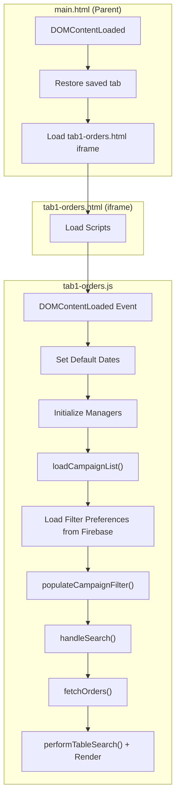

# Tab 1 - Orders Management: Initialization Flow

Tài liệu mô tả chi tiết luồng khởi tạo khi tải trang hoặc F5 tại `https://nhijudyshop.github.io/n2store/orders-report` (Tab 1 - Quản Lý Đơn Hàng).

---

## Tổng Quan Kiến Trúc



---

## 1. main.html - Parent Window

### 1.1 Scripts Load Order

```html
<!-- Head Scripts -->
<script src="../js/core-loader.js"></script>     <!-- Core utilities -->
<script src="auth.js"></script>                  <!-- Authentication - MUST load before navigation -->
<script src="../js/navigation-modern.js"></script>
<script src="../js/common-utils.js"></script>
<script src="https://unpkg.com/lucide@latest"></script> <!-- Icons -->
```

### 1.2 DOMContentLoaded Handler

```javascript
window.addEventListener("DOMContentLoaded", function () {
    // 1. Restore last active tab from localStorage
    const savedTab = localStorage.getItem("currentTab");
    
    // 2. Valid tabs: orders, statistics, product-assignment, overview, report-online
    if (savedTab && validTabs.includes(savedTab)) {
        switchTab(savedTab);  // Switch to saved tab
    } else {
        switchTab("orders");  // Default to orders tab (Tab 1)
    }

    // 3. Initialize Lucide icons
    setTimeout(() => lucide.createIcons(), 200);
});
```

### 1.3 Tab Structure

```html
<!-- Tab Navigation Buttons -->
<button class="tab-button active" onclick="switchTab('orders')" data-tab="orders">
    Quản Lý Đơn Hàng
</button>

<!-- Tab Content - iframe -->
<div id="ordersTab" class="tab-content active">
    <iframe id="ordersFrame" src="tab1-orders.html"></iframe>
</div>
```

---

## 2. tab1-orders.html - Script Dependencies

### 2.1 Head Scripts (Load Order Matters!)

```html
<!-- Firebase MUST load first -->
<script src="https://www.gstatic.com/firebasejs/9.22.0/firebase-app-compat.js"></script>
<script src="https://www.gstatic.com/firebasejs/9.22.0/firebase-database-compat.js"></script>
<script src="https://www.gstatic.com/firebasejs/9.22.0/firebase-firestore-compat.js"></script>
<script src="https://www.gstatic.com/firebasejs/9.22.0/firebase-auth-compat.js"></script>

<!-- Config files -->
<script src="config.js"></script>          <!-- API_CONFIG, FIREBASE_CONFIG -->
<script src="api-config.js"></script>      <!-- API utilities -->

<!-- Authentication -->
<script src="auth.js"></script>            <!-- AuthManager -->

<!-- Token managers -->
<script src="token-manager.js"></script>   <!-- tokenManager (TPOS) -->
<script src="pancake-token-manager.js"></script>  <!-- pancakeTokenManager -->

<!-- Data managers -->
<script src="cache.js"></script>           <!-- cacheManager -->
<script src="pancake-data-manager.js"></script>   <!-- pancakeDataManager / chatDataManager -->

<!-- Realtime -->
<script src="realtime-manager.js"></script>       <!-- RealtimeManager (SSE) -->

<!-- Other utilities -->
<script src="notification-system.js"></script>
<script src="user-employee-loader.js"></script>
<script src="column-visibility-manager.js"></script>
<!-- ... nhiều scripts khác ... -->
```

### 2.2 Body Script (Main Logic)

```html
<script src="tab1-orders.js"></script>  <!-- ~24,000 lines -->
```

---

## 3. tab1-orders.js - Initialization Flow

### 3.1 Global Variables Declaration (Lines 185-228)

```javascript
// Data arrays
let allData = [];           // All orders from API
let filteredData = [];      // After applying filters
let displayedData = [];     // After employee range filtering

// Pagination
let currentPage = 1;
const itemsPerPage = 50;

// Loading state
let isLoading = false;
let loadingAborted = false;
let isRendering = false;

// Employee ranges (loaded per campaign)
let employeeRanges = [];

// Sort state
let currentSortColumn = null;
let currentSortDirection = null;

// Search state
let searchQuery = "";

// Tag management
let availableTags = [];
let currentEditingOrderId = null;
```

### 3.2 Firebase Database Reference (Lines 238-244)

```javascript
let database = null;
try {
    database = firebase.database();
    console.log('[NOTE-TRACKER] Firebase database reference obtained');
} catch (error) {
    console.error('[NOTE-TRACKER] Firebase database reference error:', error);
}
```

### 3.3 DOMContentLoaded Event Handler (Lines 644-852)

```javascript
window.addEventListener("DOMContentLoaded", async function () {
    // ========================================
    // STEP 1: Apply font size settings
    // ========================================
    const ordersTableFontSize = localStorage.getItem("ordersTableFontSize") || "14";
    document.documentElement.style.setProperty("--orders-table-font-size", `${ordersTableFontSize}px`);

    // ========================================
    // STEP 2: Clear cache on page load
    // ========================================
    console.log("[CACHE] Clearing all cache on page load...");
    if (window.cacheManager) {
        window.cacheManager.clear("orders");
        window.cacheManager.clear("campaigns");
    }

    // ========================================
    // STEP 3: Set default date range (30 days)
    // ========================================
    const now = new Date();
    const thirtyDaysAgo = new Date(now.getTime() - 30 * 24 * 60 * 60 * 1000);
    document.getElementById("endDate").value = formatDateTimeLocal(now);
    document.getElementById("startDate").value = formatDateTimeLocal(thirtyDaysAgo);

    // ========================================
    // STEP 4: Setup Event Listeners
    // ========================================
    document.getElementById("loadCampaignsBtn").addEventListener("click", handleLoadCampaigns);
    document.getElementById("clearCacheBtn").addEventListener("click", handleClearCache);
    document.getElementById("selectAll").addEventListener("change", handleSelectAll);
    document.getElementById("campaignFilter").addEventListener("change", handleCampaignChange);
    document.getElementById("customStartDate").addEventListener("change", handleCustomDateChange);

    // Employee campaign selector
    const employeeCampaignSelector = document.getElementById('employeeCampaignSelector');
    if (employeeCampaignSelector) {
        employeeCampaignSelector.addEventListener('change', function (e) {
            const selectedOption = e.target.options[e.target.selectedIndex];
            if (selectedOption?.dataset.campaign) {
                const campaign = JSON.parse(selectedOption.dataset.campaign);
                loadEmployeeRangesForCampaign(campaign.displayName);
            } else {
                loadEmployeeRangesForCampaign(null);
            }
        });
    }

    // ========================================
    // STEP 5: Initialize Token Manager
    // ========================================
    if (window.tokenManager) {
        console.log('[TOKEN] Retrying Firebase initialization for TokenManager...');
        window.tokenManager.retryFirebaseInit();
    }

    // ========================================
    // STEP 6: Initialize Pancake Managers (AWAIT!)
    // ========================================
    let pancakeInitialized = false;
    if (window.pancakeTokenManager && window.pancakeDataManager) {
        console.log('[PANCAKE] Initializing Pancake managers...');
        
        // Initialize token manager first
        window.pancakeTokenManager.initialize();
        
        // Then initialize data manager and WAIT for it
        try {
            pancakeInitialized = await window.pancakeDataManager.initialize();
            if (pancakeInitialized) {
                console.log('[PANCAKE] ✅ PancakeDataManager initialized successfully');
                window.chatDataManager = window.pancakeDataManager;  // Alias for compatibility
            }
        } catch (error) {
            console.error('[PANCAKE] ❌ Error initializing PancakeDataManager:', error);
        }
    }

    // ========================================
    // STEP 7: Initialize Realtime Manager
    // ========================================
    if (window.RealtimeManager) {
        console.log('[REALTIME] Initializing RealtimeManager...');
        window.realtimeManager = new RealtimeManager();
        window.realtimeManager.initialize();
    }

    // ========================================
    // STEP 8: Setup TAG Realtime Listeners (Firebase)
    // ========================================
    if (database) {
        console.log('[TAG-REALTIME] Setting up Firebase TAG listeners on page load...');
        setupTagRealtimeListeners();
    }

    // ========================================
    // STEP 9: Setup Scroll to Top Button
    // ========================================
    const scrollBtn = document.getElementById("scrollToTopBtn");
    const tableWrapper = document.getElementById("tableWrapper");
    tableWrapper.addEventListener("scroll", function () {
        if (tableWrapper.scrollTop > 300) {
            scrollBtn.classList.add("show");
        } else {
            scrollBtn.classList.remove("show");
        }
    });

    // ========================================
    // STEP 10: AUTO-LOAD CAMPAIGNS (Most Important!)
    // ========================================
    console.log('[AUTO-LOAD] Tự động tải campaigns từ 1000 đơn hàng đầu tiên...');
    await loadCampaignList(0, document.getElementById("startDate").value, document.getElementById("endDate").value, true);
    // ⬆️ autoLoad=true triggers automatic search after loading campaigns

    // ========================================
    // STEP 11: Setup Search Functionality
    // ========================================
    const searchInput = document.getElementById("tableSearchInput");
    const searchClearBtn = document.getElementById("searchClearBtn");

    searchInput.addEventListener("input", function (e) {
        handleTableSearch(e.target.value);
    });

    searchClearBtn.addEventListener("click", function () {
        searchInput.value = "";
        handleTableSearch("");
        searchInput.focus();
    });

    searchInput.addEventListener("keydown", function (e) {
        if (e.key === "Escape") {
            searchInput.value = "";
            handleTableSearch("");
        }
    });

    // ========================================
    // STEP 12: Check Admin Permission
    // ========================================
    checkAdminPermission();

    // ========================================
    // STEP 13: Modal Close Handlers
    // ========================================
    window.addEventListener('click', function (event) {
        const tagModal = document.getElementById('tagModal');
        if (event.target === tagModal) {
            closeTagModal();
        }
    });

    // Keyboard shortcuts (Ctrl+Enter=save, ESC=close, Tab=save)
    document.addEventListener('keydown', function (event) {
        // ... modal keyboard handling ...
    });
});
```

---

## 4. loadCampaignList() - Load Campaigns (Lines 5235-5423)

### 4.1 Function Signature

```javascript
async function loadCampaignList(skip = 0, startDateLocal = null, endDateLocal = null, autoLoad = false)
```

### 4.2 Flow

```javascript
async function loadCampaignList(skip, startDateLocal, endDateLocal, autoLoad) {
    try {
        showLoading(true);

        // 1. Build API URL with date filter
        const filter = `(DateCreated ge ${startDate} and DateCreated le ${endDate})`;
        const url = `${API_CONFIG.WORKER_URL}/api/odata/SaleOnline_Order/ODataService.GetView?$top=3000&$skip=${skip}&$orderby=DateCreated desc&$filter=${filter}&$count=true&$select=LiveCampaignId,LiveCampaignName,DateCreated`;

        // 2. Fetch orders
        const headers = await window.tokenManager.getAuthHeader();
        const response = await API_CONFIG.smartFetch(url, { headers });
        const data = await response.json();
        const orders = data.value || [];

        // 3. Group orders by LiveCampaignId
        const campaignsByCampaignId = new Map();
        orders.forEach(order => {
            if (!order.LiveCampaignId) return;
            // ... grouping logic ...
        });

        // 4. Extract date from campaign name (e.g., "HOUSE 11/11/25")
        // 5. Merge campaigns by date
        const campaignsByDateKey = new Map();
        // ... merging logic ...

        // 6. Create merged campaigns list
        const mergedCampaigns = [];
        // ... sorting and display name generation ...

        showLoading(false);

        // 7. Populate dropdown and trigger auto-load
        await populateCampaignFilter(mergedCampaigns, autoLoad);

    } catch (error) {
        console.error("[CAMPAIGNS] Error:", error);
        showLoading(false);
    }
}
```

---

## 5. populateCampaignFilter() - Populate Dropdown & Auto-Load (Lines 5425-5614)

### 5.1 Key Logic

```javascript
async function populateCampaignFilter(campaigns, autoLoad = false) {
    const select = document.getElementById("campaignFilter");
    select.innerHTML = '<option value="">-- Chọn chiến dịch --</option>';

    // Add Custom option
    const customOption = document.createElement("option");
    customOption.value = "custom";
    customOption.textContent = "🔮 Custom (lọc theo ngày tạo đơn)";
    select.appendChild(customOption);

    // Add campaign options
    campaigns.forEach((campaign, index) => {
        const option = document.createElement("option");
        option.value = index;
        option.textContent = campaign.displayName;
        option.dataset.campaign = JSON.stringify(campaign);
        select.appendChild(option);
    });

    if (campaigns.length > 0) {
        // ========================================
        // RESTORE SAVED PREFERENCES FROM FIREBASE
        // ========================================
        const savedPrefs = await loadFilterPreferencesFromFirebase();

        if (savedPrefs?.isCustomMode) {
            // Restore CUSTOM mode
            select.value = 'custom';
            document.getElementById("customStartDate").value = savedPrefs.customStartDate;
            document.getElementById("customDateFilterContainer").style.display = "flex";
            selectedCampaign = { isCustom: true };
            
            await loadEmployeeRangesForCampaign(null);  // General ranges
            
            if (autoLoad && savedPrefs.customStartDate) {
                await handleSearch();  // Auto-search with custom date
                window.realtimeManager?.connectServerMode();
            }
            
        } else if (savedPrefs?.selectedCampaignValue) {
            // Restore saved campaign by displayName (preferred) or index (fallback)
            // ... find and select saved campaign ...
            
            await loadEmployeeRangesForCampaign(selectedCampaign.displayName);
            
            if (autoLoad) {
                await handleSearch();  // Auto-search with saved campaign
                window.realtimeManager?.connectServerMode();
            }
            
        } else {
            // No saved preferences - use first campaign
            select.value = 0;
            selectedCampaign = campaigns[0];
            
            await loadEmployeeRangesForCampaign(selectedCampaign.displayName);
            
            if (autoLoad) {
                await handleSearch();  // Auto-search with first campaign
                window.realtimeManager?.connectServerMode();
            }
        }
    }
}
```

---

## 6. handleSearch() → fetchOrders() - Load Order Data (Lines 5770-6056)

### 6.1 handleSearch() Entry Point

```javascript
async function handleSearch() {
    // Validate: must have campaign selected (or custom mode)
    const isCustomMode = selectedCampaign?.isCustom;
    if (!isCustomMode && !selectedCampaign?.campaignId && !selectedCampaign?.campaignIds) {
        alert("Vui lòng chọn chiến dịch");
        return;
    }

    // Validate: must have date range
    const startDateValue = document.getElementById("startDate").value;
    const endDateValue = document.getElementById("endDate").value;
    if (!startDateValue || !endDateValue) {
        alert("Vui lòng chọn khoảng thời gian");
        return;
    }

    // Custom mode: validate custom start date
    if (isCustomMode) {
        const customStartDateValue = document.getElementById("customStartDate").value;
        if (!customStartDateValue) {
            alert("Vui lòng chọn ngày bắt đầu custom");
            return;
        }
    }

    // Abort any ongoing background loading
    if (isLoadingInBackground) {
        loadingAborted = true;
        await new Promise(resolve => setTimeout(resolve, 200));
    }

    // Clear cache and reset state
    window.cacheManager.clear("orders");
    searchQuery = "";
    document.getElementById("tableSearchInput").value = "";
    allData = [];
    renderedCount = 0;

    // Fetch orders
    await fetchOrders();
}
```

### 6.2 fetchOrders() - Progressive Loading

```javascript
async function fetchOrders() {
    try {
        showLoading(true);
        loadingAborted = false;

        // 1. Build filter based on mode
        const isCustomMode = selectedCampaign?.isCustom;
        let filter;
        
        if (isCustomMode) {
            // CUSTOM MODE: Filter by DateCreated range only
            filter = `(DateCreated ge ${customStartDate} and DateCreated le ${endDate})`;
        } else {
            // NORMAL MODE: Filter by date range AND campaign ID(s)
            filter = `(DateCreated ge ${startDate} and DateCreated le ${endDate}) and ${campaignFilter}`;
        }

        // 2. PHASE 1: Load first 50 orders immediately
        const firstUrl = `${API_URL}?$top=50&$skip=0&$orderby=DateCreated desc&$filter=${filter}&$count=true`;
        const firstResponse = await fetch(firstUrl, { headers });
        const firstData = await firstResponse.json();
        
        allData = firstData.value;
        totalCount = firstData["@odata.count"];

        // 3. Show UI immediately with first batch
        document.getElementById("statsBar").style.display = "flex";
        document.getElementById("tableContainer").style.display = "block";
        performTableSearch();  // Render table
        showInfoBanner(`⏳ Đã tải ${allData.length}/${totalCount} đơn hàng...`);
        sendDataToTab2();
        sendOrdersDataToOverview();

        // 4. Load conversations for first batch
        if (window.chatDataManager) {
            isLoadingConversations = true;
            await window.chatDataManager.fetchConversations(true, channelIds);
            isLoadingConversations = false;
            performTableSearch();  // Re-render with chat data
        }

        // 5. Load tags in background
        loadAvailableTags().catch(err => console.error('[TAGS]', err));

        // 6. Load user identifier for quick tag
        loadCurrentUserIdentifier().catch(err => console.error('[QUICK-TAG]', err));

        // 7. Detect edited notes (Firebase)
        detectEditedNotes().then(() => {
            performTableSearch();  // Re-render with note indicators
        });

        showLoading(false);

        // 8. PHASE 2: Background loading (remaining orders)
        if (firstOrders.length === 50) {
            isLoadingInBackground = true;
            
            (async () => {
                let skip = 50;
                const PAGE_SIZE = 1000;
                
                while (hasMore && !loadingAborted) {
                    const response = await fetch(`${API_URL}?$top=${PAGE_SIZE}&$skip=${skip}&...`);
                    const data = await response.json();
                    const orders = data.value;
                    
                    allData = allData.concat(orders);
                    
                    // Update UI every ~200 orders
                    if (shouldUpdate) {
                        performTableSearch();
                        sendDataToTab2();
                        showInfoBanner(`⏳ Đã tải ${allData.length}/${totalCount}...`);
                    }
                    
                    skip += PAGE_SIZE;
                    hasMore = orders.length === PAGE_SIZE;
                }
                
                // Final update
                isLoadingInBackground = false;
                performTableSearch();
                showInfoBanner(`✅ Đã tải TOÀN BỘ ${filteredData.length} đơn hàng.`);
                sendDataToTab2();
                sendOrdersDataToTab3();
                sendOrdersDataToOverview();
            })();
        }

    } catch (error) {
        console.error("Error fetching:", error);
        showLoading(false);
    }
}
```

---

## 7. Data Flow Summary

```
┌─────────────────────────────────────────────────────────────────┐
│                     PAGE LOAD (F5)                               │
└─────────────────────────────────────────────────────────────────┘
                              │
                              ▼
┌─────────────────────────────────────────────────────────────────┐
│ 1. main.html loads → Restore tab from localStorage               │
│ 2. Load tab1-orders.html in iframe                               │
└─────────────────────────────────────────────────────────────────┘
                              │
                              ▼
┌─────────────────────────────────────────────────────────────────┐
│ 3. tab1-orders.js DOMContentLoaded:                              │
│    - Clear cache                                                 │
│    - Set default dates (30 days)                                 │
│    - Initialize managers (Token, Pancake, Realtime)              │
│    - Setup Firebase TAG listeners                                │
└─────────────────────────────────────────────────────────────────┘
                              │
                              ▼
┌─────────────────────────────────────────────────────────────────┐
│ 4. loadCampaignList(autoLoad=true):                              │
│    - Fetch 3000 orders (only LiveCampaignId, LiveCampaignName)   │
│    - Group and merge campaigns by date                           │
│    - Populate dropdown                                           │
└─────────────────────────────────────────────────────────────────┘
                              │
                              ▼
┌─────────────────────────────────────────────────────────────────┐
│ 5. populateCampaignFilter():                                     │
│    - Load saved preferences from Firebase                        │
│    - Restore Custom mode OR saved campaign OR first campaign     │
│    - Load employee ranges for campaign                           │
│    - Auto-call handleSearch() if autoLoad=true                   │
└─────────────────────────────────────────────────────────────────┘
                              │
                              ▼
┌─────────────────────────────────────────────────────────────────┐
│ 6. fetchOrders() - Progressive Loading:                          │
│    PHASE 1 (Instant):                                            │
│    - Fetch first 50 orders                                       │
│    - Render table immediately                                    │
│    - Fetch conversations                                         │
│    - Load tags                                                   │
│    - Detect edited notes                                         │
│                                                                   │
│    PHASE 2 (Background):                                         │
│    - Fetch remaining orders in 1000-order batches                │
│    - Update UI every ~200 orders                                 │
│    - Send data to Tab2, Tab3, Overview                           │
└─────────────────────────────────────────────────────────────────┘
                              │
                              ▼
┌─────────────────────────────────────────────────────────────────┐
│ 7. Final State:                                                  │
│    - allData[] = All orders from API                             │
│    - filteredData[] = After applying filters                     │
│    - displayedData[] = After employee range filtering            │
│    - Table rendered with all data                                │
│    - Realtime listeners active (Firebase, SSE)                   │
└─────────────────────────────────────────────────────────────────┘
```

---

## 8. Key Manager Classes

### 8.1 Token Managers

| Manager | Purpose | Source |
|---------|---------|--------|
| `tokenManager` | TPOS OAuth token | `token-manager.js` |
| `pancakeTokenManager` | Pancake JWT token | `pancake-token-manager.js` |

### 8.2 Data Managers

| Manager | Purpose | Source |
|---------|---------|--------|
| `cacheManager` | LocalStorage cache | `cache.js` |
| `pancakeDataManager` | Pancake conversations | `pancake-data-manager.js` |
| `chatDataManager` | Alias for pancakeDataManager | - |

### 8.3 Realtime

| Manager | Purpose | Source |
|---------|---------|--------|
| `realtimeManager` | SSE connection to server | `realtime-manager.js` |
| Firebase Realtime DB | TAG sync across users | Built-in |

---

## 9. Firebase Filter Preferences

Saved at path: `user_preferences/{userId}/filter_preferences`

```javascript
// Custom mode
{
    selectedCampaignValue: 'custom',
    isCustomMode: true,
    customStartDate: '2025-12-21T00:00',
    updatedAt: ServerValue.TIMESTAMP
}

// Campaign mode
{
    selectedCampaignValue: '0',  // index
    selectedCampaignName: '21/12/25 - HOUSE + STORE (21/12/2025)',  // displayName
    isCustomMode: false,
    customStartDate: null,
    updatedAt: ServerValue.TIMESTAMP
}
```

---

## 10. API Endpoints Used

| Endpoint | Purpose |
|----------|---------|
| `GET /api/odata/SaleOnline_Order/ODataService.GetView` | Fetch orders |
| `GET /api/odata/SaleOnlineTag` | Fetch available tags |
| `POST /api/odata/TagSaleOnlineOrder/ODataService.AssignTag` | Assign tags |
| Firebase `/tag_updates/{orderId}` | Realtime tag sync |
| Firebase `/settings/employee_ranges_by_campaign` | Employee ranges per campaign |
| Firebase `/user_preferences/{userId}/filter_preferences` | Saved filter state |

---

## 11. Thứ Tự Load Script (Quan Trọng!)

```
1. Firebase SDK (app, database, firestore, auth)
2. config.js (FIREBASE_CONFIG, API_CONFIG)
3. api-config.js (API utilities)
4. auth.js (AuthManager - redirect nếu chưa login)
5. token-manager.js (tokenManager - TPOS token)
6. pancake-token-manager.js (pancakeTokenManager)
7. cache.js (cacheManager)
8. pancake-data-manager.js (pancakeDataManager / chatDataManager)
9. realtime-manager.js (RealtimeManager)
10. notification-system.js
11. ... các scripts khác ...
12. tab1-orders.js (Main logic - PHẢI load cuối cùng)
```

> [!WARNING]
> `tab1-orders.js` **PHẢI load cuối cùng** vì nó phụ thuộc vào tất cả các managers khác đã được khởi tạo.
