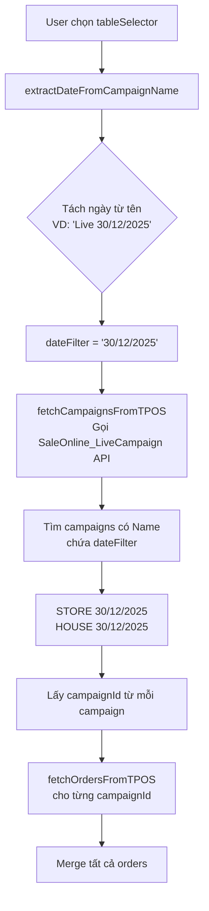

# Campaign Fetch Logic - tab-overview.html

## Tổng Quan

Tài liệu này giải thích quy trình lấy dữ liệu đơn hàng từ TPOS dựa trên việc chọn chiến dịch trong `tab-overview.html`.

---

## Luồng Dữ Liệu



---

## Chi Tiết Các Bước

### 1. Chọn Chiến Dịch (`tableSelector`)

**File:** [tab-overview.html#L2986](file:///Users/mac/Downloads/n2store/orders-report/tab-overview.html#L2986)

```html
<select id="tableSelector" onchange="handleTableChange()">
    <option value="">-- Chọn bảng --</option>
</select>
```

User chọn một bảng, ví dụ: `"Live 30/12/2025"`.

---

### 2. Tách Ngày Từ Tên Chiến Dịch

**Function:** `extractDateFromCampaignName(campaignName)`

Từ tên chiến dịch như `"Live 30/12/2025"`, tách ra phần ngày:

| Input                 | Output        |
|----------------------|---------------|
| `Live 30/12/2025`    | `30/12/2025`  |
| `STORE 15/12/2025`   | `15/12/2025`  |

---

### 3. Gọi API SaleOnline_LiveCampaign

**Function:** [fetchCampaignsFromTPOS(dateFilter)](file:///Users/mac/Downloads/n2store/orders-report/tab-overview.html#L3681-L3737)

```javascript
const url = `${WORKER_URL}/api/odata/SaleOnline_LiveCampaign?$top=20&$orderby=DateCreated+desc&$filter=contains(Name%2C%27${dateEncoded}%27)&$count=true`;
```

**API Response mẫu từ** [SaleOnline_LiveCampaign.txt](file:///Users/mac/Downloads/n2store/orders-report/SaleOnline_LiveCampaign.txt):

```json
{
    "@odata.count": 48,
    "value": [
        {
            "Id": "08381f92-6670-25bb-2e24-3a1e7f3aeacd",
            "Name": "HOUSE 30/12/2025",
            "Facebook_UserName": "Nhi Judy House"
        },
        {
            "Id": "df23fa88-3421-9f28-e5b0-3a1e7f3a5467",
            "Name": "STORE 30/12/2025",
            "Facebook_UserName": "NhiJudy Store"
        }
    ]
}
```

**Kết quả:** Với `dateFilter = "30/12/2025"`, API trả về 2 campaigns:
- `HOUSE 30/12/2025` (Id: `08381f92-...`)
- `STORE 30/12/2025` (Id: `df23fa88-...`)

---

### 4. Lấy Chi Tiết Đơn Hàng

**Function:** [fetchOrdersFromTPOS(campaignId)](file:///Users/mac/Downloads/n2store/orders-report/tab-overview.html#L3847-L3907)

```javascript
const endpoint = `/api/SaleOnline_Order/ExportFile?campaignId=${campaignId}&sort=date`;
```

Với mỗi `campaignId` từ bước 3, gọi API ExportFile để tải Excel đơn hàng.

---

### 5. Merge Tất Cả Orders

**Function:** [fetchAllCampaignsExcel()](file:///Users/mac/Downloads/n2store/orders-report/tab-overview.html#L4120-L4149)

```javascript
const fetchPromises = campaigns.map(campaign =>
    fetchOrdersFromTPOS(campaign.id)
        .then(orders => orders.map(o => ({ ...o, _campaign: campaign.name })))
);
const allOrders = results.flatMap(r => r.value);
```

Gọi song song cho tất cả campaigns, sau đó merge kết quả.

---

## Ví Dụ Thực Tế

| Bước | Dữ Liệu |
|------|---------|
| 1. User chọn | `"Live 30/12/2025"` |
| 2. Tách ngày | `"30/12/2025"` |
| 3. Gọi API LiveCampaign | Filter: `contains(Name,'30/12/2025')` |
| 4. Campaigns tìm được | `HOUSE 30/12/2025`, `STORE 30/12/2025` |
| 5. CampaignIds | `08381f92-...`, `df23fa88-...` |
| 6. Fetch Excel | 2 requests song song |
| 7. Merge | Tổng đơn từ cả HOUSE và STORE |

---

## Các File Liên Quan

| File | Mô tả |
|------|-------|
| [tab-overview.html](file:///Users/mac/Downloads/n2store/orders-report/tab-overview.html) | Chứa toàn bộ logic |
| [SaleOnline_LiveCampaign.txt](file:///Users/mac/Downloads/n2store/orders-report/SaleOnline_LiveCampaign.txt) | Sample API response |

---

## Các Function Chính

| Function | Line | Mô tả |
|----------|------|-------|
| `fetchCampaignsFromTPOS(dateFilter)` | 3681 | Gọi API lấy campaigns theo ngày |
| `getCurrentSessionCampaigns()` | 3779 | Lấy tất cả campaigns của session |
| `fetchOrdersFromTPOS(campaignId)` | 3847 | Tải Excel từ ExportFile API |
| `fetchAllCampaignsExcel()` | 4120 | Merge orders từ nhiều campaigns |
| `handleTableChange()` | 6440 | Xử lý khi user chọn bảng |
