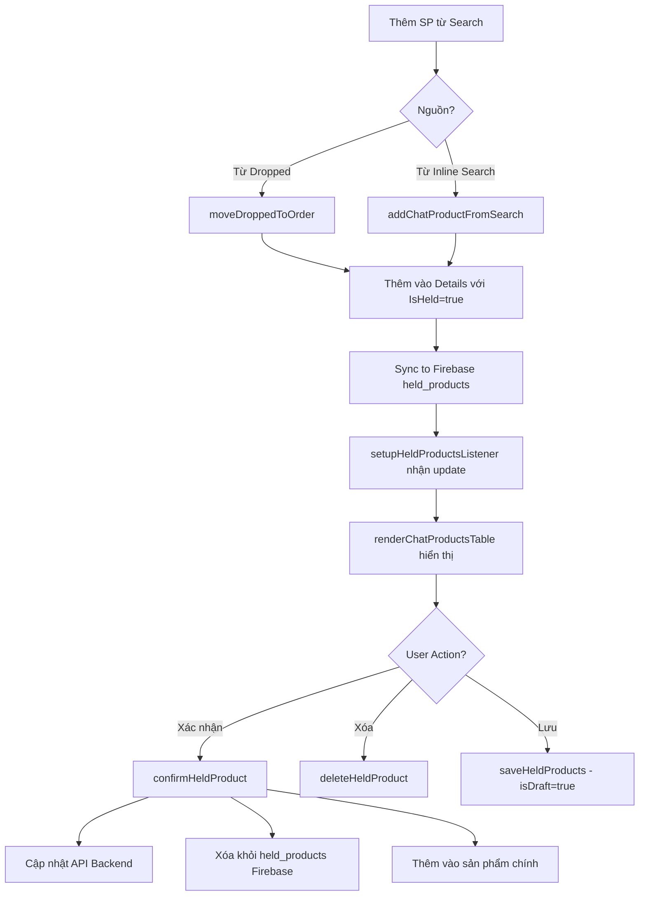

# Phân Tích Right Panel Tabs - Chat Modal

## Tổng Quan Cấu Trúc

Right panel trong chat modal có **4 tabs**:

| Tab | ID Tab Content | Mục đích |
|-----|----------------|----------|
| `orders` | `chatTabOrders` | Danh sách sản phẩm đơn hàng + sản phẩm giữ |
| `dropped` | `chatTabDropped` | Hàng rớt - xả |
| `history` | `chatTabHistory` | Lịch sử thao tác |
| `invoice_history` | `chatTabInvoiceHistory` | Lịch sử hóa đơn |

---

## Các File Liên Quan

| File | Chức năng chính |
|------|-----------------|
| [tab1-orders.html](./tab1-orders.html#L1160-1403) | HTML structure cho right panel |
| [dropped-products-manager.js](./dropped-products-manager.js) | Quản lý dropped/held products, switchChatPanelTab |
| [tab1-orders.js](./tab1-orders.js) | renderChatProductsTable, confirmHeldProduct |

---

## ✅ Trạng Thái Hiện Tại - HOẠT ĐỘNG ĐÚNG

### 1. Hàm `switchChatPanelTab` - ✅ UNIQUE

| File | Line | Trạng thái |
|------|------|------------|
| [dropped-products-manager.js](./dropped-products-manager.js#L1346) | 1346 | ✅ Hoạt động đúng |

---

## Held Products System

### Firebase Structure

```
held_products/
  └── {orderId}/
      └── {productId}/
          └── {userId}/
              ├── productId: number
              ├── displayName: string
              ├── quantity: number
              ├── isDraft: boolean    // false = tạm, true = đã lưu
              ├── timestamp: ServerValue
              ├── campaignName: string
              └── stt: string
```

### Luồng Sản Phẩm Giữ (Held Products)



### Các Hàm Chính

| Hàm | File | Line | Mục đích |
|-----|------|------|----------|
| `moveDroppedToOrder(index)` | dropped-products-manager.js | 856 | Chuyển SP từ dropped → held |
| `addChatProductFromSearch()` | tab1-orders.js | ~17695 | Thêm SP từ search → held |
| `confirmHeldProduct(productId)` | tab1-orders.js | ~17834 | Xác nhận SP → main order |
| `deleteHeldProduct(productId)` | tab1-orders.js | 18036 | Xóa SP khỏi held |
| `saveHeldProducts()` | dropped-products-manager.js | 1427 | Lưu held (isDraft=true) |
| `setupHeldProductsListener()` | dropped-products-manager.js | 1682 | Realtime listener |
| `cleanupHeldProducts()` | dropped-products-manager.js | 1497 | Cleanup temp holds |
| `cleanupHeldProductsListener()` | dropped-products-manager.js | 1825 | Detach Firebase listener |
| `cleanupAllUserHeldProducts()` | dropped-products-manager.js | 1838 | Cleanup on page unload |

---

## Realtime Sync

### Setup Listener Flow

```javascript
// Khi mở chat modal (tab1-orders.js:11266)
if (typeof window.setupHeldProductsListener === 'function') {
    window.setupHeldProductsListener();
}

// dropped-products-manager.js:1682
window.setupHeldProductsListener = function () {
    const orderId = window.currentChatOrderData?.Id;
    const heldRef = firebase.database().ref(`held_products/${orderId}`);
    
    heldRef.on('value', (snapshot) => {
        // Sync held products từ tất cả users
        // Update window.currentChatOrderData.Details
        // Re-render UI
    });
}
```

### Cleanup Flow

```javascript
// Khi đóng modal (tab1-orders.js:11726)
window.closeChatModal = async function () {
    // Chỉ cleanup listener, KHÔNG xóa held data
    window.cleanupHeldProductsListener();
    // ...reset state
}

// Khi rời page (beforeunload)
window.cleanupAllUserHeldProducts(); // Xóa temp holds (isDraft=false)
```

---

## Tab Orders - Render Logic

```javascript
// tab1-orders.js:17054
function renderChatProductsTable() {
    const productsToRender = window.currentChatOrderData?.Details || [];
    
    // Phân loại sản phẩm
    const normalProducts = productsToRender.filter(p => !p.IsHeld);
    const heldProducts = productsToRender.filter(p => p.IsHeld);
    
    // Render sections:
    // 1. Header "Sản phẩm giữ (N)" với nút "Lưu giữ"
    // 2. Danh sách held products (viền vàng)
    // 3. Header "Sản phẩm chính (N)"
    // 4. Danh sách normal products
}
```

### Product Card Actions

| Action | Held Products | Normal Products |
|--------|---------------|-----------------|
| +/- Quantity | ✅ `updateChatProductQuantity` | ✅ Cập nhật + sync API |
| Xóa | ✅ `deleteHeldProduct` | ✅ `removeChatProduct` |
| Xác nhận | ✅ `confirmHeldProduct` | N/A |
| Gửi ảnh | ✅ Right-click | ✅ Right-click |

---

## Tab Dropped - Render Logic

```javascript
// dropped-products-manager.js:1047
async function renderDroppedProductsTable() {
    // 1. Fetch holders cho mỗi product (ai đang giữ)
    // 2. Hiển thị search box để thêm SP vào dropped
    // 3. Render table với:
    //    - Tên SP + badge "Đang được giữ" nếu qty=0
    //    - Controls số lượng (disabled nếu qty=0)
    //    - Buttons: Chuyển về đơn | Gửi chat | Xóa
}
```

### Holder Status Display

Khi `Quantity = 0` → SP đang được giữ bởi user khác:
- Row opacity = 0.6
- Hiển thị tên người giữ + campaign + STT
- Nút "Chuyển về đơn" bị disabled

---

## ⚠️ Vấn Đề Đã Phát Hiện

### 1. Tab Invoice History - Chưa Implement

```javascript
// tab1-orders.js:24197
window.chatProductManager = {
    renderInvoiceHistory: function () {
        // TODO: Implement invoice history rendering
        container.innerHTML = `<p>Chức năng đang phát triển</p>`;
    }
}
```

**Status**: Placeholder - chưa có logic thực tế.

---

## Verification Plan

### Manual Testing - Held Products Flow

1. Mở orders-report page
2. Click vào một row để mở Chat Modal
3. Mở Right Panel (click icon info)

**Test Tab Orders:**
- [ ] Thêm SP từ inline search → SP xuất hiện ở section "Sản phẩm giữ"
- [ ] Click "+/-" để thay đổi số lượng → số lượng cập nhật
- [ ] Click nút "Xác nhận" → SP chuyển xuống "Sản phẩm chính"
- [ ] Click nút "Lưu giữ" → Reload page → SP vẫn còn

**Test Tab Dropped:**
- [ ] Click tab "Hàng rớt - xả"
- [ ] Tìm kiếm SP → Thêm vào dropped list
- [ ] Click nút ↩️ (Chuyển về đơn) → SP xuất hiện ở tab Orders

**Test Multi-user Realtime:**
- [ ] Mở 2 browser tabs với cùng đơn hàng
- [ ] Thêm SP từ tab 1 → Tab 2 tự động hiển thị SP mới

---

*Cập nhật lần cuối: 2025-12-25*
