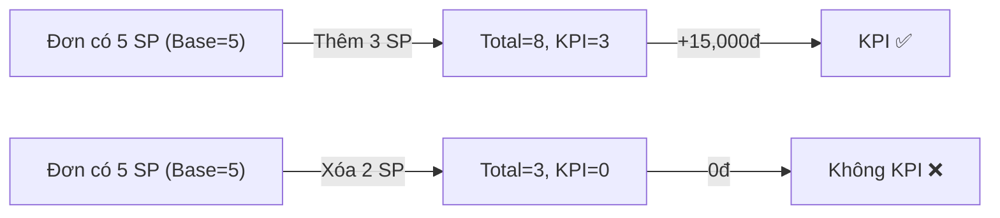
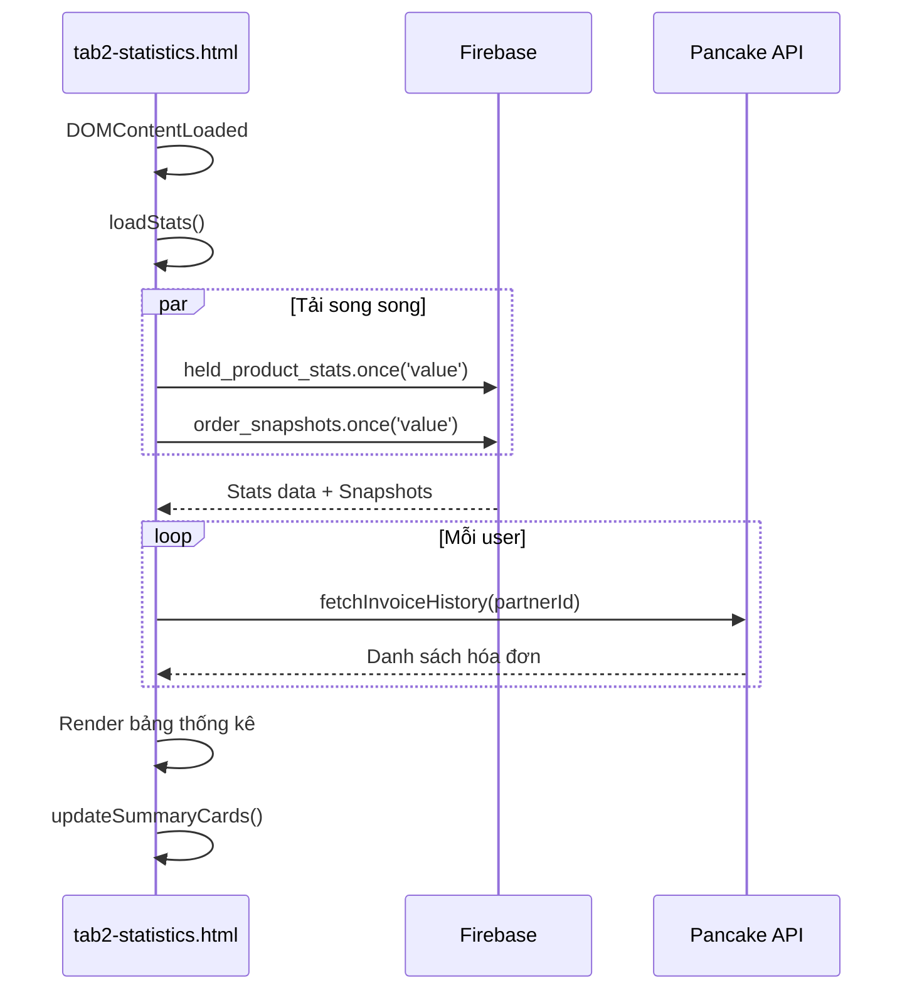

# Hướng Dẫn Chi Tiết Tab Thống Kê KPI (tab2-statistics.html)

> **URL:** https://nhijudyshop.github.io/n2store/orders-report  
> **File:** `orders-report/tab2-statistics.html`  
> **Mục đích:** Thống kê và theo dõi KPI của nhân viên dựa trên sản phẩm được thêm vào đơn hàng

---

## 📊 Tổng Quan

Tab Thống Kê (tab2-statistics.html) hiển thị thống kê KPI của từng nhân viên, cho phép:
- Xem tổng hợp KPI theo người dùng
- Drill-down vào danh sách đơn hàng của từng người
- Chi tiết sản phẩm trong từng đơn
- So sánh với hóa đơn thực tế từ API
- Xuất báo cáo Excel
- Xem biểu đồ Timeline

---

## 🔢 Công Thức Tính KPI

### Nguyên Tắc Cơ Bản

```
KPI = Max(0, Số lượng hiện tại - Base Product)
Delta KPI = KPI mới - KPI cũ
Tiền KPI = Delta KPI × 5,000đ
```

| Loại | Giá trị |
|------|---------|
| **+1 sản phẩm** (vượt base) | +5,000đ |
| **-1 sản phẩm** (từ phần KPI) | -5,000đ |
| **Sản phẩm ban đầu (base)** | 0đ |

### Ví Dụ Minh Họa



### Giải Thích Chi Tiết

1. **Base Product (không đổi):** Số lượng sản phẩm ban đầu trong đơn khi được mở lần đầu
2. **Thêm sản phẩm MỚI:** KPI = số lượng thêm (vì base = 0)
3. **Thêm vào sản phẩm có SẴN:** KPI = Max(0, total - base)
4. **Xóa sản phẩm:** Chỉ trừ KPI nếu xóa phần vượt quá base

---

## 🏗️ Cấu Trúc Dữ Liệu Firebase

### 1. Node `held_product_stats` (Lưu log KPI)

```javascript
held_product_stats/
  {userId}/
    {timestamp}: {
      userName: "Nguyen Van A",
      productCount: 3,           // Số lượng thay đổi (có thể âm)
      amount: 15000,             // Tiền (có thể âm)
      timestamp: 1732454123456,
      orderId: "12345",
      orderSTT: "ĐH001",
      isReduction: false,        // true nếu là giảm KPI
      products: [...]            // Chi tiết sản phẩm
    }
```

### 2. Node `order_snapshots` (Snapshot đơn hàng)

```javascript
order_snapshots/
  {orderId}: {
    orderId: "12345",
    orderSTT: "ĐH001",
    userId: "user123",
    userName: "Nguyen Van A",
    partnerId: 67890,            // ID khách hàng (để lấy hóa đơn)
    products: [...],             // Danh sách sản phẩm
    lastUpdated: 1732454123456
  }
```

### 3. Node `order_product_history` (Lịch sử baseline)

```javascript
order_product_history/
  {orderId}/
    {productId}: {
      baseProduct: 5,            // Số lượng ban đầu (KHÔNG ĐỔI)
      currentQty: 8,             // Số lượng hiện tại
      kpiQty: 3,                 // KPI = currentQty - baseProduct
      lastUpdated: 1732454123456
    }
```

---

## 🔄 Flow Hoạt Động

### Initialization Flow



### Chi Tiết Function `loadStats()`

```javascript
async function loadStats() {
    // 1. Fetch từ Firebase (song song)
    const [statsSnapshot, orderSnapshotsSnapshot] = await Promise.all([
        firebase.database().ref('held_product_stats').once('value'),
        firebase.database().ref('order_snapshots').once('value')
    ]);
    
    // 2. Aggregate data by user
    const userStats = {};
    Object.keys(data).forEach(userId => {
        // Tính tổng qty, amount, orderIds cho mỗi user
        // Phát hiện fraudScore nếu có isReduction
    });
    
    // 3. Fetch invoice totals
    for (const stat of userStats) {
        const invoices = await fetchInvoiceHistory(partnerId);
        stat.totalInvoiceAmount = sum(invoices.AmountTotal);
    }
    
    // 4. Render table và summary cards
}
```

---

## 🖥️ Giao Diện & Chức Năng

### 1. Summary Cards (Thẻ tổng hợp)

| Card | Mô tả | ID Element |
|------|-------|------------|
| 🔵 Tổng người dùng | Số user có KPI | `totalUsers` |
| 🟢 Tổng đơn hàng | Số đơn có sản phẩm KPI | `totalOrders` |
| 🟣 Tổng sản phẩm | Tổng số lượng KPI | `totalProducts` |
| 🔴 Cảnh báo | Nghi ngờ gian lận (fraudScore ≥ 3) | `totalFraudWarnings` |

### 2. Bảng Thống Kê Chính

| Cột | Mô tả |
|-----|-------|
| STT | Số thứ tự |
| Tên người dùng | Tên nhân viên |
| Số đơn | Số lượng đơn hàng unique |
| Tổng số lượng | Tổng số sản phẩm KPI |
| Tổng tiền (5.000đ/sp) | = Tổng số lượng × 5,000đ |
| Tổng tiền hóa đơn | Từ API (30 ngày gần nhất) |
| Trạng thái | OK / Cảnh báo / Nghi ngờ |

### 3. Nút Hành Động

| Nút | Chức năng | Function |
|-----|-----------|----------|
| 📈 Timeline | Biểu đồ KPI theo thời gian | `showTimeline()` |
| 📊 Export Excel | Xuất file Excel | `exportToExcel()` |
| 🔄 Làm mới | Tải lại dữ liệu | `loadStats()` |

---

## 📋 Modal Chi Tiết (3 cấp)

### Level 1: Modal Danh Sách Đơn Hàng

```
Click vào row → showOrders(userId, userName)
```

| Cột | Mô tả |
|-----|-------|
| # | Số thứ tự |
| STT Đơn | Mã đơn hàng |
| Số lượng SP | Số sản phẩm trong đơn |
| KPI | +N hoặc -N (màu xanh/đỏ) |
| Thời gian | Thời gian cập nhật |
| Trạng thái | Badge cảnh báo nếu có |

### Level 2: Modal Chi Tiết Đơn Hàng

```
Click vào đơn → showOrderDetails(orderId, orderSTT)
```

Gồm 6 tab:

#### Tab 1: Tất cả SP
- Hiển thị toàn bộ sản phẩm trong đơn
- Watermark badges: `B: baseline`, `C: current`, `KPI: kpi_qty`

#### Tab 2: SP có KPI
- Chỉ hiển thị sản phẩm được tính KPI
- Cột: Baseline, Current, KPI Qty, Giá trị KPI

#### Tab 3: SP không KPI
- Sản phẩm không được tính KPI
- Lý do: không qua "Sản phẩm đang giữ", không vượt baseline, etc.

#### Tab 4: Hóa đơn
- Load từ API: `fetchInvoiceHistory(partnerId)`
- Hiển thị tất cả hóa đơn 30 ngày gần nhất
- Chi tiết từng hóa đơn với OrderLines

#### Tab 5: Baseline
- Load từ: `order_product_history/{orderId}`
- So sánh baselineQty vs currentQty vs kpiQty
- Icon lock 🔒 cho baseline (không đổi)

#### Tab 6: So sánh với hóa đơn
- Dropdown chọn hóa đơn
- 2 bảng song song: Sản phẩm đơn vs Sản phẩm hóa đơn
- Highlight sản phẩm khớp (có KPI)

---

## 📈 Biểu Đồ Timeline

```javascript
function showTimeline() {
    // Aggregate by date
    const dateMap = new Map();
    Object.values(allStatsData).forEach(userStats => {
        const date = new Date(record.timestamp).toLocaleDateString('vi-VN');
        dateMap.get(date).qty += qty;
        dateMap.get(date).count += 1;
    });
    
    // Chart.js dual axis
    new Chart(ctx, {
        type: 'line',
        datasets: [
            { label: 'Tổng số lượng KPI', yAxisID: 'y' },
            { label: 'Số lượt "Lưu vào đơn"', yAxisID: 'y1' }
        ]
    });
}
```

---

## 📤 Export Excel

```javascript
function exportToExcel() {
    // Data structure
    const data = [
        ['THỐNG KÊ KPI - WATERMARK METHOD'],
        ['Xuất ngày:', new Date().toLocaleString('vi-VN')],
        [],
        ['STT', 'Tên người dùng', 'Số đơn', 'Tổng số lượng', 'Tổng tiền (đ)', 'Trạng thái'],
        // ... user rows
    ];
    
    // Use SheetJS (xlsx library)
    const ws = XLSX.utils.aoa_to_sheet(data);
    const wb = XLSX.utils.book_new();
    XLSX.utils.book_append_sheet(wb, ws, 'Thống kê KPI');
    XLSX.writeFile(wb, `KPI_Statistics_${date}.xlsx`);
}
```

---

## 🔍 Phát Hiện Gian Lận

### Fraud Score

```javascript
// Tăng fraudScore khi có giảm KPI
if (record.isReduction) {
    userStats[userId].hasNegativeKPI = true;
    userStats[userId].fraudScore += 1;
}

// Hiển thị cảnh báo
if (stat.fraudScore >= 3) {
    rowClass += " fraud-warning-row";
    statusHtml = '<span class="badge-fraud">Nghi ngờ</span>';
} else if (stat.hasNegativeKPI) {
    statusHtml = '<span class="badge-warning">Cảnh báo</span>';
}
```

### Các chỉ báo nghi ngờ:
- ⚠️ **Cảnh báo:** Có ít nhất 1 lần giảm KPI
- 🚨 **Nghi ngờ:** fraudScore ≥ 3 (3+ lần giảm KPI)

---

## 🔗 API Endpoints

### 1. Lấy danh sách hóa đơn

```javascript
GET /api/odata/FastSaleOrder/ODataService.GetOrdersByPartnerId
    ?partnerId={partnerId}
    &fromDate={YYYY-MM-DD}
    &toDate={YYYY-MM-DD}
```

### 2. Lấy chi tiết hóa đơn

```javascript
GET /api/odata/FastSaleOrder({invoiceId})
    ?$expand=OrderLines($expand=Product,ProductUOM,User)
```

---

## 📚 Danh Sách Functions

| Function | Mô tả |
|----------|-------|
| `loadStats()` | Tải và render bảng thống kê chính |
| `updateSummaryCards(users, orders, products, warnings)` | Cập nhật summary cards |
| `showOrders(userId, userName)` | Hiển thị modal danh sách đơn (Level 1) |
| `showOrderDetails(orderId, orderSTT)` | Hiển thị modal chi tiết đơn (Level 2) |
| `fetchInvoiceHistory(partnerId)` | Fetch hóa đơn từ API |
| `fetchInvoiceDetails(invoiceId)` | Fetch chi tiết hóa đơn với OrderLines |
| `loadInvoice(orderId, partnerId)` | Load và render tab Hóa đơn |
| `loadBaseline(orderId, orderProducts)` | Load và render tab Baseline |
| `loadComparison(orderId, partnerId, orderProducts)` | Load tab So sánh |
| `compareProducts(orderProducts, invoice)` | So sánh SP đơn với hóa đơn |
| `showTimeline()` | Hiển thị biểu đồ Timeline |
| `exportToExcel()` | Xuất file Excel |

---

## 🔧 Troubleshooting

### KPI không hiển thị

1. Kiểm tra Console → `[STATS]` logs
2. Xác nhận Firebase có data trong `held_product_stats`
3. Kiểm tra `order_snapshots` có partnerId

### Hóa đơn không load

1. Kiểm tra Console → `[INVOICE-FETCH]` logs
2. Xác nhận partnerId có trong order snapshot
3. Kiểm tra token hết hạn → refresh page

### Timeline trống

1. Xác nhận có data trong `allStatsData`
2. Kiểm tra timestamp format

---

## 📎 Files Liên Quan

| File | Mô tả |
|------|-------|
| `tab2-statistics.html` | File chính (HTML + JS inline) |
| `config.js` | Firebase config |
| `auth.js` | Authentication |
| `token-manager.js` | Token management |
| `api-config.js` | API configuration |
| `tab1-orders.css` | CSS styles |
| `report-modern.css` | Additional styles |

---

## 📝 Changelog

- **2024-12-26:** Tạo tài liệu hướng dẫn chi tiết
- **2024-11-25:** Refactored to Base Product Anchor Method
- **2024-11-24:** Initial implementation (Watermark Method)

---

**Tác giả:** Claude AI Assistant  
**Ngày cập nhật:** 2024-12-26
