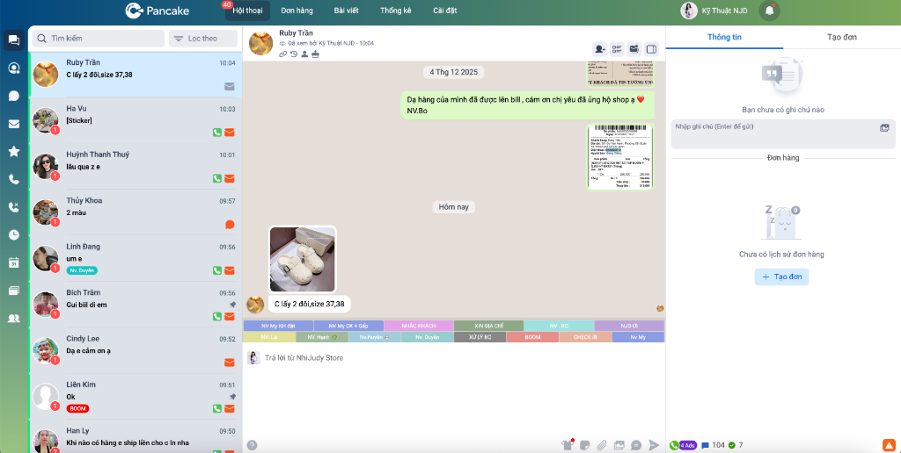
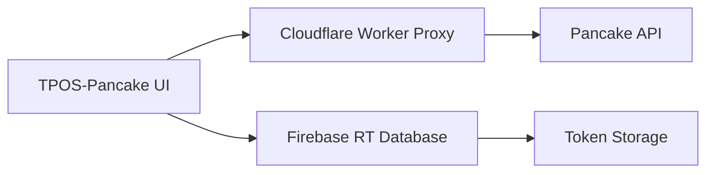
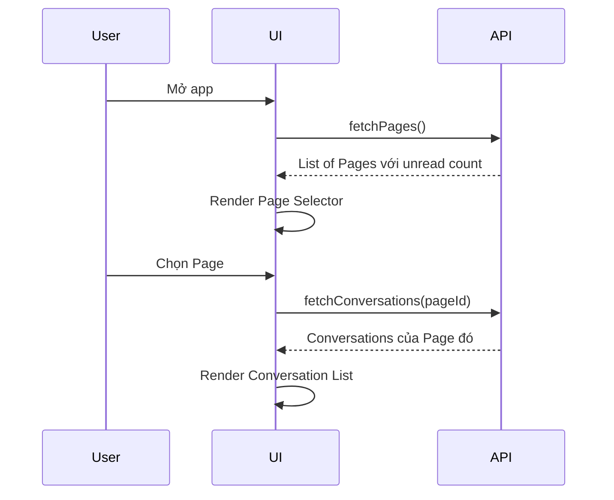
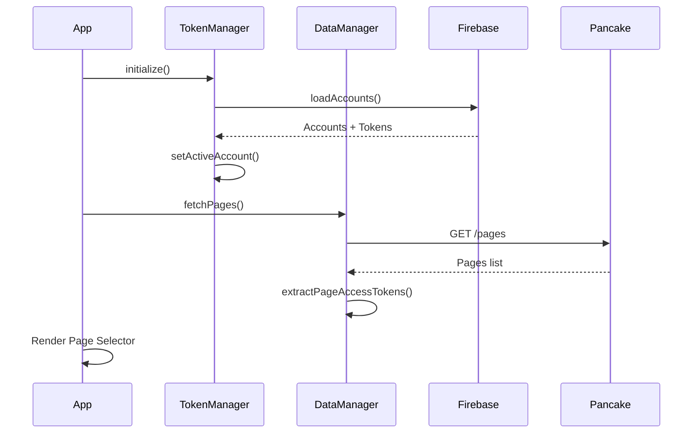
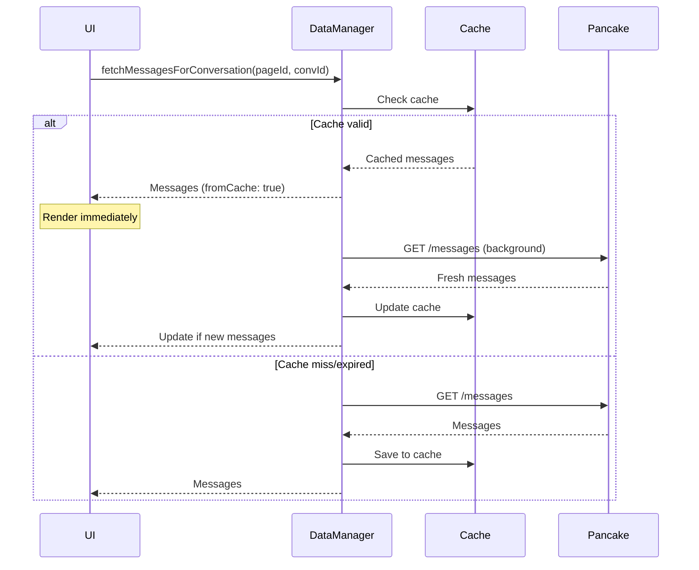
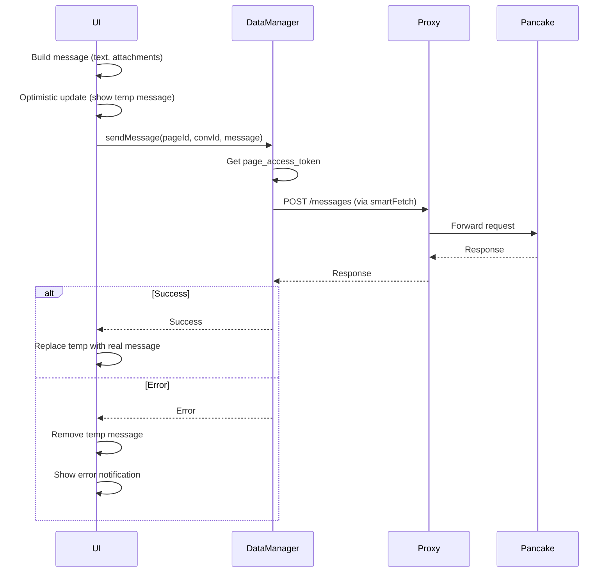

# 📚 Hướng Dẫn Chi Tiết Pancake Integration

> **Tài liệu hướng dẫn toàn diện về chức năng Pancake và cách xây dựng giao diện**

---

## �️ Giao Diện Tham Khảo (Pancake.vn)



### So Sánh UI Hiện Tại vs Pancake Gốc

| Thành phần | Pancake.vn Gốc | TPOS-Pancake Hiện Tại | Trạng thái |
|------------|----------------|------------------------|------------|
| **Header Tabs** | Hội thoại, Đơn hàng, Bài viết, Thống kê, Cài đặt | Sidebar đơn giản | ⚠️ Cần cải thiện |
| **Page Selector** | Góc trên phải với avatar + tên page | ❌ Chưa có | 🔴 **Bắt buộc thêm** |
| **Left Icon Sidebar** | Icons: Home, Messages, Tags, etc. | Có nhưng khác style | ⚠️ Cần align |
| **Conversation List** | Avatar, tên, preview, time, tags (BOOM) | ✅ Có cơ bản | ⚠️ Thiếu tags badge |
| **Chat Window** | Messages + images + staff tag | ✅ Có cơ bản | ⚠️ Cần polish |
| **Quick Replies** | 2 hàng buttons màu sắc | ✅ Có | ✅ OK |
| **Customer Info Panel** | Panel phải với "Thông tin" + "Tạo đơn" | ❌ Chưa có | 🟡 Nên thêm |
| **Reply From Label** | "Trả lời từ NhiJudy Store" | ✅ Có | ✅ OK |

> [!IMPORTANT]
> **Ưu tiên cao nhất**: Thêm **Page Selector** để người dùng có thể chọn page và xem tin nhắn của từng page riêng biệt.

---

## �📑 Mục Lục

1. [Tổng Quan Hệ Thống](#1-tổng-quan-hệ-thống)
2. [Chức Năng Chính](#2-chức-năng-chính)
3. [Yêu Cầu Giao Diện](#3-yêu-cầu-giao-diện)
4. [Chi Tiết Từng Màn Hình](#4-chi-tiết-từng-màn-hình)
5. [Luồng Dữ Liệu](#5-luồng-dữ-liệu)
6. [API Endpoints](#6-api-endpoints)
7. [Hướng Dẫn Cài Đặt](#7-hướng-dẫn-cài-đặt)

---

## 1. Tổng Quan Hệ Thống

### 1.1 Pancake là gì?

**Pancake.vn** là một nền tảng quản lý tin nhắn đa kênh (Omnichannel) cho phép:
- Quản lý nhiều **Facebook Pages** trên một giao diện
- Xử lý **Inbox** (tin nhắn) và **Comments** (bình luận) 
- Gửi tin nhắn/reply comment tự động hoặc thủ công
- Theo dõi thống kê tương tác

### 1.2 Kiến Trúc Tích Hợp



### 1.3 Các File Quan Trọng

| File | Vai Trò | Chức Năng |
|------|---------|-----------|
| `pancake-token-manager.js` | Quản lý xác thực | Lưu/lấy token, đồng bộ Firebase |
| `pancake-data-manager.js` | Quản lý dữ liệu | Fetch pages, conversations, messages |
| `pancake-chat.js` | Giao diện chat | Render UI, xử lý events |
| `api-config.js` | Cấu hình API | Proxy URLs, smartFetch |

---

## 2. Chức Năng Chính

### 2.1 Quản Lý Pages

| Chức năng | API | Mô tả |
|-----------|-----|-------|
| Lấy danh sách pages | `GET /api/v1/pages` | Tất cả pages đã kết nối |
| Đếm tin chưa đọc | `GET /api/v1/pages/unread_conv_pages_count` | Số conversations chưa đọc/page |
| Tạo Page Access Token | `POST /pages/{id}/generate_page_access_token` | Token cho Public API |

> [!IMPORTANT]
> **Hiện tại cần sửa**: UI chưa hiển thị danh sách pages và cho phép chọn page để xem tin nhắn.

### 2.2 Quản Lý Conversations

| Chức năng | API | Mô tả |
|-----------|-----|-------|
| Lấy conversations | `GET /api/public_api/v2/pages/{id}/conversations` | 60 conversations mới nhất |
| Tìm kiếm | `POST /conversations/search` | Search theo tên, fb_id |
| Đánh dấu đã đọc | `POST /conversations/{id}/read` | Bỏ badge unread |
| Thêm/xóa tag | `POST /conversations/{id}/tags` | Gắn nhãn phân loại |

### 2.3 Quản Lý Messages

| Chức năng | API | Mô tả |
|-----------|-----|-------|
| Lấy tin nhắn | `GET /conversations/{id}/messages` | 30 messages/lần |
| Gửi tin inbox | `POST /messages` với `action: reply_inbox` | Trả lời messenger |
| Reply comment | `POST /messages` với `action: reply_comment` | Trả lời bình luận |
| Private reply | `POST /messages` với `action: private_replies` | Nhắn riêng từ comment |
| Upload media | `POST /upload_contents` | Upload ảnh/video |

### 2.4 Phân Loại Conversation

```
┌──────────────────────────────────────────────────────────────┐
│                    CONVERSATIONS                              │
├─────────────────────────┬────────────────────────────────────┤
│        INBOX            │            COMMENT                  │
├─────────────────────────┼────────────────────────────────────┤
│ - Tin nhắn Messenger    │ - Bình luận trên bài viết          │
│ - 1-on-1 chat           │ - Có thể reply hoặc private reply  │
│ - from_psid có giá trị  │ - from_psid thường = null          │
│ - Thread persistent     │ - Thread theo post_id              │
└─────────────────────────┴────────────────────────────────────┘
```

---

## 3. Yêu Cầu Giao Diện

### 3.1 Cấu Trúc Layout Chính

```
┌─────────────────────────────────────────────────────────────────┐
│                         HEADER                                   │
│  [Logo] [Page Selector ▼] [Search] [Settings] [Account]         │
├───────────────┬─────────────────────────────────────────────────┤
│               │                                                  │
│   SIDEBAR     │              MAIN CONTENT                        │
│               │                                                  │
│  - Pages      │  ┌─────────────────┬───────────────────────┐   │
│  - Filters    │  │ Conversation    │    Chat Window        │   │
│  - Stats      │  │ List            │                       │   │
│               │  │                 │  [Header: Name, Tags] │   │
│               │  │ [Avatar] Name   │  [Messages Area]      │   │
│               │  │ [Preview]       │  [Quick Replies]      │   │
│               │  │ [Time] [Badge]  │  [Input Area]         │   │
│               │  │                 │                       │   │
│               │  └─────────────────┴───────────────────────┘   │
└───────────────┴─────────────────────────────────────────────────┘
```

### 3.2 Components Cần Thiết

#### A. Page Selector (Bắt buộc - Chưa có)

```html
<!-- Dropdown chọn Page -->
<div class="page-selector">
    <button class="selected-page">
        
        <span>Tên Page Hiện Tại</span>
        <span class="unread-badge">5</span>
        <i data-lucide="chevron-down"></i>
    </button>
    
    <div class="page-dropdown">
        <div class="page-item" data-page-id="123">
            
            <span>Page 1</span>
            <span class="unread-count">3</span>
        </div>
        <div class="page-item active" data-page-id="456">
            
            <span>Page 2</span>
            <span class="unread-count">2</span>
        </div>
    </div>
</div>
```

#### B. Conversation List (Đã có - Cần cải thiện)

```html
<div class="conversation-list">
    <!-- Filter tabs -->
    <div class="filter-tabs">
        <button class="tab active" data-type="all">Tất cả</button>
        <button class="tab" data-type="inbox">Inbox</button>
        <button class="tab" data-type="comment">Comment</button>
        <button class="tab" data-type="unread">Chưa đọc</button>
    </div>
    
    <!-- Search -->
    <div class="search-box">
        <i data-lucide="search"></i>
        <input type="text" placeholder="Tìm kiếm...">
    </div>
    
    <!-- Conversations -->
    <div class="conversations">
        <!-- Conversation item -->
        <div class="conversation-item unread" data-conv-id="xxx">
            <div class="avatar">
                
                <span class="type-badge inbox">M</span> <!-- M = Messenger, C = Comment -->
            </div>
            <div class="content">
                <div class="header">
                    <span class="name">Tên khách hàng</span>
                    <span class="time">10:30</span>
                </div>
                <div class="preview">Nội dung tin nhắn cuối...</div>
                <div class="tags">
                    <span class="tag" style="background: #4CAF50">Đã mua</span>
                </div>
            </div>
            <span class="unread-badge">3</span>
        </div>
    </div>
</div>
```

#### C. Chat Window (Đã có - Cần cải thiện)

```html
<div class="chat-window">
    <!-- Header -->
    <div class="chat-header">
        <div class="customer-info">
            
            <div class="details">
                <span class="name">Tên khách hàng</span>
                <span class="phone">0987654321</span>
                <span class="location">Hà Nội</span>
            </div>
        </div>
        <div class="actions">
            <button title="Tạo đơn hàng"><i data-lucide="shopping-cart"></i></button>
            <button title="Gọi điện"><i data-lucide="phone"></i></button>
            <button title="Thêm tag"><i data-lucide="tag"></i></button>
            <button title="Thông tin"><i data-lucide="info"></i></button>
        </div>
    </div>
    
    <!-- Messages -->
    <div class="messages-area">
        <!-- Date separator -->
        <div class="date-separator">Hôm nay</div>
        
        <!-- Incoming message -->
        <div class="message incoming">
            <div class="bubble">
                <p>Nội dung tin nhắn từ khách hàng</p>
            </div>
            <span class="time">10:30</span>
        </div>
        
        <!-- Outgoing message -->
        <div class="message outgoing">
            <div class="bubble">
                <p>Nội dung trả lời</p>
            </div>
            <div class="meta">
                <span class="sender">Nv.My</span>
                <span class="time">10:32</span>
                <i data-lucide="check-check"></i> <!-- Đã gửi -->
            </div>
        </div>
        
        <!-- Image message -->
        <div class="message incoming">
            <div class="image-container">
                
            </div>
            <span class="time">10:35</span>
        </div>
        
        <!-- Sticker -->
        <div class="message incoming">
            <div class="sticker">
                
            </div>
        </div>
    </div>
    
    <!-- Quick Replies -->
    <div class="quick-replies">
        <button class="qr-btn green">Hẹn ship</button>
        <button class="qr-btn blue">Đã nhận</button>
        <button class="qr-btn orange">Kiểm hàng</button>
    </div>
    
    <!-- Input -->
    <div class="input-area">
        <div class="input-actions">
            <button><i data-lucide="paperclip"></i></button>
            <button><i data-lucide="image"></i></button>
            <button><i data-lucide="smile"></i></button>
        </div>
        <textarea placeholder="Nhập tin nhắn..."></textarea>
        <button class="send-btn"><i data-lucide="send"></i></button>
    </div>
</div>
```

---

## 4. Chi Tiết Từng Màn Hình

### 4.1 Màn Hình Chọn Page (QUAN TRỌNG - CHƯA CÓ)

**Mục đích**: Cho phép user chọn Page Facebook để xem tin nhắn

**Flow**:


**Yêu cầu UI**:
1. **Dropdown** hoặc **Sidebar** hiển thị tất cả pages
2. Mỗi page hiển thị:
   - Avatar
   - Tên page
   - Badge số tin chưa đọc
   - Platform icon (Facebook/Instagram/Zalo)
3. Highlight page đang được chọn
4. Auto-refresh unread count định kỳ (30s)

### 4.2 Màn Hình Danh Sách Conversations

**Mục đích**: Hiển thị và filter conversations của page đang chọn

**Yêu cầu UI**:
1. **Filter Tabs**: Tất cả | Inbox | Comment | Chưa đọc
2. **Search Box**: Tìm theo tên, SĐT, nội dung
3. **Conversation Item**:
   - Avatar + Type badge (M/C)
   - Tên khách hàng
   - Preview tin nhắn cuối
   - Thời gian
   - Tags
   - Unread badge
4. **Sorting**: Mới nhất trước, chưa đọc đầu tiên
5. **Pagination**: Load more khi scroll

### 4.3 Màn Hình Chat

**Mục đích**: Xem và gửi tin nhắn trong conversation

**Yêu cầu UI**:
1. **Header**:
   - Avatar + Tên khách hàng
   - Phone, location (từ customers[0])
   - Action buttons (tạo đơn, gọi, tag, info)
2. **Messages Area**:
   - Group theo ngày
   - Incoming (trái) vs Outgoing (phải)
   - Hiển thị: text, image, video, sticker, reaction
   - Sender name cho outgoing
   - Timestamp
   - Status (sent/delivered/seen)
3. **Quick Replies**: Các mẫu trả lời nhanh
4. **Input Area**:
   - Attach file
   - Insert image
   - Emoji picker
   - Text input (auto-resize)
   - Send button

---

## 5. Luồng Dữ Liệu

### 5.1 Khởi Tạo App



### 5.2 Load Messages



### 5.3 Gửi Tin Nhắn



---

## 6. API Endpoints

### 6.1 Authentication

| Endpoint | Method | Auth | Mô Tả |
|----------|--------|------|-------|
| `/api/v1/pages` | GET | `access_token` | Lấy danh sách pages |
| `/pages/{id}/generate_page_access_token` | POST | `access_token` | Tạo page token |

### 6.2 Conversations

| Endpoint | Method | Auth | Mô Tả |
|----------|--------|------|-------|
| `/api/public_api/v2/pages/{id}/conversations` | GET | `page_access_token` | Lấy conversations |
| `/conversations/search` | POST | `access_token` | Tìm kiếm |
| `/conversations/{id}/read` | POST | `page_access_token` | Đánh dấu đã đọc |
| `/conversations/{id}/tags` | POST | `page_access_token` | Thêm/xóa tag |

### 6.3 Messages

| Endpoint | Method | Auth | Mô Tả |
|----------|--------|------|-------|
| `/conversations/{id}/messages` | GET | `page_access_token` | Lấy tin nhắn |
| `/conversations/{id}/messages` | POST | `page_access_token` | Gửi tin nhắn |
| `/pages/{id}/upload_contents` | POST | `page_access_token` | Upload media |

---

## 7. Hướng Dẫn Cài Đặt

### 7.1 Yêu Cầu Hệ Thống

- **Firebase**: Realtime Database để lưu tokens
- **Cloudflare Worker**: Proxy để bypass CORS
- **Pancake Account**: Đăng nhập để lấy JWT token

### 7.2 Cấu Hình Firebase

```javascript
// config.js
const firebaseConfig = {
    apiKey: "...",
    authDomain: "...",
    databaseURL: "https://xxx.firebasedatabase.app",
    projectId: "...",
    // ...
};
```

### 7.3 Lấy Pancake Token

**Cách 1**: Lấy từ cookie `pancake.vn`
- Mở DevTools → Application → Cookies
- Tìm cookie chứa JWT token

**Cách 2**: Pancake → Account → Personal Settings → API Token

### 7.4 Lưu Token vào Firebase

Token được lưu tại path: `pancake_jwt_tokens/accounts/{accountId}`

```json
{
    "token": "eyJhbGciOi...",
    "exp": 1234567890,
    "uid": "123456",
    "name": "User Name",
    "savedAt": 1700000000000
}
```

---

## 📋 Checklist Cần Làm (Dựa trên UI Tham Khảo)

### 🔴 Ưu Tiên Cao (Bắt buộc)

- [ ] **Page Selector** (Góc trên phải)
  - Dropdown hiển thị tất cả pages
  - Avatar + Tên page hiện tại
  - Badge unread count per page
  - Click để chuyển page
  
- [ ] **Filter theo Page**
  - Khi chọn page mới → reload conversations
  - Lưu page đã chọn vào localStorage
  
- [ ] **Hiển thị Tags Badge** (như "BOOM" trong hình)
  - Tags màu sắc trên conversation item
  - Có thể click để filter theo tag

### 🟡 Ưu Tiên Trung Bình

- [ ] **Header Tabs**
  - Tabs: Hội thoại | Đơn hàng | Bài viết | Thống kê | Cài đặt
  - Active tab styling
  
- [ ] **Left Icon Sidebar Styling**
  - Align icons theo Pancake gốc
  - Tooltips cho mỗi icon
  
- [ ] **Staff Badge trong Message**
  - Hiển thị "Đã xem bởi Kỹ Thuật NJD - 10:04"
  - Staff name trong outgoing messages

- [ ] **Customer Info Panel** (Panel phải)
  - Tab "Thông tin": Hiển thị customer details
  - Tab "Tạo đơn": Button tạo đơn hàng
  - Notes section: Ghi chú customer

### 🟢 Ưu Tiên Thấp

- [ ] **Gửi tin nhắn**: Implement sendMessage API
- [ ] **Upload media**: Upload ảnh/video
- [ ] **Emoji picker**: Chọn emoji
- [ ] **Auto-refresh**: Polling conversations định kỳ (30s)
- [ ] **Mark as read animation**: Visual feedback

---

## 📐 Chi Tiết Layout Theo Hình Tham Khảo

### Layout Chính (3 cột)

```
┌───┬────────────────────────────────────────────────────────────────────────┐
│   │  [Pancake Logo] [Hội thoại] [Đơn hàng] [Bài viết] [Thống kê] [Cài đặt] │
│   │                                                        [Page Selector] │
│ S ├──────────────────┬──────────────────────────┬──────────────────────────┤
│ I │                  │                          │                          │
│ D │  CONVERSATION    │      CHAT WINDOW         │    CUSTOMER INFO         │
│ E │  LIST            │                          │    PANEL                 │
│ B │  ┌────────────┐  │  [Header: Ruby Trần]     │    ┌──────────────────┐  │
│ A │  │ 🔍 Search  │  │  [Status bar]            │    │ Thông tin │Tạo đơn│  │
│ R │  │ [Lọc theo] │  │                          │    ├──────────────────┤  │
│   │  ├────────────┤  │  ┌──────────────────┐    │    │ Avatar           │  │
│   │  │ Ruby Trần  │  │  │ Messages         │    │    │ Name             │  │
│ I │  │ Ha Vu      │  │  │ - Incoming msg   │    │    │ Phone            │  │
│ C │  │ Huỳnh Thuỷ │  │  │ - Images         │    │    │ Notes            │  │
│ O │  │ Thùy Khoa  │  │  │ - Outgoing msg   │    │    │                  │  │
│ N │  │ Liên Kim🔴 │  │  └──────────────────┘    │    │ Đơn hàng         │  │
│ S │  │ etc...     │  │                          │    │ [+ Tạo đơn]      │  │
│   │  └────────────┘  │  [Quick Replies]         │    └──────────────────┘  │
│   │                  │  [Reply From Label]      │                          │
│   │                  │  [Input Area]            │                          │
└───┴──────────────────┴──────────────────────────┴──────────────────────────┘
```

### Quick Replies (2 hàng - từ hình)

**Hàng 1:**
| Button | Màu |
|--------|-----|
| NV.My Kh.Dặt | 🔵 Blue |
| NV.My OK + Gặp | 🟢 Green |
| NHẮC KHÁCH | 🟠 Orange |
| XIN ĐỊA CHỈ | 🟣 Purple |
| NV_BD | 🔵 Blue |
| NJD Có | 🟢 Green |

**Hàng 2:**
| Button | Màu |
|--------|-----|
| NV. Lễ | 🔵 Blue |
| NV. Hanh ✨ | 🟢 Green |
| Nv.Huyền | 🟠 Orange |
| Nv. Duyên | 🔴 Red |
| XỬ LÝ BC | 🟣 Purple |
| BOOM | 🔴 Red |
| CHECK III | 🟢 Green |
| Nv My | 🔵 Blue |

---

*Tài liệu được cập nhật: 2025-12-19*

