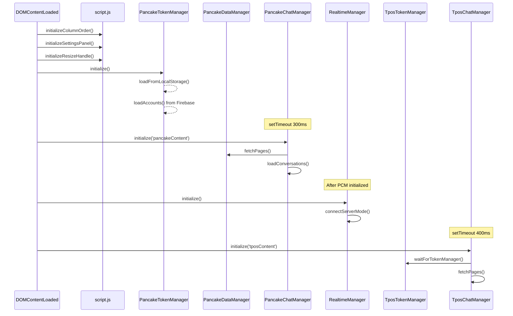
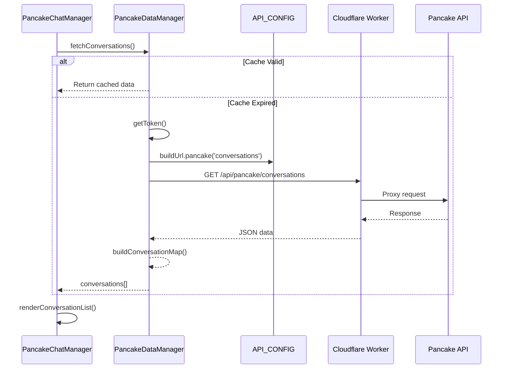
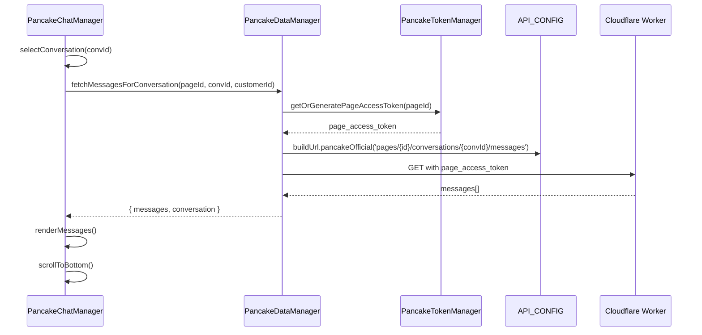
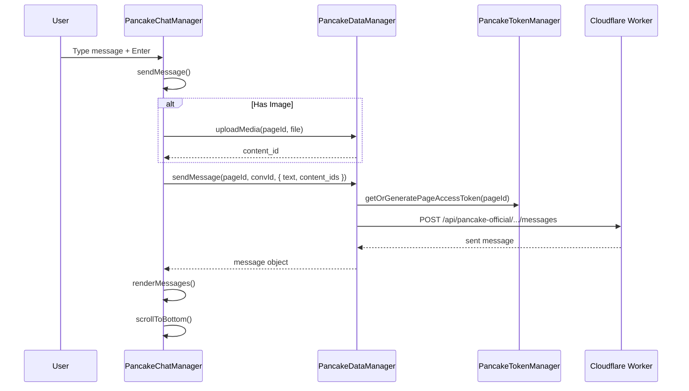
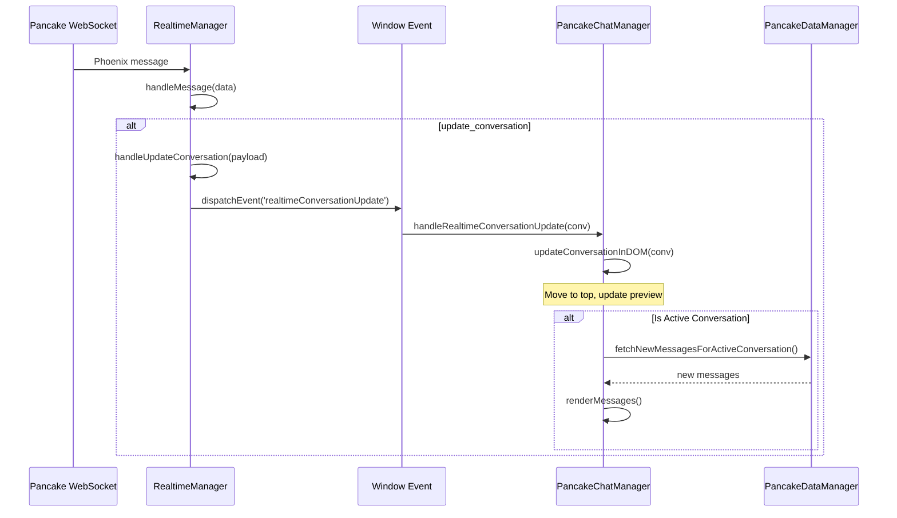
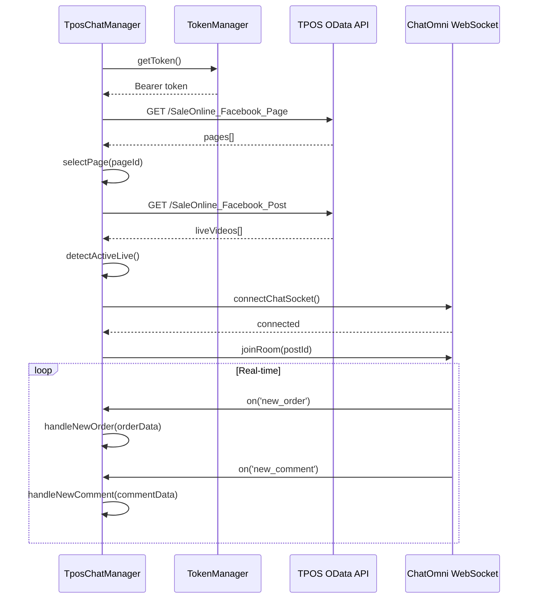

# TPOS-Pancake Architecture Documentation

## Tổng Quan

TPOS-Pancake là ứng dụng chat tích hợp 2 hệ thống:
- **TPOS (trái)**: Live Comments từ TPOS API - quản lý bình luận livestream
- **Pancake (phải)**: Chat từ Pancake.vn API - quản lý tin nhắn Messenger/Comment

Project sử dụng Vanilla JS, không framework, với kiến trúc 2 cột có thể hoán đổi vị trí.

---

## 📁 Cấu Trúc File Chi Tiết

```
tpos-pancake/
├── index.html                  # Main HTML - layout 2 cột (850 lines)
├── script.js                   # UI Manager - column, resize, settings (477 lines, 26 functions)
│
├── ─────────────────────────── # PANCAKE SIDE (RIGHT COLUMN)
├── pancake-chat.js             # Chat UI Manager (3456 lines, 94 functions)
├── pancake-data-manager.js     # Data Layer (3169 lines, 64 functions)
├── pancake-token-manager.js    # Token Management (1055 lines, 34 functions)
├── pancake-chat.css            # Pancake chat styles (44KB)
│
├── ─────────────────────────── # TPOS SIDE (LEFT COLUMN)
├── tpos-chat.js                # TPOS Live Comments (1453 lines, 62 functions)
├── tpos-token-manager.js       # Bearer Token Manager (514 lines, 22 functions)
├── tpos-chat.css               # TPOS chat styles (21KB)
│
├── ─────────────────────────── # SHARED
├── realtime-manager.js         # WebSocket Realtime Manager (496 lines, 25 functions)
├── api-config.js               # API URLs & endpoints (115 lines)
├── auth.js                     # Authentication
├── cache.js                    # Local caching
├── config.js                   # Firebase config
├── notification-system.js      # Toast notifications
├── modern.css                  # TPOS column styles (17KB)
│
├── ─────────────────────────── # DOCUMENTATION
├── ARCHITECTURE.md             # This file
├── PANCAKE_GUIDE.md           # Pancake features guide
├── PROJECT_ANALYSIS.md        # Detailed project analysis
└── *.md                       # Other documentation files
```

---

## 🔵 PANCAKE SIDE (Cột Phải)

### 1. PancakeChatManager (`pancake-chat.js`)

**Mô tả:** Quản lý toàn bộ giao diện chat Pancake - hiển thị danh sách hội thoại, tin nhắn, và tương tác người dùng.

**Kích thước:** 3,456 lines | 94 functions | 138KB

```javascript
class PancakeChatManager {
    // State
    conversations: []              // Danh sách hội thoại
    activeConversation: null       // Hội thoại đang chọn
    messages: []                   // Tin nhắn của conversation hiện tại
    pages: []                      // Danh sách Facebook Pages
    selectedPageId: null           // Page đang filter
    
    // Pagination
    hasMoreMessages: true
    hasMoreConversations: true
    messageCurrentCount: 0
    
    // WebSocket
    ws: null
    wsReconnectTimer: null
    heartbeatInterval: null
    refCounter: 1
}
```

**Nhóm Functions Chi Tiết:**

| Nhóm | Functions | Số lượng | Mô tả |
|------|-----------|----------|-------|
| **Initialize** | `initialize()`, `render()` | 2 | Khởi tạo UI và render layout |
| **Conversation List** | `renderConversationList()`, `renderConversationItem()`, `loadConversations()`, `loadMoreConversations()` | 4 | Hiển thị & load danh sách |
| **Chat Window** | `renderChatWindow()`, `renderMessages()`, `renderMessage()`, `loadMessages()`, `loadMoreMessages()`, `refreshMessagesInBackground()` | 6 | Hiển thị chat & tin nhắn |
| **Realtime Updates** | `handleRealtimeConversationUpdate()`, `fetchNewMessagesForActiveConversation()`, `updateConversationInDOM()`, `showNewMessageIndicator()` | 4 | Cập nhật in-place như Messenger |
| **Page Selector** | `loadPages()`, `renderPageDropdown()`, `selectPage()`, `togglePageDropdown()`, `updateSelectedPageDisplay()`, `saveSelectedPage()`, `loadSelectedPage()`, `preloadPageAccessTokens()` | 8 | Chọn & quản lý Facebook Pages |
| **Search** | `performSearch()`, `clearSearch()`, `setFilterType()` | 3 | Tìm kiếm hội thoại |
| **Context Menu** | `showContextMenu()`, `hideContextMenu()`, `handleContextMenuAction()`, `showTagsSubmenu()` | 4 | Menu chuột phải |
| **Send Message** | `sendMessage()`, `handleImageSelect()`, `clearImagePreview()` | 3 | Gửi tin nhắn + ảnh |
| **Emoji Picker** | `bindEmojiPicker()`, `renderEmojiGrid()`, `addToRecentEmojis()` | 3 | Bộ chọn emoji |
| **Typing Indicator** | `bindTypingIndicator()` | 1 | Hiển thị "đang nhập..." |
| **Scroll Events** | `bindScrollEvents()`, `scrollToBottom()`, `updateScrollButtonVisibility()`, `updateScrollButtonBadge()` | 4 | Xử lý cuộn & button |
| **Customer Stats** | `renderCustomerStatsBar()` | 1 | Thanh thống kê khách hàng |
| **Quick Replies** | `renderQuickReplies()`, `setQuickReplies()` | 2 | Tin nhắn mẫu nhanh |
| **WebSocket** | `initializeWebSocket()`, `onSocketOpen()`, `onSocketClose()`, `onSocketError()`, `onSocketMessage()`, `joinChannels()`, `sendPhxMessage()`, `handlePhxReply()`, `handleConversationUpdate()`, `handleNewMessage()`, `handleTagsUpdated()`, `startHeartbeat()`, `stopHeartbeat()`, `closeWebSocket()`, `updateSocketStatusUI()` | 15 | Kết nối Phoenix Protocol |
| **Notifications** | `updateUnreadCounts()`, `showNewMessageNotification()` | 2 | Thông báo tin nhắn mới |
| **UI Helpers** | `getAvatarHtml()`, `getTagsHtml()`, `getChatStatus()`, `getSenderName()`, `renderLoadingState()`, `renderErrorState()`, `switchTab()` | 7 | Helper functions |
| **Formatting** | `formatTime()`, `formatMessageTime()`, `groupMessagesByDate()`, `parseTimestamp()`, `escapeHtml()`, `parseMessageHtml()` | 6 | Format thời gian & text |
| **Tab Management** | `switchTab()` | 1 | Chuyển tab Inbox/Comment |
| **Event Binding** | `bindEvents()`, `bindChatInputEvents()` | 2 | Bind sự kiện UI |
| **Auto Refresh** | `startAutoRefresh()`, `stopAutoRefresh()` | 2 | Tự động refresh |
| **Utilities** | `selectConversation()`, `refresh()`, `getActiveConversation()` | 3 | Các function tiện ích |

---

### 2. PancakeDataManager (`pancake-data-manager.js`)

**Mô tả:** Data layer - Gọi API, cache, xử lý dữ liệu. Không có UI logic.

**Kích thước:** 3,169 lines | 64 functions | 126KB

```javascript
class PancakeDataManager {
    // State
    conversations: []
    pageIds: []
    lastFetchTime: null
    CACHE_DURATION: 60000  // 1 phút

    // Maps for fast lookup (O(1) thay vì O(n))
    inboxMapByPSID: Map()     // INBOX conversations by PSID
    inboxMapByFBID: Map()     // INBOX conversations by Facebook ID  
    commentMapByPSID: Map()   // COMMENT conversations by PSID
    commentMapByFBID: Map()   // COMMENT conversations by Facebook ID
}
```

**Nhóm Functions Chi Tiết:**

| Nhóm | Functions | Mô tả |
|------|-----------|-------|
| **Token** | `getToken()`, `getHeaders()` | Lấy JWT token và build headers |
| **Avatar** | `getAvatarUrl()` | URL avatar với fallback (direct → proxy → default) |
| **Pages** | `fetchPages()`, `fetchPagesWithUnreadCount()`, `extractAndCachePageAccessTokens()` | Quản lý Facebook Pages |
| **Conversations** | `fetchConversations()`, `fetchMoreConversations()`, `fetchConversationsByCustomerFbId()`, `fetchConversationsByFbId()` | Load & paginate hội thoại |
| **Search** | `searchConversations()`, `searchConversationsByCommentIds()` | Tìm kiếm theo tên/phone/fb_id |
| **Conversation Map** | `buildConversationMap()`, `getConversationByUserId()` | Maps lookup nhanh |
| **Messages** | `fetchMessagesForConversation()`, `fetchMessages()`, `fetchInboxPreview()`, `clearMessagesCache()` | Load tin nhắn với caching |
| **Send Message** | `sendMessage()`, `sendPrivateReply()` | Gửi inbox/comment reply |
| **Upload** | `uploadMedia()`, `uploadImage()`, `deleteImage()`, `calculateSHA1()` | Upload ảnh/video |
| **Read Status** | `markConversationAsRead()`, `markConversationAsUnread()`, `updateConversationReadStatus()`, `markAsSeen()` | Đánh dấu đọc/chưa đọc |
| **Comment Actions** | `fetchComments()`, `hideComment()`, `unhideComment()`, `likeComment()`, `unlikeComment()`, `deleteComment()` | Quản lý bình luận |
| **Tags** | `fetchTags()`, `addRemoveConversationTag()` | Quản lý nhãn |
| **Customer** | `fetchCustomerInfo()`, `updateCustomerInfo()`, `addCustomerNote()`, `fetchCustomerNotes()`, `deleteCustomerNote()` | Quản lý khách hàng |
| **Employees** | `fetchEmployees()`, `assignEmployeeToConversation()`, `unassignEmployeeFromConversation()` | Phân công nhân viên |
| **Typing** | `sendTypingIndicator()` | Gửi trạng thái đang nhập |
| **Quick Replies** | `fetchQuickReplies()` | Load tin nhắn mẫu |
| **Posts** | `fetchPosts()` | Load danh sách bài viết |
| **24h Window** | `check24HourWindow()`, `findLastCustomerMessage()` | Kiểm tra Facebook 24h policy |
| **Order Integration** | `getUnreadInfoForOrder()`, `getMessageUnreadInfoForOrder()`, `getCommentUnreadInfoForOrder()`, `getLastMessageForOrder()`, `getLastCommentForOrder()`, `getChatInfoForOrder()` | Tích hợp với đơn hàng TPOS |
| **Utilities** | `parseChannelId()`, `getPageToken()`, `initialize()` | Các function tiện ích |

---

### 3. PancakeTokenManager (`pancake-token-manager.js`)

**Mô tả:** Quản lý JWT tokens & page_access_tokens với multi-layer storage.

**Kích thước:** 1,055 lines | 34 functions | 40KB

```javascript
class PancakeTokenManager {
    // State
    currentToken: null
    currentTokenExpiry: null
    accounts: {}                 // Multiple Pancake accounts
    activeAccountId: null        // Currently active account
    pageAccessTokens: {}         // Per-page tokens (never expire)

    // Firebase refs
    firebaseRef: null
    accountsRef: null
    pageTokensRef: null
}
```

**Token Priority Order:**
1. **In-memory cache** (fastest, 0ms)
2. **localStorage** (fast, no network, ~1ms)
3. **Firebase RTDB** (network required, ~100ms)
4. **Cookie** (fallback, cross-domain)

**Nhóm Functions:**

| Nhóm | Functions | Mô tả |
|------|-----------|-------|
| **localStorage JWT** | `saveTokenToLocalStorage()`, `getTokenFromLocalStorage()`, `clearTokenFromLocalStorage()` | Cache JWT local |
| **localStorage Page Tokens** | `savePageAccessTokensToLocalStorage()`, `getPageAccessTokensFromLocalStorage()`, `clearPageAccessTokensFromLocalStorage()` | Cache page tokens local |
| **Firebase** | `initialize()`, `loadAccounts()`, `getTokenFromFirebase()`, `saveTokenToFirebase()`, `loadPageAccessTokens()` | Firebase backup |
| **Accounts** | `getAllAccounts()`, `setActiveAccount()`, `deleteAccount()`, `getAccountInfo()` | Multi-account support |
| **JWT Operations** | `getToken()`, `setTokenManual()`, `getTokenFromCookie()`, `getTokenInfo()`, `clearToken()` | CRUD token |
| **JWT Decode** | `decodeToken()`, `base64UrlDecode()`, `isTokenExpired()`, `debugToken()` | Parse & validate |
| **Page Tokens** | `savePageAccessToken()`, `getPageAccessToken()`, `generatePageAccessToken()`, `getOrGeneratePageAccessToken()`, `getAllPageAccessTokens()` | Per-page tokens (không hết hạn) |
| **Init** | `loadFromLocalStorage()` | Fast synchronous load |

---

## 🟢 TPOS SIDE (Cột Trái)

### 4. TposChatManager (`tpos-chat.js`)

**Mô tả:** Quản lý Live Comments từ TPOS - hiển thị bình luận từ livestream Facebook.

**Kích thước:** 1,453 lines | 62 functions | 56KB

```javascript
class TposChatManager {
    // Comments data
    comments: []                 // Tất cả bình luận
    filteredComments: []         // Bình luận sau filter
    filterType: 'all'            // 'all', 'hasOrder', 'noOrder'
    
    // Page & Post selection
    pages: []                    // Danh sách pages
    selectedPageId: null         // Page đang chọn
    liveVideos: []               // Danh sách live videos
    selectedPostId: null         // Post/Live đang xem
    
    // WebSocket
    socket: null                 // ChatOmni WebSocket
    serverSocket: null           // Server-mode WebSocket
    isConnected: false
    
    // Real-time
    sessionIndexes: {}           // Map comment → session index
}
```

**Nhóm Functions:**

| Nhóm | Functions | Mô tả |
|------|-----------|-------|
| **Initialize** | `initialize()`, `render()`, `bindEvents()` | Khởi tạo UI |
| **Token** | `waitForTokenManager()`, `getAccessToken()`, `getAuthHeader()`, `autoFetchToken()` | Lấy Bearer token từ TPOS |
| **WebSocket** | `connectWebSocket()`, `connectServerMode()`, `connectToServerWebSocket()`, `handleServerMessage()`, `processTPOSEvent()` | Server-mode WebSocket |
| **ChatSocket** | `connectChatSocket()`, `joinRoom()`, `startHeartbeat()`, `handleSocketMessage()`, `handleOnEvents()`, `scheduleReconnect()`, `updateSocketStatus()` | ChatOmni Socket.IO |
| **Event Handlers** | `handleNewOrder()`, `handleNewComment()`, `handleOrderUpdate()` | Xử lý real-time events |
| **Pages** | `fetchPages()`, `getPageName()`, `showPageSelector()`, `selectPage()`, `updatePageSelectorUI()` | Quản lý pages |
| **Live Videos** | `fetchLiveVideos()`, `detectActiveLive()`, `updatePostSelectorUI()`, `showLiveVideoSelector()`, `selectLiveVideo()` | Quản lý livestream |
| **Session Index** | `fetchSessionIndexes()` | Lấy STT phiên cho comments |
| **Comments** | `fetchComments()`, `renderComments()`, `updateCommentBadges()`, `applyFilter()`, `updateCommentCount()`, `updateOrderCount()` | Hiển thị & filter bình luận |
| **UI States** | `showLoading()`, `showError()`, `showLoginPrompt()`, `showTokenError()`, `showEmptyState()`, `showPostSelector()`, `showSettings()` | Các trạng thái UI |
| **Utilities** | `formatTime()`, `escapeHtml()`, `refresh()`, `destroy()` | Helper functions |

---

### 5. TokenManager (`tpos-token-manager.js`)

**Mô tả:** Quản lý Bearer token cho TPOS API với auto-refresh.

**Kích thước:** 514 lines | 22 functions | 18KB

```javascript
class TokenManager {
    token: null
    tokenExpiry: null
    isRefreshing: false
    isInitialized: false
    storageKey: 'bearer_token_data'
    
    // Firebase
    firebaseRef: null
}
```

**Token Refresh Flow:**
1. Check localStorage first
2. Check Firebase backup
3. Fetch new from TPOS OAuth API
4. Save to both localStorage & Firebase

**Nhóm Functions:**

| Nhóm | Functions | Mô tả |
|------|-----------|-------|
| **Firebase** | `waitForFirebase()`, `waitForFirebaseAndInit()`, `initFirebase()`, `retryFirebaseInit()`, `getTokenFromFirebase()`, `saveTokenToFirebase()` | Firebase integration |
| **Storage** | `loadFromStorage()`, `saveToStorage()` | localStorage operations |
| **Token** | `init()`, `getToken()`, `getAuthHeader()`, `fetchNewToken()`, `isTokenValid()`, `clearToken()`, `waitForRefresh()`, `refresh()` | Token lifecycle |
| **Helpers** | `authenticatedFetch()`, `getTokenInfo()` | Utilities |

---

## 🔄 SHARED COMPONENTS

### 6. RealtimeManager (`realtime-manager.js`)

**Mô tả:** Quản lý WebSocket connection cho Pancake realtime updates (Phoenix Protocol).

**Kích thước:** 496 lines | 25 functions | 17KB

```javascript
class RealtimeManager {
    ws: null
    isConnected: false
    refCounter: 1
    heartbeatInterval: null
    reconnectTimer: null
    subscribedChannels: Set()
}
```

**WebSocket Modes:**
1. **Server Mode** (default): Proxy server quản lý connection
2. **Browser Mode**: Kết nối trực tiếp từ browser
3. **Localhost Mode**: Debug local

**Phoenix Protocol:**
- Format: `[join_ref, ref, topic, event, payload]`
- Channel: `page_conversation:{pageId}:{uid}`
- Events: `update_conversation`, `phx_reply`, `phx_join`

**Nhóm Functions:**

| Nhóm | Functions | Mô tả |
|------|-----------|-------|
| **Initialize** | `initialize()`, `manualConnect()` | Khởi tạo connection |
| **Server Mode** | `connectServerMode()`, `connectToProxyServer()` | Qua proxy server |
| **Browser Mode** | `connect()`, `disconnect()` | Trực tiếp từ browser |
| **Heartbeat** | `startHeartbeat()`, `stopHeartbeat()` | Keep-alive ping mỗi 30s |
| **Channels** | `joinChannels()` | Subscribe page channels |
| **Handlers** | `handleMessage()`, `handleUpdateConversation()`, `handleOrderTagsUpdate()` | Xử lý events |
| **Utilities** | `makeRef()`, `generateClientSession()` | Helper functions |

---

### 7. API_CONFIG (`api-config.js`)

**Mô tả:** Central configuration cho tất cả API endpoints.

**Kích thước:** 115 lines

```javascript
const API_CONFIG = {
    WORKER_URL: 'https://chatomni-proxy.nhijudyshop.workers.dev',
    TPOS_ODATA: '{WORKER}/api/odata',
    PANCAKE: '{WORKER}/api/pancake',

    buildUrl: {
        tposOData(endpoint, params),        // TPOS OData API
        pancake(endpoint, params),           // Pancake qua proxy
        pancakeOfficial(endpoint, token),    // pages.fm Public API
        pancakeDirect(endpoint, pageId, jwt, token),  // 24h bypass
        facebookSend()                       // Facebook Send API
    },
    
    smartFetch(url, options),               // Simple fetch wrapper
    getStatus()                             // Get server status
}
```

**API Routing:**

| Route | Mô tả | Auth |
|-------|-------|------|
| `/api/odata/*` | TPOS OData API | Bearer token |
| `/api/pancake/*` | Pancake Internal API | JWT cookie |
| `/api/pancake-official/*` | pages.fm Public API | `page_access_token` |
| `/api/pancake-direct/*` | Pancake với Referer bypass | JWT + page_access_token |
| `/api/facebook-send` | Facebook Send API | Page token + message_tag |

---

### 8. Script.js (`script.js`)

**Mô tả:** UI Manager - quản lý layout 2 cột, resize, settings.

**Kích thước:** 477 lines | 26 functions

```javascript
const COLUMN_CONFIG = {
    storageKey: 'tpos_pancake_column_order',
    defaultOrder: ['tpos', 'pancake']
}
```

**Nhóm Functions:**

| Nhóm | Functions | Mô tả |
|------|-----------|-------|
| **Column Order** | `initializeColumnOrder()`, `applyColumnOrder()`, `saveColumnOrder()`, `updateSelectValues()`, `swapColumns()`, `getColumnOrder()` | Quản lý thứ tự cột |
| **Settings Panel** | `initializeSettingsPanel()` | Panel cài đặt |
| **Resize** | `initializeResizeHandle()`, `startResize()`, `doResize()`, `stopResize()` | Kéo thả resize |
| **Fullscreen** | `toggleFullscreen()` | Phóng to 1 cột |
| **Notifications** | `showNotification()` | Toast messages |
| **Content** | `setColumnIframe()`, `setColumnContent()` | Set nội dung cột |
| **Icons** | `initializeLucideIcons()` | Lucide icons |

---

## 🔀 Data Flows

### 1. Khởi Tạo Application



### 2. Load Conversations (Pancake)



### 3. Load Messages (Pancake)



### 4. Send Message (Pancake)



### 5. Realtime Update (Pancake)



### 6. TPOS Live Comments Flow



---

## 📡 API Endpoints

### Pancake APIs (via Cloudflare Proxy)

| Endpoint | Method | Auth | Mô tả |
|----------|--------|------|-------|
| `/api/pancake/pages` | GET | JWT | List Facebook Pages |
| `/api/pancake/pages/unread_conv_pages_count` | GET | JWT | Unread count per page |
| `/api/pancake/conversations` | GET | JWT | List conversations |
| `/api/pancake/conversations/search` | GET | JWT | Search by name/phone/fb_id |
| `/api/pancake/conversations/customer/{fb_id}` | GET | JWT | Get by customer fb_id |
| `/api/pancake-official/pages/{id}/conversations/{convId}/messages` | GET | page_access_token | Get messages |
| `/api/pancake-official/pages/{id}/conversations/{convId}/messages` | POST | page_access_token | Send message |
| `/api/pancake-official/pages/{id}/conversations/{convId}/read` | POST | page_access_token | Mark read |
| `/api/pancake-official/pages/{id}/conversations/{convId}/unread` | POST | page_access_token | Mark unread |
| `/api/pancake-official/pages/{id}/conversations/{convId}/tags` | POST | page_access_token | Add/remove tag |
| `/api/pancake-official/pages/{id}/upload_contents` | POST | page_access_token | Upload image |
| `/api/pancake-official/pages/{id}/page_customers/{custId}/notes` | POST | page_access_token | Add note |
| `/api/pancake-direct/pages/{id}/conversations/{convId}/typing` | POST | JWT + page_access_token | Typing indicator |
| `/api/pancake-official/pages/{id}/comments/{commentId}/hide` | POST | page_access_token | Hide comment |
| `/api/pancake-official/pages/{id}/comments/{commentId}/like` | POST | page_access_token | Like comment |
| `/api/pancake-official/pages/{id}/employees` | GET | page_access_token | List employees |
| `/api/pancake-official/pages/{id}/quick_replies` | GET | page_access_token | Quick reply templates |

### TPOS APIs (via Cloudflare Proxy)

| Endpoint | Method | Auth | Mô tả |
|----------|--------|------|-------|
| `/api/odata/SaleOnline_Facebook_Page/ODataService.GetView` | GET | Bearer | List pages |
| `/api/odata/SaleOnline_Facebook_Post/ODataService.GetView` | GET | Bearer | List posts/lives |
| `/api/odata/SaleOnline_Facebook_LiveComment/ODataService.GetView` | GET | Bearer | List comments |
| `/api/odata/SaleOnline_Order/ODataService.GetView` | GET | Bearer | List orders |

---

## 🎨 CSS Structure

### `pancake-chat.css` (44KB)

| Section | Classes | Mô tả |
|---------|---------|-------|
| Variables | `--pk-*` | CSS custom properties |
| Container | `.pk-container`, `.pk-sidebar`, `.pk-chat-window` | Layout chính |
| Conversations | `.pk-conversation-item`, `.pk-avatar`, `.pk-unread-badge` | List items |
| Messages | `.pk-message`, `.pk-message-outgoing`, `.pk-message-incoming` | Tin nhắn |
| Input | `.pk-chat-input-bar`, `.pk-input-btn`, `.pk-send-btn` | Khung nhập |
| Attachments | `.pk-attachment-image`, `.pk-attachment-sticker`, `.pk-attachment-video` | Đính kèm |
| Context Menu | `.pk-context-menu`, `.pk-context-menu-item`, `.pk-tags-menu` | Menu chuột phải |
| Stats Bar | `.pk-customer-stats-bar`, `.pk-stat-badge` | Thống kê khách |
| Scroll Button | `.pk-scroll-to-bottom-btn` | Nút cuộn xuống |
| Emoji Picker | `.pk-emoji-picker`, `.pk-emoji-grid` | Bộ chọn emoji |

### `tpos-chat.css` (21KB)

| Section | Classes | Mô tả |
|---------|---------|-------|
| Container | `.tpos-container`, `.tpos-sidebar` | Layout chính |
| Comments | `.tpos-comment-item`, `.tpos-session-badge` | List bình luận |
| Filters | `.tpos-filter-tabs` | Tab lọc |
| Page Selector | `.tpos-page-selector` | Chọn page |

### `modern.css` (17KB)

| Section | Mô tả |
|---------|-------|
| Layout | Dual column grid |
| Sidebar | Navigation sidebar |
| Top Bar | Header với breadcrumb |
| Settings Panel | Overlay settings |
| Resize Handle | Draggable divider |
| Animations | Slide, fade effects |

---

## 💾 Storage

| Key | Storage | Mô tả |
|-----|---------|-------|
| `pancake_jwt_token` | localStorage | Main JWT token |
| `pancake_jwt_expiry` | localStorage | Token expiry time |
| `pancake_page_access_tokens` | localStorage | Per-page tokens (JSON) |
| `tpos_pancake_selected_page` | localStorage | Page đang chọn |
| `tpos_pancake_column_order` | localStorage | Thứ tự cột `['tpos','pancake']` |
| `bearer_token_data` | localStorage | TPOS Bearer token |
| `chat_realtime_enabled` | localStorage | Enable/disable realtime |
| `chat_realtime_mode` | localStorage | 'server' / 'browser' / 'localhost' |
| `pancake_jwt_tokens/accounts` | Firebase RTDB | Backup multi-accounts |
| `tpos_bearer_tokens` | Firebase RTDB | Backup TPOS tokens |

---

## ✅ Features Implemented

### Pancake Side (Right Column)
| Feature | Status | Description |
|---------|--------|-------------|
| Conversation List | ✅ | Load, filter, search, infinite scroll |
| Messages | ✅ | Load, send text/image, infinite scroll (older) |
| Realtime Updates | ✅ | WebSocket Phoenix protocol, in-place updates |
| Multi-Page Support | ✅ | Page selector with unread counts |
| Mark Read/Unread | ✅ | Via context menu |
| Tags Management | ✅ | Add/remove via submenu |
| Image Upload | ✅ | Preview + send with content_id |
| Customer Notes | ✅ | Add notes via context menu |
| Stats Bar | ✅ | Phone, Ad ID, orders, comments |
| Search | ✅ | By name, phone, fb_id |
| Emoji Picker | ✅ | Categorized emoji selection |
| Typing Indicator | ✅ | Show typing status |
| Quick Replies | ✅ | Pre-defined message templates |
| Comment Actions | ✅ | Hide, unhide, like, unlike, delete |
| Employee Assignment | ✅ | Assign/unassign to conversation |
| Scroll to Bottom | ✅ | Button with new message badge |
| New Message Indicator | ✅ | Visual notification for new messages |
| Tab Switch | ✅ | Inbox/Comment tabs |
| Multi-Account | ✅ | Multiple Pancake accounts support |

### TPOS Side (Left Column)
| Feature | Status | Description |
|---------|--------|-------------|
| Live Comments | ✅ | Real-time từ ChatOmni WebSocket |
| Session Index Badge | ✅ | STT phiên cho mỗi comment |
| Page Selector | ✅ | Multiple pages support |
| Live Video Selector | ✅ | Chọn livestream/post |
| Auto Detect Live | ✅ | Tự động phát hiện live đang phát |
| Comment Filters | ✅ | All, Has Order, No Order |
| Order Integration | ✅ | Hiển thị orders liên quan |
| Real-time Orders | ✅ | New order notification |

### Shared Features
| Feature | Status | Description |
|---------|--------|-------------|
| Column Swap | ✅ | Hoán đổi vị trí 2 cột |
| Resize Columns | ✅ | Kéo thả resize |
| Fullscreen Mode | ✅ | Phóng to 1 cột |
| Settings Panel | ✅ | Cấu hình column order |
| Notifications | ✅ | Toast messages |
| Firebase Backup | ✅ | Sync tokens across devices |
| Token Auto-Refresh | ✅ | Tự động refresh khi hết hạn |

---

## 🔧 Development Notes

### Adding New Pancake API Endpoint
1. Add URL builder to `api-config.js` in `buildUrl` object
2. Add function in `pancake-data-manager.js` with proper error handling
3. Call from `pancake-chat.js` for UI updates

### Adding New TPOS Feature
1. Add Bearer token call via `tpos-token-manager.js`
2. Implement in `tpos-chat.js`
3. Handle WebSocket events if real-time

### WebSocket Debugging
```javascript
// Enable debug logging
localStorage.setItem('ws_debug', 'true');

// Check connection status
console.log(window.realtimeManager.isConnected);
console.log(window.pancakeChatManager.ws?.readyState);
```

### Token Debugging
```javascript
// Pancake token
window.pancakeTokenManager.debugToken(token);
window.pancakeTokenManager.getTokenInfo();

// TPOS token
window.tposTokenManager.getTokenInfo();
```

---

## 📊 Statistics Summary

| Component | Lines | Functions | Size |
|-----------|-------|-----------|------|
| pancake-chat.js | 3,456 | 94 | 138KB |
| pancake-data-manager.js | 3,169 | 64 | 126KB |
| tpos-chat.js | 1,453 | 62 | 56KB |
| pancake-token-manager.js | 1,055 | 34 | 40KB |
| tpos-token-manager.js | 514 | 22 | 18KB |
| realtime-manager.js | 496 | 25 | 17KB |
| script.js | 477 | 26 | 14KB |
| index.html | 850 | - | 40KB |
| **Total JS** | **10,620** | **327** | **409KB** |
| pancake-chat.css | - | - | 44KB |
| tpos-chat.css | - | - | 21KB |
| modern.css | - | - | 17KB |
| **Total CSS** | - | - | **82KB** |
| **Grand Total** | - | - | **491KB** |
