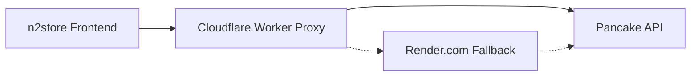
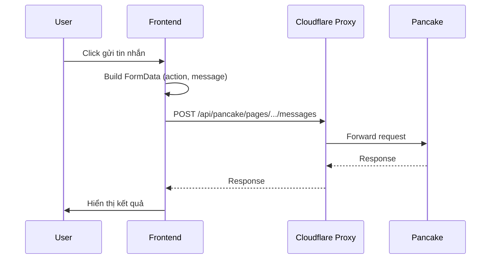

# 🔍 Tư Vấn Tích Hợp Pancake API - N2Store

> **Phân tích**: So sánh API hiện tại với API chính thức & đề xuất cải thiện performance

---

## 1. 📊 Phân Tích Code Hiện Tại

### 1.1 Kiến Trúc API Hiện Tại



**Files chính**:
| File | Dòng | Chức năng |
|------|------|-----------|
| [api-config.js](file:///Users/mac/Downloads/n2store/orders-report/api-config.js) | 223 | Proxy config, smartFetch với retry/fallback |
| [pancake-data-manager.js](file:///Users/mac/Downloads/n2store/orders-report/pancake-data-manager.js) | 1857 | Quản lý conversations, messages |
| [tab1-orders.js](file:///Users/mac/Downloads/n2store/orders-report/tab1-orders.js) | 14000+ | Send message/comment đơn lẻ |
| [message-template-manager.js](file:///Users/mac/Downloads/n2store/orders-report/message-template-manager.js) | 1581 | Bulk message sending |
| [quick-reply-manager.js](file:///Users/mac/Downloads/n2store/orders-report/quick-reply-manager.js) | 1609 | Quick reply với ảnh |

### 1.2 Flow Gửi Tin Nhắn Hiện Tại



---

## 2. ⚖️ So Sánh API Hiện Tại vs API Chính Thức

### 2.1 Gửi Tin Nhắn Inbox

| Aspect | Code Hiện Tại | API Chính Thức | Đánh Giá |
|--------|---------------|----------------|----------|
| **Endpoint** | `/pages/{id}/conversations/{id}/messages` | `/pages/{id}/conversations/{id}/messages` | ✅ Đúng |
| **Method** | `POST` | `POST` | ✅ Đúng |
| **Content-Type** | `multipart/form-data` | `application/json` hoặc `multipart/form-data` | ✅ OK |
| **Action** | `reply_inbox` | `reply_inbox` | ✅ Đúng |
| **customer_id** | Query param | Không bắt buộc (official) | ⚠️ Có thể bỏ |

**Code hiện tại** ([tab1-orders.js#sendMessageInternal](file:///Users/mac/Downloads/n2store/orders-report/tab1-orders.js)):
```javascript
// FormData approach (hiện tại)
const formData = new FormData();
formData.append('action', 'reply_inbox');
formData.append('message', message);
// Upload images via content_url (external) hoặc content_ids (uploaded)
```

**API chính thức khuyến nghị**:
```javascript
// JSON approach (official docs)
{
  "action": "reply_inbox",
  "message": "Nội dung",
  "content_ids": ["uploaded_id"],  // từ /upload_contents
  "attachment_type": "PHOTO"
}
```

> [!NOTE]
> **Kết luận**: Code hiện tại **TƯƠNG THÍCH** với API chính thức. FormData cũng được chấp nhận.

---

### 2.2 Reply Comment

| Aspect | Code Hiện Tại | API Chính Thức | Đánh Giá |
|--------|---------------|----------------|----------|
| **Action** | `reply_comment` | `reply_comment` | ✅ Đúng |
| **message_id** | ✅ Có | ✅ Bắt buộc | ✅ Đúng |
| **content_url** | ✅ Có hỗ trợ | ✅ Optional | ✅ Đúng |

---

### 2.3 Private Reply

| Aspect | Code Hiện Tại | API Chính Thức | Đánh Giá |
|--------|---------------|----------------|----------|
| **Action** | `private_replies` | `private_replies` | ✅ Đúng |
| **post_id** | ✅ Có | ✅ Bắt buộc | ✅ Đúng |
| **message_id** | ✅ Có | ✅ Bắt buộc | ✅ Đúng |
| **from_id** | ✅ Có | ✅ Bắt buộc | ✅ Đúng |

---

### 2.4 Upload Content

| Aspect | Code Hiện Tại | API Chính Thức | Đánh Giá |
|--------|---------------|----------------|----------|
| **Endpoint** | ❌ Không dùng | `/pages/{id}/upload_contents` | ⚠️ Khác biệt |
| **Approach** | `content_url` (external URL) | `content_ids` (uploaded) | ⚠️ Khác biệt |

> [!IMPORTANT]
> **Điểm khác biệt quan trọng**: 
> - Code hiện tại: Dùng `content_url` (URL ảnh bên ngoài)
> - API chính thức: Khuyến nghị upload file → nhận `content_id` → dùng trong message
> 
> **Tác động**: Sử dụng URL bên ngoài có thể gặp vấn đề với ảnh private hoặc CORS.

---

## 3. 🚀 Cải Thiện Performance Cho Bulk Message Sending

### 3.1 Phân Tích Hiện Trạng

**File**: [message-template-manager.js](file:///Users/mac/Downloads/n2store/orders-report/message-template-manager.js)

**Flow hiện tại**:
```javascript
// Concurrency control với workers
const concurrency = 3;  // 3 workers song song
const delay = 1000;     // 1s delay giữa các request

for (let i = 0; i < concurrency; i++) {
    workers.push(worker());
}
await Promise.all(workers);
```

**Điểm tốt** ✅:
- Có concurrency control (3 workers)
- Có configurable delay
- Có progress UI
- Xử lý lỗi 24h policy riêng

**Điểm cần cải thiện** ⚠️:
- Không có request batching
- Fetch full order data cho mỗi order (kể cả khi không cần)
- Retry logic chưa tối ưu cho bulk

---

### 3.2 Đề Xuất Cải Thiện

#### A. Tối Ưu Concurrency

```javascript
// TRƯỚC: Fixed concurrency
const concurrency = 3;

// SAU: Dynamic concurrency based on rate limiting
class AdaptiveConcurrency {
  constructor(initial = 3, min = 1, max = 5) {
    this.current = initial;
    this.min = min;
    this.max = max;
    this.successStreak = 0;
    this.errorStreak = 0;
  }

  onSuccess() {
    this.successStreak++;
    this.errorStreak = 0;
    // Tăng concurrency sau 10 success liên tiếp
    if (this.successStreak >= 10 && this.current < this.max) {
      this.current++;
      this.successStreak = 0;
      console.log(`[BULK] ⬆️ Increased concurrency to ${this.current}`);
    }
  }

  onError(isRateLimit) {
    this.errorStreak++;
    this.successStreak = 0;
    // Giảm concurrency khi gặp rate limit
    if (isRateLimit && this.current > this.min) {
      this.current = Math.max(this.min, this.current - 1);
      console.log(`[BULK] ⬇️ Decreased concurrency to ${this.current}`);
    }
  }
}
```

#### B. Request Batching (Nếu API hỗ trợ)

> [!WARNING]
> Pancake API **KHÔNG có batch endpoint** chính thức. Tuy nhiên có thể tối ưu client-side.

```javascript
// Batch order data fetching (TRƯỚC khi gửi)
async function prefetchOrderData(orderIds) {
  const batchSize = 10;
  const results = new Map();
  
  for (let i = 0; i < orderIds.length; i += batchSize) {
    const batch = orderIds.slice(i, i + batchSize);
    const promises = batch.map(id => fetchOrderData(id));
    const batchResults = await Promise.allSettled(promises);
    
    batch.forEach((id, idx) => {
      if (batchResults[idx].status === 'fulfilled') {
        results.set(id, batchResults[idx].value);
      }
    });
    
    // Small delay between batches
    await delay(100);
  }
  
  return results;
}
```

#### C. Tối Ưu Upload Ảnh

```javascript
// TRƯỚC: Upload ảnh sequential với message
// SAU: Pre-upload tất cả ảnh, cache content_ids

class ImageUploadCache {
  constructor() {
    this.cache = new Map(); // imageUrl -> content_id
    this.pending = new Map(); // imageUrl -> Promise
  }

  async getContentId(pageId, imageUrl, token) {
    // Check cache
    if (this.cache.has(imageUrl)) {
      return this.cache.get(imageUrl);
    }

    // Check pending
    if (this.pending.has(imageUrl)) {
      return this.pending.get(imageUrl);
    }

    // Upload new
    const uploadPromise = this._upload(pageId, imageUrl, token);
    this.pending.set(imageUrl, uploadPromise);
    
    try {
      const contentId = await uploadPromise;
      this.cache.set(imageUrl, contentId);
      return contentId;
    } finally {
      this.pending.delete(imageUrl);
    }
  }

  async _upload(pageId, imageUrl, token) {
    // Fetch image as blob
    const imageRes = await fetch(imageUrl);
    const blob = await imageRes.blob();
    
    // Upload to Pancake
    const formData = new FormData();
    formData.append('file', blob, 'image.jpg');
    
    const res = await fetch(
      `${API_URL}/pages/${pageId}/upload_contents?page_access_token=${token}`,
      { method: 'POST', body: formData }
    );
    const data = await res.json();
    return data.id;
  }
}
```

#### D. Exponential Backoff Cho Individual Requests

```javascript
async function sendWithRetry(sendFn, maxRetries = 3) {
  for (let attempt = 1; attempt <= maxRetries; attempt++) {
    try {
      return await sendFn();
    } catch (error) {
      const isRateLimit = error.message?.includes('rate limit') || 
                          error.status === 429;
      
      if (attempt === maxRetries) throw error;
      
      // 24h policy error - không retry
      if (error.is24HourError) throw error;
      
      // Rate limit - longer delay
      const baseDelay = isRateLimit ? 5000 : 1000;
      const delay = baseDelay * Math.pow(2, attempt - 1);
      
      console.log(`[RETRY] Attempt ${attempt} failed, retrying in ${delay}ms`);
      await new Promise(r => setTimeout(r, delay));
    }
  }
}
```

#### E. Queue Priority

```javascript
// Ưu tiên orders chưa có lỗi 24h
class PriorityQueue {
  constructor() {
    this.high = [];   // Normal orders
    this.low = [];    // Orders từng bị lỗi 24h (cần dùng comment)
  }

  enqueue(order, priority = 'high') {
    if (priority === 'high') {
      this.high.push(order);
    } else {
      this.low.push(order);
    }
  }

  dequeue() {
    return this.high.shift() || this.low.shift();
  }

  get length() {
    return this.high.length + this.low.length;
  }
}
```

---

## 4. 📋 Tổng Hợp Khuyến Nghị

### Ngắn Hạn (Quick Wins)

| # | Việc cần làm | File | Impact |
|---|--------------|------|--------|
| 1 | Tăng delay giữa các request từ 1s → 1.5s | message-template-manager.js | Giảm rate limit errors |
| 2 | Cache conversation lookup | pancake-data-manager.js | Giảm fetch time |
| 3 | Skip fetch order data khi không cần products | message-template-manager.js | Đã có ✅ |

### Trung Hạn (Performance)

| # | Việc cần làm | Effort | Impact |
|---|--------------|--------|--------|
| 1 | Implement Adaptive Concurrency | Medium | Cao |
| 2 | Pre-fetch order data theo batch | Medium | Cao |
| 3 | Image Upload Cache | Medium | Trung bình |

### Dài Hạn (Architecture)

| # | Việc cần làm | Effort | Impact |
|---|--------------|--------|--------|
| 1 | Chuyển sang dùng `/upload_contents` API thay vì `content_url` | High | Reliability |
| 2 | Queue persistence (localStorage) để resume sau refresh | High | UX |
| 3 | Background worker (Service Worker) cho bulk send | Very High | Performance |

---

## 5. 🔧 Code Sample: Cải Thiện Bulk Send

```javascript
// Improved _processSingleOrder with all optimizations
async _processSingleOrder(order, context) {
    const { token, displayName, templateContent, sendMode, imageCache, adaptiveConcurrency } = context;

    try {
        // 1. Smart data fetching (đã có)
        const needsProductDetails = templateContent.includes('{order.details}');
        const fullOrderData = needsProductDetails 
            ? await this.fetchFullOrderData(order.Id)
            : { raw: order, converted: order };

        // 2. Build message
        let messageContent = this.replacePlaceholders(templateContent, fullOrderData.converted);
        if (displayName) messageContent += '\nNv. ' + displayName;

        // 3. Pre-upload image if needed (with cache)
        let contentIds = [];
        if (sendMode === 'image' && imageCache) {
            const imageBlob = await this.generateOrderImage(fullOrderData);
            const contentId = await imageCache.uploadBlob(channelId, imageBlob, token);
            contentIds.push(contentId);
        }

        // 4. Send with retry
        const result = await sendWithRetry(async () => {
            const formData = new FormData();
            formData.append('action', 'reply_inbox');
            formData.append('message', messageContent);
            if (contentIds.length > 0) {
                formData.append('content_ids', JSON.stringify(contentIds));
                formData.append('attachment_type', 'PHOTO');
            }

            const response = await fetch(apiUrl, { method: 'POST', body: formData });
            if (!response.ok) throw new Error(`HTTP ${response.status}`);
            return response.json();
        }, 3);

        // 5. Update adaptive concurrency on success
        adaptiveConcurrency?.onSuccess();
        return result;

    } catch (error) {
        // Update adaptive concurrency on error
        const isRateLimit = error.message?.includes('rate') || error.status === 429;
        adaptiveConcurrency?.onError(isRateLimit);
        throw error;
    }
}
```

---

## 6. 📈 Metrics Để Theo Dõi

Sau khi implement các cải tiến, theo dõi:

| Metric | Cách đo | Target |
|--------|---------|--------|
| Success Rate | `success / total * 100` | > 95% |
| Avg Time Per Message | `total_time / success_count` | < 2s |
| 24h Policy Errors | Count | Minimize |
| Rate Limit Hits | Count 429 errors | 0 |

---

*Tài liệu tư vấn cho dự án n2store - Cập nhật: 2025-12-12*
