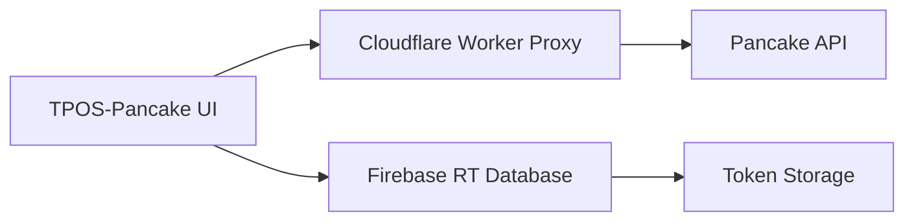
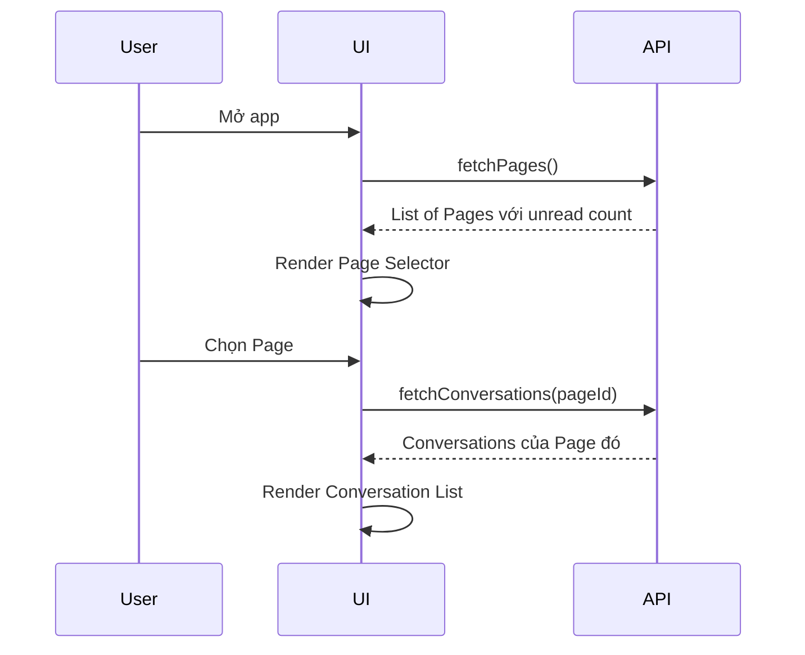
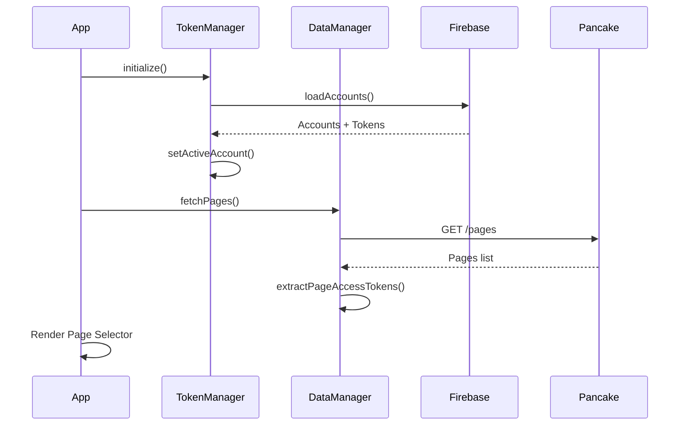
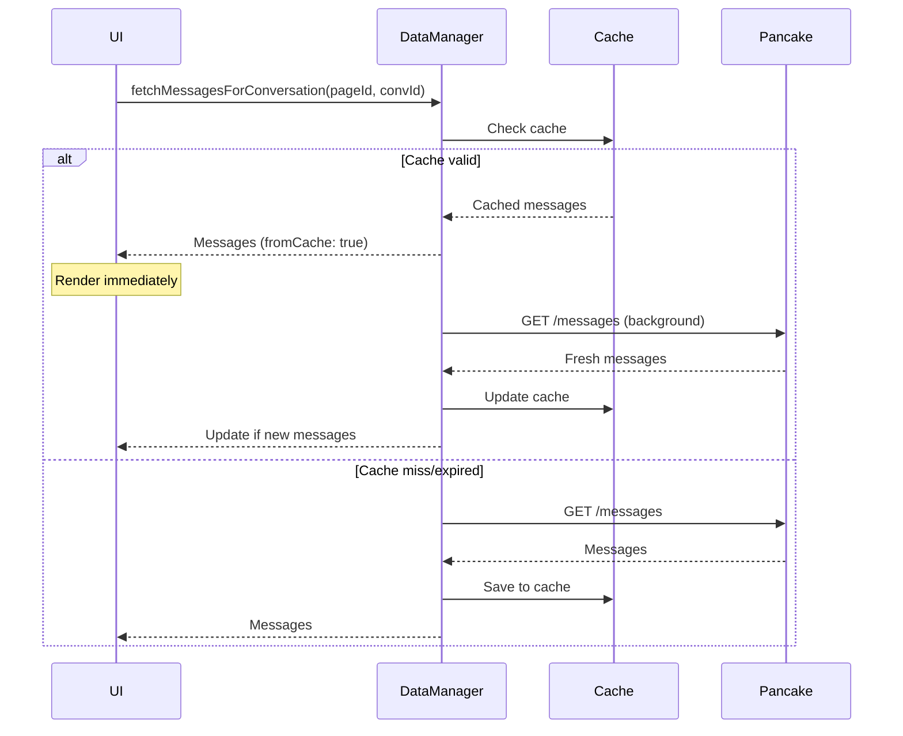
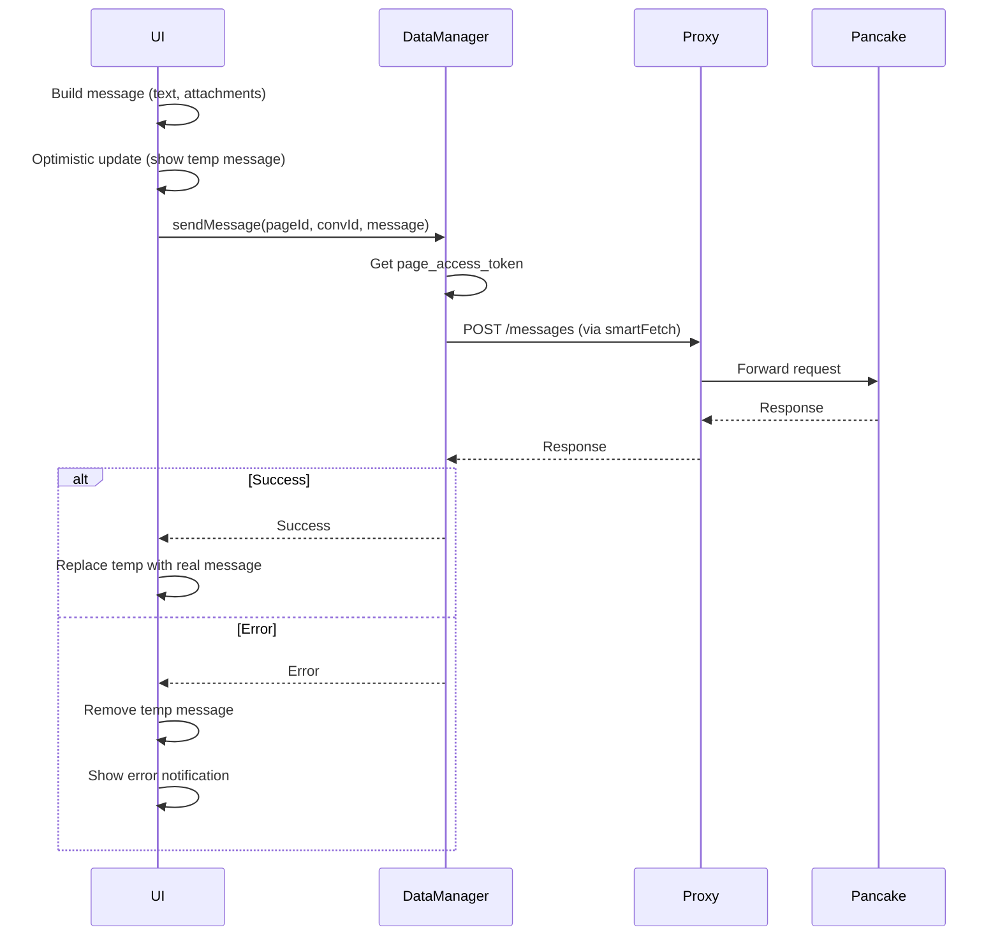
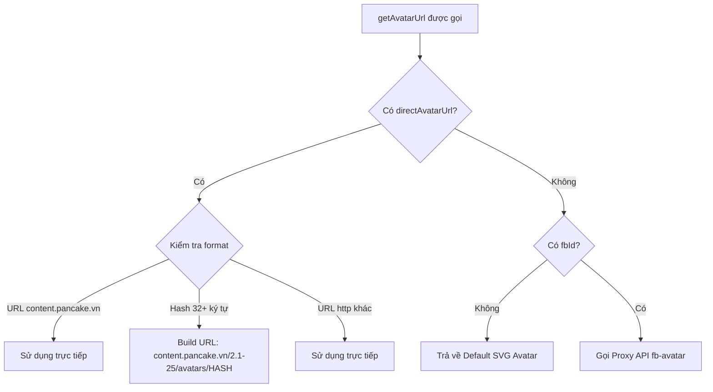
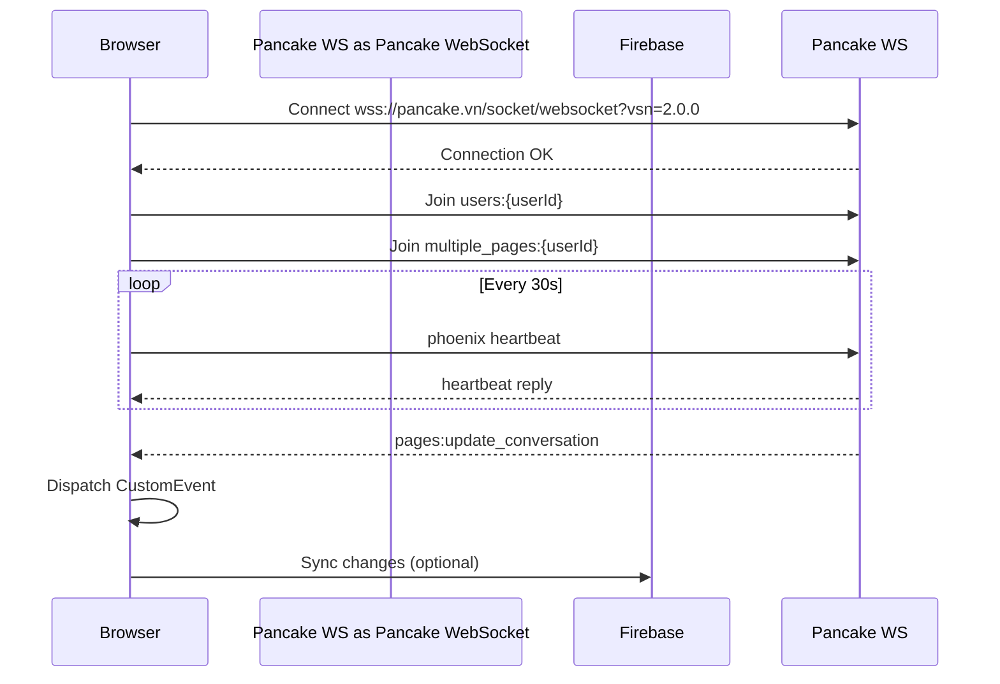
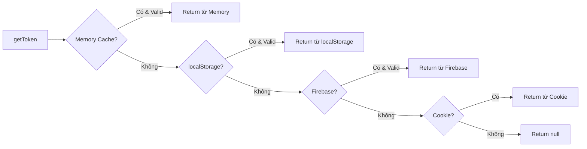
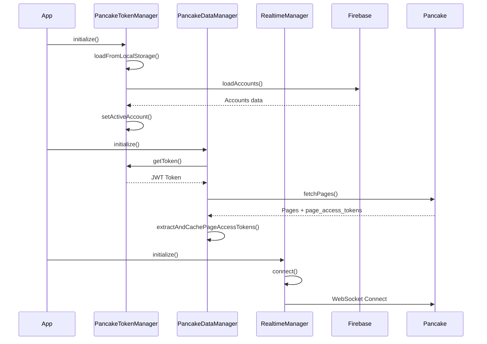
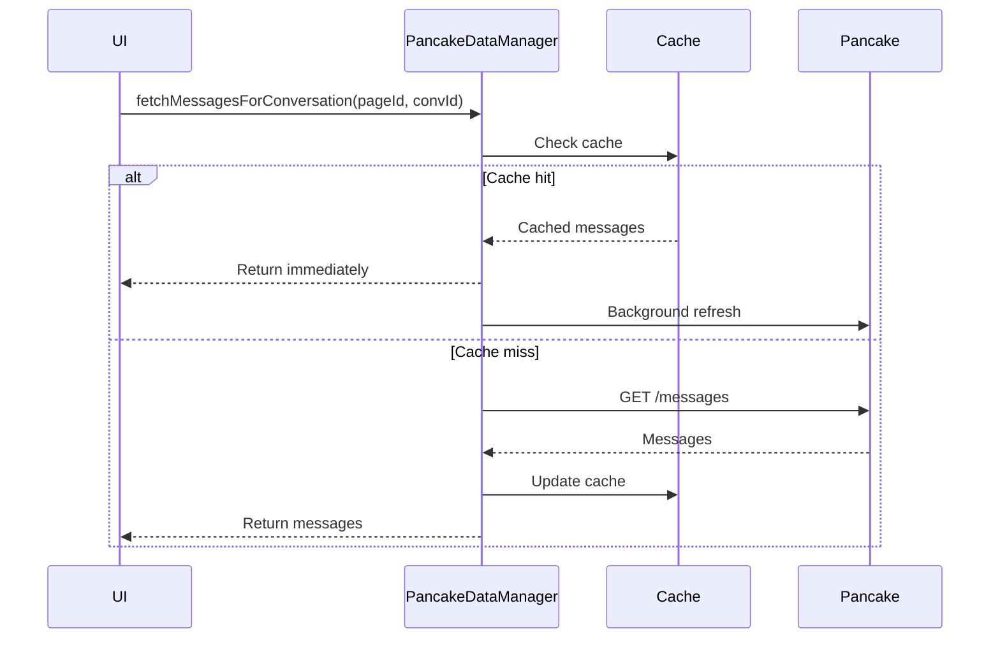

# 📚 Hướng Dẫn Chi Tiết Pancake Integration

> **Tài liệu hướng dẫn toàn diện về chức năng Pancake và cách xây dựng giao diện**

---

## �️ Giao Diện Tham Khảo (Pancake.vn)


### So Sánh UI Hiện Tại vs Pancake Gốc

| Thành phần | Pancake.vn Gốc | TPOS-Pancake Hiện Tại | Trạng thái |
|------------|----------------|------------------------|------------|
| **Header Tabs** | Hội thoại, Đơn hàng, Bài viết, Thống kê, Cài đặt | Sidebar đơn giản | ⚠️ Cần cải thiện |
| **Page Selector** | Góc trên phải với avatar + tên page | ❌ Chưa có | 🔴 **Bắt buộc thêm** |
| **Left Icon Sidebar** | Icons: Home, Messages, Tags, etc. | Có nhưng khác style | ⚠️ Cần align |
| **Conversation List** | Avatar, tên, preview, time, tags (BOOM) | ✅ Có cơ bản | ⚠️ Thiếu tags badge |
| **Chat Window** | Messages + images + staff tag | ✅ Có cơ bản | ⚠️ Cần polish |
| **Quick Replies** | 2 hàng buttons màu sắc | ✅ Có | ✅ OK |
| **Customer Info Panel** | Panel phải với "Thông tin" + "Tạo đơn" | ❌ Chưa có | 🟡 Nên thêm |
| **Reply From Label** | "Trả lời từ NhiJudy Store" | ✅ Có | ✅ OK |

> [!IMPORTANT]
> **Ưu tiên cao nhất**: Thêm **Page Selector** để người dùng có thể chọn page và xem tin nhắn của từng page riêng biệt.

---

## �📑 Mục Lục

1. [Tổng Quan Hệ Thống](#1-tổng-quan-hệ-thống)
2. [Chức Năng Chính](#2-chức-năng-chính)
3. [Yêu Cầu Giao Diện](#3-yêu-cầu-giao-diện)
4. [Chi Tiết Từng Màn Hình](#4-chi-tiết-từng-màn-hình)
5. [Luồng Dữ Liệu](#5-luồng-dữ-liệu)
6. [API Endpoints](#6-api-endpoints)
7. [Hướng Dẫn Cài Đặt](#7-hướng-dẫn-cài-đặt)

---

## 1. Tổng Quan Hệ Thống

### 1.1 Pancake là gì?

**Pancake.vn** là một nền tảng quản lý tin nhắn đa kênh (Omnichannel) cho phép:
- Quản lý nhiều **Facebook Pages** trên một giao diện
- Xử lý **Inbox** (tin nhắn) và **Comments** (bình luận) 
- Gửi tin nhắn/reply comment tự động hoặc thủ công
- Theo dõi thống kê tương tác

### 1.2 Kiến Trúc Tích Hợp



### 1.3 Các File Quan Trọng

| File | Vai Trò | Chức Năng |
|------|---------|-----------|
| `pancake-token-manager.js` | Quản lý xác thực | Lưu/lấy token, đồng bộ Firebase |
| `pancake-data-manager.js` | Quản lý dữ liệu | Fetch pages, conversations, messages |
| `pancake-chat.js` | Giao diện chat | Render UI, xử lý events |
| `api-config.js` | Cấu hình API | Proxy URLs, smartFetch |

---

## 2. Chức Năng Chính

### 2.1 Quản Lý Pages

| Chức năng | API | Mô tả |
|-----------|-----|-------|
| Lấy danh sách pages | `GET /api/v1/pages` | Tất cả pages đã kết nối |
| Đếm tin chưa đọc | `GET /api/v1/pages/unread_conv_pages_count` | Số conversations chưa đọc/page |
| Tạo Page Access Token | `POST /pages/{id}/generate_page_access_token` | Token cho Public API |

> [!IMPORTANT]
> **Hiện tại cần sửa**: UI chưa hiển thị danh sách pages và cho phép chọn page để xem tin nhắn.

### 2.2 Quản Lý Conversations

| Chức năng | API | Mô tả |
|-----------|-----|-------|
| Lấy conversations | `GET /api/public_api/v2/pages/{id}/conversations` | 60 conversations mới nhất |
| Tìm kiếm | `POST /conversations/search` | Search theo tên, fb_id |
| Đánh dấu đã đọc | `POST /conversations/{id}/read` | Bỏ badge unread |
| Thêm/xóa tag | `POST /conversations/{id}/tags` | Gắn nhãn phân loại |

### 2.3 Quản Lý Messages

| Chức năng | API | Mô tả |
|-----------|-----|-------|
| Lấy tin nhắn | `GET /conversations/{id}/messages` | 30 messages/lần |
| Gửi tin inbox | `POST /messages` với `action: reply_inbox` | Trả lời messenger |
| Reply comment | `POST /messages` với `action: reply_comment` | Trả lời bình luận |
| Private reply | `POST /messages` với `action: private_replies` | Nhắn riêng từ comment |
| Upload media | `POST /upload_contents` | Upload ảnh/video |

### 2.4 Phân Loại Conversation

```
┌──────────────────────────────────────────────────────────────┐
│                    CONVERSATIONS                              │
├─────────────────────────┬────────────────────────────────────┤
│        INBOX            │            COMMENT                  │
├─────────────────────────┼────────────────────────────────────┤
│ - Tin nhắn Messenger    │ - Bình luận trên bài viết          │
│ - 1-on-1 chat           │ - Có thể reply hoặc private reply  │
│ - from_psid có giá trị  │ - from_psid thường = null          │
│ - Thread persistent     │ - Thread theo post_id              │
└─────────────────────────┴────────────────────────────────────┘
```

---

## 3. Yêu Cầu Giao Diện

### 3.1 Cấu Trúc Layout Chính

```
┌─────────────────────────────────────────────────────────────────┐
│                         HEADER                                   │
│  [Logo] [Page Selector ▼] [Search] [Settings] [Account]         │
├───────────────┬─────────────────────────────────────────────────┤
│               │                                                  │
│   SIDEBAR     │              MAIN CONTENT                        │
│               │                                                  │
│  - Pages      │  ┌─────────────────┬───────────────────────┐   │
│  - Filters    │  │ Conversation    │    Chat Window        │   │
│  - Stats      │  │ List            │                       │   │
│               │  │                 │  [Header: Name, Tags] │   │
│               │  │ [Avatar] Name   │  [Messages Area]      │   │
│               │  │ [Preview]       │  [Quick Replies]      │   │
│               │  │ [Time] [Badge]  │  [Input Area]         │   │
│               │  │                 │                       │   │
│               │  └─────────────────┴───────────────────────┘   │
└───────────────┴─────────────────────────────────────────────────┘
```

### 3.2 Components Cần Thiết

#### A. Page Selector (Bắt buộc - Chưa có)

```html
<!-- Dropdown chọn Page -->
<div class="page-selector">
    <button class="selected-page">
        
        <span>Tên Page Hiện Tại</span>
        <span class="unread-badge">5</span>
        <i data-lucide="chevron-down"></i>
    </button>
    
    <div class="page-dropdown">
        <div class="page-item" data-page-id="123">
            
            <span>Page 1</span>
            <span class="unread-count">3</span>
        </div>
        <div class="page-item active" data-page-id="456">
            
            <span>Page 2</span>
            <span class="unread-count">2</span>
        </div>
    </div>
</div>
```

#### B. Conversation List (Đã có - Cần cải thiện)

```html
<div class="conversation-list">
    <!-- Filter tabs -->
    <div class="filter-tabs">
        <button class="tab active" data-type="all">Tất cả</button>
        <button class="tab" data-type="inbox">Inbox</button>
        <button class="tab" data-type="comment">Comment</button>
        <button class="tab" data-type="unread">Chưa đọc</button>
    </div>
    
    <!-- Search -->
    <div class="search-box">
        <i data-lucide="search"></i>
        <input type="text" placeholder="Tìm kiếm...">
    </div>
    
    <!-- Conversations -->
    <div class="conversations">
        <!-- Conversation item -->
        <div class="conversation-item unread" data-conv-id="xxx">
            <div class="avatar">
                
                <span class="type-badge inbox">M</span> <!-- M = Messenger, C = Comment -->
            </div>
            <div class="content">
                <div class="header">
                    <span class="name">Tên khách hàng</span>
                    <span class="time">10:30</span>
                </div>
                <div class="preview">Nội dung tin nhắn cuối...</div>
                <div class="tags">
                    <span class="tag" style="background: #4CAF50">Đã mua</span>
                </div>
            </div>
            <span class="unread-badge">3</span>
        </div>
    </div>
</div>
```

#### C. Chat Window (Đã có - Cần cải thiện)

```html
<div class="chat-window">
    <!-- Header -->
    <div class="chat-header">
        <div class="customer-info">
            
            <div class="details">
                <span class="name">Tên khách hàng</span>
                <span class="phone">0987654321</span>
                <span class="location">Hà Nội</span>
            </div>
        </div>
        <div class="actions">
            <button title="Tạo đơn hàng"><i data-lucide="shopping-cart"></i></button>
            <button title="Gọi điện"><i data-lucide="phone"></i></button>
            <button title="Thêm tag"><i data-lucide="tag"></i></button>
            <button title="Thông tin"><i data-lucide="info"></i></button>
        </div>
    </div>
    
    <!-- Messages -->
    <div class="messages-area">
        <!-- Date separator -->
        <div class="date-separator">Hôm nay</div>
        
        <!-- Incoming message -->
        <div class="message incoming">
            <div class="bubble">
                <p>Nội dung tin nhắn từ khách hàng</p>
            </div>
            <span class="time">10:30</span>
        </div>
        
        <!-- Outgoing message -->
        <div class="message outgoing">
            <div class="bubble">
                <p>Nội dung trả lời</p>
            </div>
            <div class="meta">
                <span class="sender">Nv.My</span>
                <span class="time">10:32</span>
                <i data-lucide="check-check"></i> <!-- Đã gửi -->
            </div>
        </div>
        
        <!-- Image message -->
        <div class="message incoming">
            <div class="image-container">
                
            </div>
            <span class="time">10:35</span>
        </div>
        
        <!-- Sticker -->
        <div class="message incoming">
            <div class="sticker">
                
            </div>
        </div>
    </div>
    
    <!-- Quick Replies -->
    <div class="quick-replies">
        <button class="qr-btn green">Hẹn ship</button>
        <button class="qr-btn blue">Đã nhận</button>
        <button class="qr-btn orange">Kiểm hàng</button>
    </div>
    
    <!-- Input -->
    <div class="input-area">
        <div class="input-actions">
            <button><i data-lucide="paperclip"></i></button>
            <button><i data-lucide="image"></i></button>
            <button><i data-lucide="smile"></i></button>
        </div>
        <textarea placeholder="Nhập tin nhắn..."></textarea>
        <button class="send-btn"><i data-lucide="send"></i></button>
    </div>
</div>
```

---

## 4. Chi Tiết Từng Màn Hình

### 4.1 Màn Hình Chọn Page (QUAN TRỌNG - CHƯA CÓ)

**Mục đích**: Cho phép user chọn Page Facebook để xem tin nhắn

**Flow**:


**Yêu cầu UI**:
1. **Dropdown** hoặc **Sidebar** hiển thị tất cả pages
2. Mỗi page hiển thị:
   - Avatar
   - Tên page
   - Badge số tin chưa đọc
   - Platform icon (Facebook/Instagram/Zalo)
3. Highlight page đang được chọn
4. Auto-refresh unread count định kỳ (30s)

### 4.2 Màn Hình Danh Sách Conversations

**Mục đích**: Hiển thị và filter conversations của page đang chọn

**Yêu cầu UI**:
1. **Filter Tabs**: Tất cả | Inbox | Comment | Chưa đọc
2. **Search Box**: Tìm theo tên, SĐT, nội dung
3. **Conversation Item**:
   - Avatar + Type badge (M/C)
   - Tên khách hàng
   - Preview tin nhắn cuối
   - Thời gian
   - Tags
   - Unread badge
4. **Sorting**: Mới nhất trước, chưa đọc đầu tiên
5. **Pagination**: Load more khi scroll

### 4.3 Màn Hình Chat

**Mục đích**: Xem và gửi tin nhắn trong conversation

**Yêu cầu UI**:
1. **Header**:
   - Avatar + Tên khách hàng
   - Phone, location (từ customers[0])
   - Action buttons (tạo đơn, gọi, tag, info)
2. **Messages Area**:
   - Group theo ngày
   - Incoming (trái) vs Outgoing (phải)
   - Hiển thị: text, image, video, sticker, reaction
   - Sender name cho outgoing
   - Timestamp
   - Status (sent/delivered/seen)
3. **Quick Replies**: Các mẫu trả lời nhanh
4. **Input Area**:
   - Attach file
   - Insert image
   - Emoji picker
   - Text input (auto-resize)
   - Send button

---

## 5. Luồng Dữ Liệu

### 5.1 Khởi Tạo App



### 5.2 Load Messages



### 5.3 Gửi Tin Nhắn



---

## 6. API Endpoints

### 6.1 Authentication

| Endpoint | Method | Auth | Mô Tả |
|----------|--------|------|-------|
| `/api/v1/pages` | GET | `access_token` | Lấy danh sách pages |
| `/pages/{id}/generate_page_access_token` | POST | `access_token` | Tạo page token |

### 6.2 Conversations

| Endpoint | Method | Auth | Mô Tả |
|----------|--------|------|-------|
| `/api/public_api/v2/pages/{id}/conversations` | GET | `page_access_token` | Lấy conversations |
| `/conversations/search` | POST | `access_token` | Tìm kiếm |
| `/conversations/{id}/read` | POST | `page_access_token` | Đánh dấu đã đọc |
| `/conversations/{id}/tags` | POST | `page_access_token` | Thêm/xóa tag |

### 6.3 Messages

| Endpoint | Method | Auth | Mô Tả |
|----------|--------|------|-------|
| `/conversations/{id}/messages` | GET | `page_access_token` | Lấy tin nhắn |
| `/conversations/{id}/messages` | POST | `page_access_token` | Gửi tin nhắn |
| `/pages/{id}/upload_contents` | POST | `page_access_token` | Upload media |

---

## 7. Hướng Dẫn Cài Đặt

### 7.1 Yêu Cầu Hệ Thống

- **Firebase**: Realtime Database để lưu tokens
- **Cloudflare Worker**: Proxy để bypass CORS
- **Pancake Account**: Đăng nhập để lấy JWT token

### 7.2 Cấu Hình Firebase

```javascript
// config.js
const firebaseConfig = {
    apiKey: "...",
    authDomain: "...",
    databaseURL: "https://xxx.firebasedatabase.app",
    projectId: "...",
    // ...
};
```

### 7.3 Lấy Pancake Token

**Cách 1**: Lấy từ cookie `pancake.vn`
- Mở DevTools → Application → Cookies
- Tìm cookie chứa JWT token

**Cách 2**: Pancake → Account → Personal Settings → API Token

### 7.4 Lưu Token vào Firebase

Token được lưu tại path: `pancake_jwt_tokens/accounts/{accountId}`

```json
{
    "token": "eyJhbGciOi...",
    "exp": 1234567890,
    "uid": "123456",
    "name": "User Name",
    "savedAt": 1700000000000
}
```

---

## 📋 Checklist Cần Làm (Dựa trên UI Tham Khảo)

### ⚠️ BUG HIỆN TẠI (Cần Fix Ngay)

> [!CAUTION]
> **Hai vấn đề nghiêm trọng trong UI hiện tại:**


#### 1. ❌ Thời Gian Hiển Thị SAI (UTC thay vì GMT+7)

| Vấn Đề | Chi Tiết |
|--------|----------|
| **Hiện tại** | Hiển thị `04:22`, `04:21`... (UTC) |
| **Đúng ra** | Phải hiển thị `11:22`, `11:21`... (GMT+7) |
| **Nguyên nhân** | API trả về UTC, code chưa convert sang GMT+7 |

**Fix cần làm:**
```javascript
// TRƯỚC (sai - hiển thị UTC)
const time = new Date(message.inserted_at);
return `${time.getHours()}:${time.getMinutes()}`;

// SAU (đúng - hiển thị GMT+7)
const time = new Date(message.inserted_at);
return new Intl.DateTimeFormat('vi-VN', {
    timeZone: 'Asia/Ho_Chi_Minh',  // ← Quan trọng!
    hour: '2-digit',
    minute: '2-digit'
}).format(time);
```

#### 2. ❌ Avatar Chưa Load (Chỉ Hiện Chữ Cái)

| Vấn Đề | Chi Tiết |
|--------|----------|
| **Hiện tại** | Hiển thị vòng tròn với chữ cái (E, Q, N, T) |
| **Đúng ra** | Phải hiển thị avatar Facebook của khách hàng |
| **Nguyên nhân** | Chưa gọi `getAvatarUrl()` hoặc avatar_url từ API null |

**Fix cần làm:**
```javascript
// Lấy avatar đúng cách
const customer = conversation.customers?.[0];
const avatarUrl = pancakeDataManager.getAvatarUrl(
    customer?.fb_id,
    conversation.page_id,
    token,
    customer?.avatar_url  // Avatar từ Pancake API
);

// Nếu vẫn null, fallback sang initial letter
if (!avatarUrl || avatarUrl.includes('data:image/svg')) {
    // Hiển thị initial letter (E, Q, N...)
    showInitialAvatar(customer?.name);
} else {
    // Hiển thị avatar thật
    img.src = avatarUrl;
}
```

---

### 🔴 Ưu Tiên Cao (Bắt buộc)

- [ ] **Page Selector** (Góc trên phải)
  - Dropdown hiển thị tất cả pages
  - Avatar + Tên page hiện tại
  - Badge unread count per page
  - Click để chuyển page
  
- [ ] **Filter theo Page**
  - Khi chọn page mới → reload conversations
  - Lưu page đã chọn vào localStorage
  
- [ ] **Hiển thị Tags Badge** (như "BOOM" trong hình)
  - Tags màu sắc trên conversation item
  - Có thể click để filter theo tag

### 🟡 Ưu Tiên Trung Bình

- [ ] **Header Tabs**
  - Tabs: Hội thoại | Đơn hàng | Bài viết | Thống kê | Cài đặt
  - Active tab styling
  
- [ ] **Left Icon Sidebar Styling**
  - Align icons theo Pancake gốc
  - Tooltips cho mỗi icon
  
- [ ] **Staff Badge trong Message**
  - Hiển thị "Đã xem bởi Kỹ Thuật NJD - 10:04"
  - Staff name trong outgoing messages

- [ ] **Customer Info Panel** (Panel phải)
  - Tab "Thông tin": Hiển thị customer details
  - Tab "Tạo đơn": Button tạo đơn hàng
  - Notes section: Ghi chú customer

### 🟢 Ưu Tiên Thấp

- [ ] **Gửi tin nhắn**: Implement sendMessage API
- [ ] **Upload media**: Upload ảnh/video
- [ ] **Emoji picker**: Chọn emoji
- [ ] **Auto-refresh**: Polling conversations định kỳ (30s)
- [ ] **Mark as read animation**: Visual feedback

---

## 📐 Chi Tiết Layout Theo Hình Tham Khảo

### Layout Chính (3 cột)

```
┌───┬────────────────────────────────────────────────────────────────────────┐
│   │  [Pancake Logo] [Hội thoại] [Đơn hàng] [Bài viết] [Thống kê] [Cài đặt] │
│   │                                                        [Page Selector] │
│ S ├──────────────────┬──────────────────────────┬──────────────────────────┤
│ I │                  │                          │                          │
│ D │  CONVERSATION    │      CHAT WINDOW         │    CUSTOMER INFO         │
│ E │  LIST            │                          │    PANEL                 │
│ B │  ┌────────────┐  │  [Header: Ruby Trần]     │    ┌──────────────────┐  │
│ A │  │ 🔍 Search  │  │  [Status bar]            │    │ Thông tin │Tạo đơn│  │
│ R │  │ [Lọc theo] │  │                          │    ├──────────────────┤  │
│   │  ├────────────┤  │  ┌──────────────────┐    │    │ Avatar           │  │
│   │  │ Ruby Trần  │  │  │ Messages         │    │    │ Name             │  │
│ I │  │ Ha Vu      │  │  │ - Incoming msg   │    │    │ Phone            │  │
│ C │  │ Huỳnh Thuỷ │  │  │ - Images         │    │    │ Notes            │  │
│ O │  │ Thùy Khoa  │  │  │ - Outgoing msg   │    │    │                  │  │
│ N │  │ Liên Kim🔴 │  │  └──────────────────┘    │    │ Đơn hàng         │  │
│ S │  │ etc...     │  │                          │    │ [+ Tạo đơn]      │  │
│   │  └────────────┘  │  [Quick Replies]         │    └──────────────────┘  │
│   │                  │  [Reply From Label]      │                          │
│   │                  │  [Input Area]            │                          │
└───┴──────────────────┴──────────────────────────┴──────────────────────────┘
```

### Quick Replies (2 hàng - từ hình)

**Hàng 1:**
| Button | Màu |
|--------|-----|
| NV.My Kh.Dặt | 🔵 Blue |
| NV.My OK + Gặp | 🟢 Green |
| NHẮC KHÁCH | 🟠 Orange |
| XIN ĐỊA CHỈ | 🟣 Purple |
| NV_BD | 🔵 Blue |
| NJD Có | 🟢 Green |

**Hàng 2:**
| Button | Màu |
|--------|-----|
| NV. Lễ | 🔵 Blue |
| NV. Hanh ✨ | 🟢 Green |
| Nv.Huyền | 🟠 Orange |
| Nv. Duyên | 🔴 Red |
| XỬ LÝ BC | 🟣 Purple |
| BOOM | 🔴 Red |
| CHECK III | 🟢 Green |
| Nv My | 🔵 Blue |

---

## 8. 🖼️ Cách Hiển Thị Avatar (Chi Tiết Từ orders-report)

### 8.1 Logic Hiển Thị Avatar

Avatar được lấy thông qua hàm `getAvatarUrl()` trong `PancakeDataManager` với logic ưu tiên:



### 8.2 Code Implementation

```javascript
// File: pancake-data-manager.js - Hàm getAvatarUrl()
getAvatarUrl(fbId, pageId = null, token = null, directAvatarUrl = null) {
    // 1. Ưu tiên avatar từ Pancake API trực tiếp
    if (directAvatarUrl && typeof directAvatarUrl === 'string') {
        // URL Pancake CDN - dùng trực tiếp
        if (directAvatarUrl.includes('content.pancake.vn')) {
            return directAvatarUrl;
        }
        // Hash - build URL
        if (/^[a-f0-9]{32,}$/i.test(directAvatarUrl)) {
            return `https://content.pancake.vn/2.1-25/avatars/${directAvatarUrl}`;
        }
        // URL http khác
        if (directAvatarUrl.startsWith('http')) {
            return directAvatarUrl;
        }
    }

    // 2. Fallback: Default SVG nếu không có fbId
    if (!fbId) {
        return 'data:image/svg+xml,<svg>...</svg>';
    }

    // 3. Fallback: Gọi proxy API
    let url = `https://chatomni-proxy.nhijudyshop.workers.dev/api/fb-avatar?id=${fbId}`;
    if (pageId) url += `&page=${pageId}`;
    if (token) url += `&token=${encodeURIComponent(token)}`;
    return url;
}
```

### 8.3 Avatar URLs

| Source | URL Pattern | Ví Dụ |
|--------|-------------|-------|
| **Pancake CDN** | `content.pancake.vn/2.1-25/avatars/{hash}` | `https://content.pancake.vn/2.1-25/avatars/abc123...` |
| **Proxy API** | `chatomni-proxy.../api/fb-avatar?id={fbId}` | `https://chatomni-proxy.nhijudyshop.workers.dev/api/fb-avatar?id=100123456` |
| **Default** | SVG Data URI | Inline SVG với circle và person icon |

### 8.4 Cách Lấy Avatar Trong Conversation

Khi fetch conversations từ Pancake API, avatar có thể được lấy từ:

```javascript
// Từ conversation.customers[0]
const customer = conversation.customers?.[0];
const avatarUrl = pancakeDataManager.getAvatarUrl(
    customer?.fb_id,           // Facebook ID
    conversation.page_id,      // Page ID
    token,                     // JWT Token
    customer?.avatar_url       // Direct avatar URL từ API (nếu có)
);
```

---

## 9. 🔌 Pancake Socket Server - Live Updates (Chi Tiết)

### 9.1 Kiến Trúc WebSocket



### 9.2 Cấu Hình WebSocket

```javascript
// File: realtime-manager.js
class RealtimeManager {
    constructor() {
        this.ws = null;
        this.isConnected = false;
        this.refCounter = 1;
        this.url = "wss://pancake.vn/socket/websocket?vsn=2.0.0";
        this.userId = null;
        this.token = null;
        this.pageIds = [];
    }
}
```

### 9.3 Flow Kết Nối

#### Bước 1: Khởi Tạo

```javascript
async connect() {
    // Lấy token từ PancakeTokenManager
    this.token = await window.pancakeTokenManager.getToken();
    
    // Lấy User ID từ token payload
    const tokenInfo = window.pancakeTokenManager.getTokenInfo();
    this.userId = tokenInfo?.uid;
    
    // Lấy Page IDs từ PancakeDataManager
    this.pageIds = window.pancakeDataManager.pageIds;
    
    // Mở WebSocket
    this.ws = new WebSocket(this.url);
}
```

#### Bước 2: Join Channels (Phoenix Protocol)

```javascript
joinChannels() {
    // 1. Join User Channel
    const userJoinMsg = [
        ref, ref,
        `users:${this.userId}`,
        "phx_join",
        {
            accessToken: this.token,
            userId: this.userId,
            platform: "web"
        }
    ];
    this.ws.send(JSON.stringify(userJoinMsg));

    // 2. Join Multiple Pages Channel
    const pagesJoinMsg = [
        ref, ref,
        `multiple_pages:${this.userId}`,
        "phx_join",
        {
            accessToken: this.token,
            userId: this.userId,
            clientSession: this.generateClientSession(),
            pageIds: this.pageIds.map(id => String(id)),
            platform: "web"
        }
    ];
    this.ws.send(JSON.stringify(pagesJoinMsg));
}
```

#### Bước 3: Heartbeat (Keep-Alive) - KHÔNG PHẢI POLLING

> [!IMPORTANT]
> **Heartbeat ≠ Polling**. Heartbeat chỉ gửi ping rỗng `{}` để giữ kết nối WebSocket sống, KHÔNG fetch dữ liệu. Tin nhắn mới được server **PUSH** realtime ngay lập tức.

```javascript
startHeartbeat() {
    this.heartbeatInterval = setInterval(() => {
        if (this.ws?.readyState === WebSocket.OPEN) {
            // Phoenix heartbeat - payload rỗng, chỉ giữ connection
            this.ws.send(JSON.stringify([null, ref, "phoenix", "heartbeat", {}]));
        }
    }, 30000); // 30 giây
}
```

**Tại sao cần Heartbeat?**
- WebSocket bị timeout bởi load balancers, firewalls (~60s không hoạt động)
- Heartbeat giữ connection "active" để nhận realtime push

| | Polling (❌ Không dùng) | Heartbeat (✅ Hiện tại) |
|---|------------------------|-------------------------|
| **Mục đích** | Fetch dữ liệu mới | Giữ kết nối sống |
| **Payload** | Request data | Rỗng `{}` |
| **Response** | Data mới | Chỉ `{status: "ok"}` |
| **Bandwidth** | Cao | Rất thấp (~50 bytes) |
| **Tin nhắn mới** | Delay lên đến 30s | **Ngay lập tức (PUSH)** |


### 9.4 Message Format (Phoenix Protocol v2.0.0)

```javascript
// Format: [joinRef, ref, topic, event, payload]

// Join response
["1", "1", "users:12345", "phx_reply", { status: "ok" }]

// Conversation update
["2", null, "multiple_pages:12345", "pages:update_conversation", {
    conversation: {
        id: "conv_123",
        snippet: "Tin nhắn mới...",
        seen: false,
        updated_at: "2025-12-19T17:00:00+07:00"  // GMT+7 Vietnam
    }
}]

// Heartbeat reply
[null, "3", "phoenix", "phx_reply", { status: "ok" }]
```

### 9.5 Xử Lý Events

```javascript
handleMessage(data) {
    const [joinRef, ref, topic, event, payload] = JSON.parse(data);
    
    switch (event) {
        case 'pages:update_conversation':
            // Dispatch event for UI update
            window.dispatchEvent(new CustomEvent('realtimeConversationUpdate', {
                detail: payload.conversation
            }));
            break;
            
        case 'order:tags_updated':
            window.dispatchEvent(new CustomEvent('realtimeOrderTagsUpdate', {
                detail: payload
            }));
            break;
    }
}
```

### 9.6 Chế Độ Kết Nối

| Mode | Mô Tả | Use Case |
|------|-------|----------|
| **Browser** | Kết nối WS trực tiếp từ browser | Realtime khi mở app |
| **Server** | Delegate cho backend server duy trì WS | 24/7 monitoring |
| **Localhost** | Kết nối tới localhost:3000 | Development/testing |

### 9.7 Server Mode (Optional)

```javascript
async connectServerMode() {
    // Gọi API backend để start WebSocket client
    const response = await fetch('https://chatomni-proxy.../api/realtime/start', {
        method: 'POST',
        body: JSON.stringify({
            token: this.token,
            userId: this.userId,
            pageIds: this.pageIds,
            cookie: `jwt=${this.token}`
        })
    });
    
    // Kết nối WS tới proxy để nhận updates
    this.connectToProxyServer('wss://n2store-fallback.onrender.com');
}
```

---

## 10. 📱 Chi Tiết Tất Cả Chức Năng Pancake

### 10.1 Quản Lý Token

#### Token Retrieval Priority



#### Storage Locations

| Storage | Path/Key | Dữ Liệu |
|---------|----------|---------|
| **localStorage** | `pancake_jwt_token` | JWT token string |
| **localStorage** | `pancake_jwt_token_expiry` | Expiry timestamp |
| **localStorage** | `pancake_active_account_id` | Active account ID |
| **Firebase** | `pancake_jwt_tokens/accounts/{accountId}` | Full account data |

### 10.2 Quản Lý Conversations

#### Fetch Conversations

```javascript
// GET /api/public_api/v2/pages/{pageId}/conversations
const conversations = await pancakeDataManager.fetchConversations(forceRefresh);
```

#### Conversation Type Maps

| Map | Key | Value | Use Case |
|-----|-----|-------|----------|
| `inboxMapByPSID` | Page Scoped ID | Conversation | Tìm inbox theo PSID |
| `inboxMapByFBID` | Facebook ID | Conversation | Tìm inbox theo FB ID |
| `commentMapByPSID` | PSID | Conversation | Tìm comment thread |
| `commentMapByFBID` | FB ID | Conversation | Tìm comment thread |

#### Search Conversations

```javascript
// POST /conversations/search
const results = await pancakeDataManager.searchConversations(query, pageIds);
// Returns: { conversations: [], customerId: string|null }
```

### 10.3 Quản Lý Messages

#### Fetch Messages

```javascript
// GET /pages/{pageId}/conversations/{convId}/messages
const { messages, conversation } = await pancakeDataManager.fetchMessagesForConversation(
    pageId, 
    conversationId, 
    currentCount,  // Pagination offset
    customerId     // Optional UUID
);
```

#### Send Message (Inbox)

```javascript
// POST /pages/{pageId}/conversations/{convId}/messages
const formData = new FormData();
formData.append('action', 'reply_inbox');
formData.append('message', 'Nội dung tin nhắn');

// With image
formData.append('content_ids', JSON.stringify([contentId]));
formData.append('attachment_type', 'PHOTO');
```

#### Reply Comment

```javascript
formData.append('action', 'reply_comment');
formData.append('message_id', commentId);  // Comment cần reply
formData.append('message', 'Nội dung reply');
```

#### Private Reply (Nhắn riêng từ comment)

```javascript
formData.append('action', 'private_replies');
formData.append('post_id', postId);
formData.append('message_id', commentId);
formData.append('from_id', senderId);
formData.append('message', 'Tin nhắn riêng');
```

### 10.4 Upload Media

```javascript
// POST /pages/{pageId}/upload_contents
const file = new File([blob], 'image.jpg', { type: 'image/jpeg' });
const formData = new FormData();
formData.append('file', file);

const response = await fetch(
    `${API_URL}/pages/${pageId}/upload_contents?page_access_token=${token}`,
    { method: 'POST', body: formData }
);
// Response: { id: "content_id", attachment_type: "PHOTO", success: true }
```

### 10.5 Mark Read/Unread

```javascript
// Mark as Read
// POST /pages/{pageId}/conversations/{convId}/read
await pancakeDataManager.markConversationAsRead(pageId, conversationId);

// Mark as Unread
// POST /pages/{pageId}/conversations/{convId}/unread
await pancakeDataManager.markConversationAsUnread(pageId, conversationId);
```

### 10.6 Tags Management

```javascript
// Add Tag
// POST /pages/{pageId}/conversations/{convId}/tags
await fetch(url, {
    method: 'POST',
    body: JSON.stringify({
        action: 'add',
        tag_id: tagId
    })
});

// Remove Tag
await fetch(url, {
    method: 'POST',
    body: JSON.stringify({
        action: 'remove',
        tag_id: tagId
    })
});
```

### 10.7 Hiển Thị Attachments

#### Image Attachments

```javascript
if (att.type === 'image' || att.type === 'photo') {
    const imageUrl = att.url || att.file_url;
    return ``;
}
```

#### Sticker

```javascript
// Type 1: att.type === 'sticker'
if (att.type === 'sticker' && (att.url || att.file_url)) {
    return ``;
}

// Type 2: att.sticker_id
if (att.sticker_id && (att.url || att.file_url)) {
    return ``;
}

// Type 3: Animated GIF
if (att.type === 'animated_image_url' && att.url) {
    return ``;
}
```

#### Reactions

```javascript
// Reactions nằm trong attachments array
const reactions = msg.attachments?.filter(att => att.type === 'reaction');
reactions?.forEach(reaction => {
    // reaction.emoji = "❤️", "👍", etc.
    return `<span class="reaction-badge">${reaction.emoji}</span>`;
});
```

#### Audio/Voice Messages

```javascript
if (att.type === 'audio') {
    return `<audio controls src="${att.url}"></audio>`;
}
```

#### Video

```javascript
if (att.type === 'video' && att.url) {
    return `<video controls src="${att.url}" class="chat-video"></video>`;
}
```

### 10.8 24-Hour Policy Check

```javascript
// Kiểm tra cửa sổ 24h để gửi tin nhắn inbox
const { canSend, hoursSinceLastMessage, lastCustomerMessage } = 
    await pancakeDataManager.check24HourWindow(pageId, conversationId, customerId);

if (!canSend) {
    // Phải dùng Facebook Message Tags hoặc reply comment
    console.log(`Không thể gửi inbox, đã ${hoursSinceLastMessage}h kể từ tin nhắn cuối của khách`);
}
```

### 10.9 Pages Management

#### Fetch Pages

```javascript
// GET /api/v1/pages
const pages = await pancakeDataManager.fetchPages(forceRefresh);
// Tự động extract page_access_tokens từ settings
```

#### Get Unread Count Per Page

```javascript
// GET /api/v1/pages/unread_conv_pages_count
const unreadCounts = await pancakeDataManager.fetchPagesWithUnreadCount();
// Returns: [{ page_id: "123", unread_conv_count: 5 }, ...]
```

### 10.10 Statistics API

| Endpoint | Mô Tả |
|----------|-------|
| `/statistics/pages` | Thống kê tổng quan page |
| `/statistics/users` | Thống kê theo nhân viên |
| `/statistics/tags` | Thống kê theo tag |
| `/statistics/customer_engagements` | Thống kê tương tác khách hàng |
| `/statistics/ads` | Thống kê quảng cáo |

### 10.11 Xử Lý Múi Giờ (GMT+7 Vietnam)

> [!IMPORTANT]
> Pancake API trả về thời gian dạng **ISO 8601**. Cần convert sang **GMT+7** để hiển thị đúng giờ Việt Nam.

#### Format Thời Gian Từ API

| API Response | Ý Nghĩa | Convert Sang GMT+7 |
|--------------|---------|-------------------|
| `2025-12-19T10:00:00Z` | 10:00 UTC | **17:00** GMT+7 |
| `2025-12-19T03:30:00Z` | 03:30 UTC | **10:30** GMT+7 |

#### Code Convert Sang GMT+7

```javascript
/**
 * Convert timestamp sang GMT+7 (Vietnam timezone)
 * @param {string} isoString - ISO 8601 string từ API
 * @returns {string} Formatted string "HH:mm dd/MM/yyyy"
 */
function formatToVietnamTime(isoString) {
    const date = new Date(isoString);
    
    // Cách 1: Dùng Intl.DateTimeFormat (khuyến nghị)
    return new Intl.DateTimeFormat('vi-VN', {
        timeZone: 'Asia/Ho_Chi_Minh',
        hour: '2-digit',
        minute: '2-digit',
        day: '2-digit',
        month: '2-digit',
        year: 'numeric'
    }).format(date);
    
    // Cách 2: Manual offset (+7 hours)
    // const vnTime = new Date(date.getTime() + 7 * 60 * 60 * 1000);
}

// Ví dụ sử dụng
const apiTime = "2025-12-19T10:00:00Z";
console.log(formatToVietnamTime(apiTime)); // "17:00 19/12/2025"
```

#### Hiển Thị Thời Gian Tin Nhắn

```javascript
function formatMessageTime(message) {
    const time = message.inserted_at || message.created_at;
    if (!time) return '';
    
    const date = new Date(time);
    const now = new Date();
    
    // Cùng ngày - chỉ hiện giờ
    if (date.toDateString() === now.toDateString()) {
        return new Intl.DateTimeFormat('vi-VN', {
            timeZone: 'Asia/Ho_Chi_Minh',
            hour: '2-digit',
            minute: '2-digit'
        }).format(date);
    }
    
    // Khác ngày - hiện đầy đủ
    return new Intl.DateTimeFormat('vi-VN', {
        timeZone: 'Asia/Ho_Chi_Minh',
        hour: '2-digit',
        minute: '2-digit',
        day: '2-digit',
        month: '2-digit'
    }).format(date);
}

// Kết quả:
// Cùng ngày: "17:30"
// Khác ngày: "17:30 18/12"
```

#### Hiển Thị "Vừa xong", "5 phút trước"

```javascript
function formatRelativeTime(isoString) {
    const date = new Date(isoString);
    const now = new Date();
    const diffMs = now - date;
    const diffMins = Math.floor(diffMs / 60000);
    const diffHours = Math.floor(diffMs / 3600000);
    const diffDays = Math.floor(diffMs / 86400000);
    
    if (diffMins < 1) return 'Vừa xong';
    if (diffMins < 60) return `${diffMins} phút trước`;
    if (diffHours < 24) return `${diffHours} giờ trước`;
    if (diffDays < 7) return `${diffDays} ngày trước`;
    
    // Quá 7 ngày - hiện ngày tháng đầy đủ
    return formatToVietnamTime(isoString);
}
```

---

## 11. 🔄 Data Flow Chi Tiết

### 11.1 Khởi Tạo App



### 11.2 Tải Tin Nhắn



---

## 12. 📁 Files Reference (orders-report)

| File | Mô Tả | Chức Năng Chính |
|------|-------|-----------------|
| `pancake-token-manager.js` | Token Management | JWT storage, retrieval, account switching |
| `pancake-data-manager.js` | Data Management | Conversations, messages, avatar, cache |
| `realtime-manager.js` | Realtime WebSocket | Phoenix protocol, live updates |
| `api-config.js` | API Configuration | Proxy URLs, smartFetch, retry logic |
| `comment-modal.js` | Comment Modal | Comment rendering, stickers, reactions |
| `message-template-manager.js` | Bulk Messaging | Gửi tin nhắn hàng loạt |
| `quick-reply-manager.js` | Quick Reply | Reply nhanh với ảnh |

---

*Tài liệu được cập nhật: 2025-12-19*

